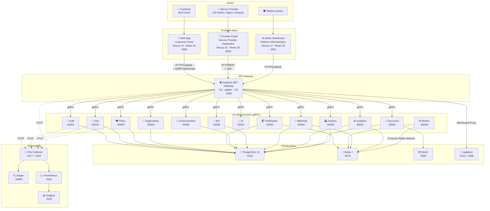
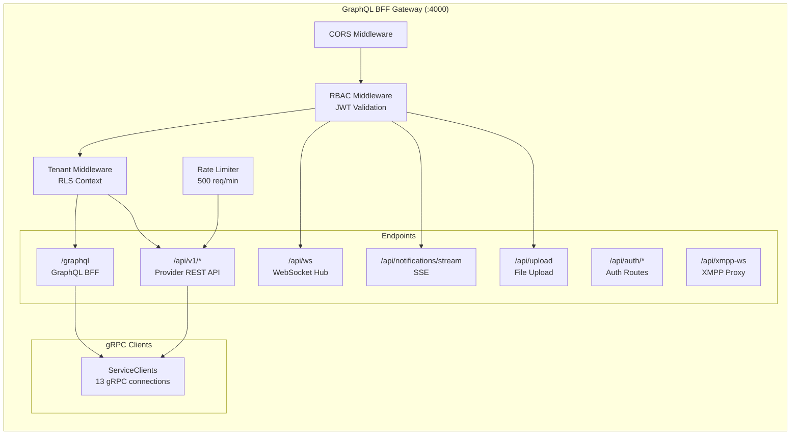
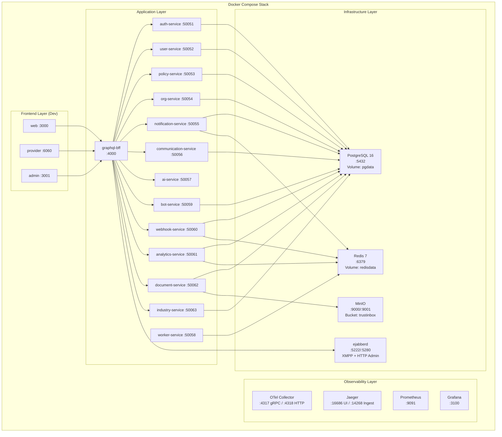

# 01 — System Architecture

> High-level C4-style context diagram showing actors, frontends, gateway, backend services, and infrastructure.

## System Context Diagram

## Container Diagram — Gateway Detail

## Deployment Topology

