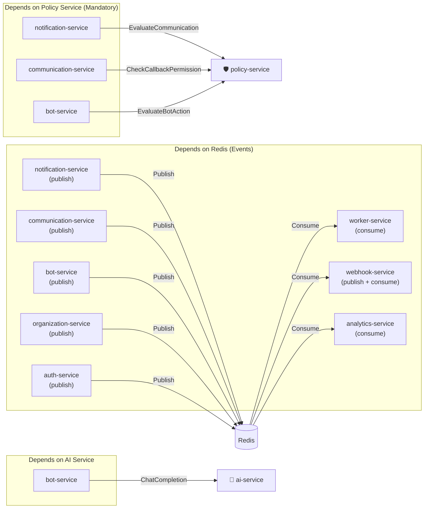
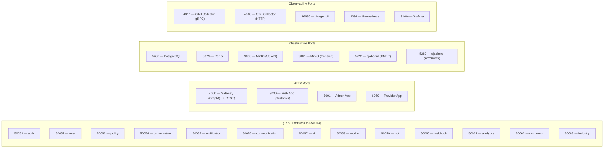

# 02 — Service Topology

> Detailed view of all 13 microservices, their gRPC ports, inter-service dependencies, and data store connections.

## Full Service Map

```mermaid
graph TB
    subgraph "API Gateway (:4000)"
        GW["GraphQL BFF<br/>Go · gqlgen · Chi Router<br/>GraphQL + REST + WebSocket + SSE"]
    end

    subgraph "Core Services"
        Auth["🔐 auth-service<br/>:50051<br/>Login · Register · JWT · Refresh"]
        User["👤 user-service<br/>:50052<br/>Profile · Privacy · DND · Availability<br/>· Blocked SPs · Virtual IDs"]
        Policy["🛡️ policy-service<br/>:50053<br/>MANDATORY Gatekeeper<br/>9-Step Evaluation Engine"]
        Org["🏢 organization-service<br/>:50054<br/>SP CRUD · Verification<br/>· Team · Invitations"]
    end

    subgraph "Communication Services"
        Notif["📬 notification-service<br/>:50055<br/>Create · Deliver · Read<br/>· Campaigns · Priorities"]
        Comm["💬 communication-service<br/>:50056<br/>Callbacks · Conversations<br/>· Messages · Spam Reports"]
        Doc["📄 document-service<br/>:50062<br/>Upload · Versions · Share<br/>· Presigned URLs · Classification"]
    end

    subgraph "Intelligence Services"
        AI["🤖 ai-service<br/>:50057<br/>Orchestrator · RAG · Categorizer<br/>· Spam Detector · Summarizer"]
        Bot["🤖 bot-service<br/>:50059<br/>Bot CRUD · Permissions<br/>· Knowledge · Actions · Analytics"]
    end

    subgraph "Platform Services"
        Worker["⚙️ worker-service<br/>:50058<br/>Delivery · Callbacks<br/>· Campaigns · Cleanup"]
        Webhook["🔗 webhook-service<br/>:50060<br/>Subscriptions · HMAC Delivery<br/>· Retry · Event Dispatch"]
        Analytics["📊 analytics-service<br/>:50061<br/>Dashboard · Daily Metrics<br/>· Domain Breakdowns"]
        Industry["🏭 industry-service<br/>:50063<br/>Templates · Compliance Hints<br/>· Bot Prompts · Presets"]
    end

    subgraph "Data Stores"
        PG[("🐘 PostgreSQL 16<br/>:5432<br/>Source of Truth")]
        Redis[("⚡ Redis 7<br/>:6379<br/>Events · Cache · Presence")]
        MinIO[("📦 MinIO<br/>:9000<br/>S3-Compatible Files")]
        XMPP[("💬 ejabberd<br/>:5222/:5280<br/>XMPP Server")]
    end

    %% Gateway → Services (gRPC)
    GW ==>|gRPC| Auth
    GW ==>|gRPC| User
    GW ==>|gRPC| Policy
    GW ==>|gRPC| Org
    GW ==>|gRPC| Notif
    GW ==>|gRPC| Comm
    GW ==>|gRPC| AI
    GW ==>|gRPC| Bot
    GW ==>|gRPC| Webhook
    GW ==>|gRPC| Analytics
    GW ==>|gRPC| Doc
    GW ==>|gRPC| Industry
    GW -.->|"WebSocket Proxy"| XMPP

    %% Inter-service calls (thin arrows)
    Notif -->|"Policy Check"| Policy
    Comm -->|"Policy Check"| Policy
    Bot -->|"Policy Check"| Policy
    Bot -->|"AI Completion"| AI

    %% Services → Data Stores
    Auth --> PG
    User --> PG
    Policy --> PG
    Org --> PG
    Notif --> PG
    Comm --> PG
    Bot --> PG
    Webhook --> PG
    Analytics --> PG
    Doc --> PG
    Industry --> PG

    Notif -.-> Redis
    Worker -.-> Redis
    Webhook -.-> Redis
    Analytics -.-> Redis

    Doc --> MinIO
```

## Service Dependency Matrix

## Port Allocation Map

