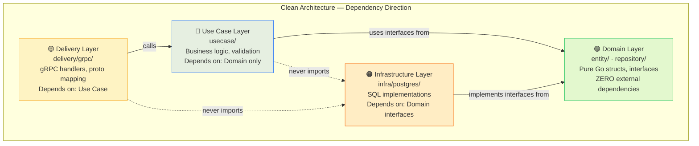
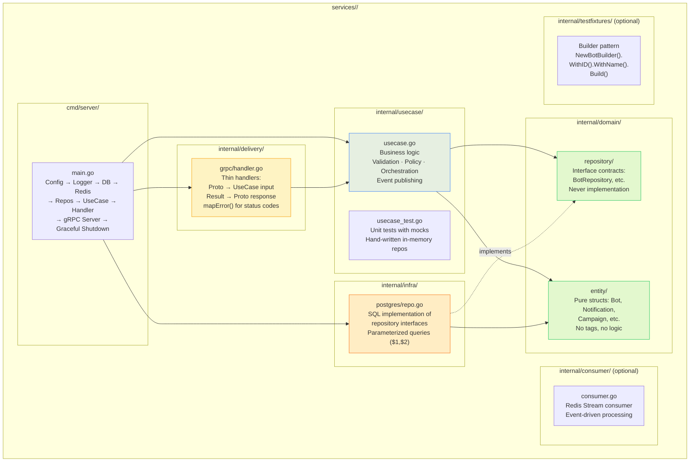
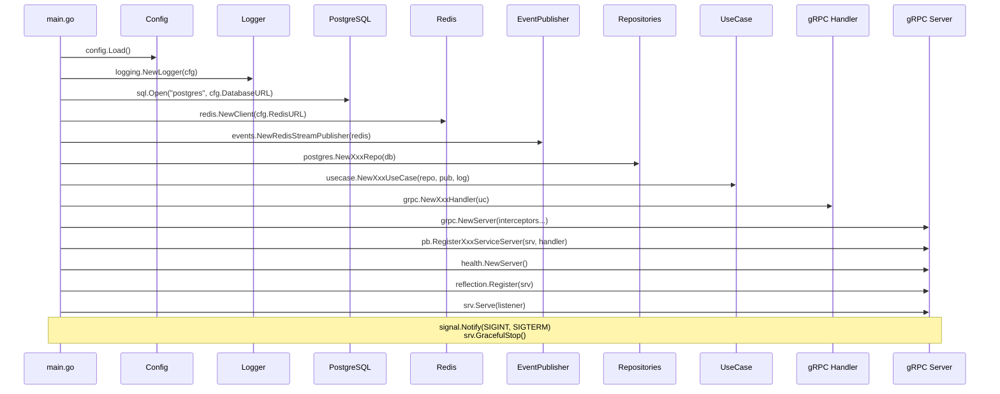
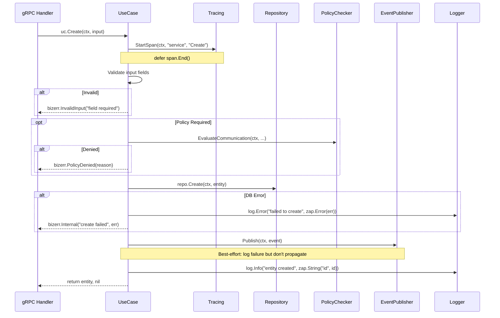
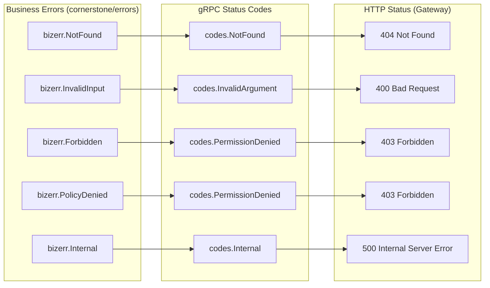

# 03 — Clean Architecture Layers

> Per-service internal structure following Clean Architecture: Domain → Use Case → Delivery → Infrastructure.

## Layer Dependency Rule

## Service Internal Structure (Generic)

## Wiring Pattern (main.go)

## Use Case Method Pattern

## Error Translation (Delivery Layer)

