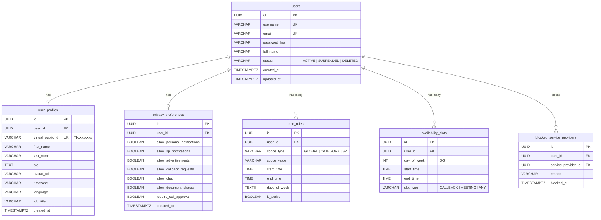
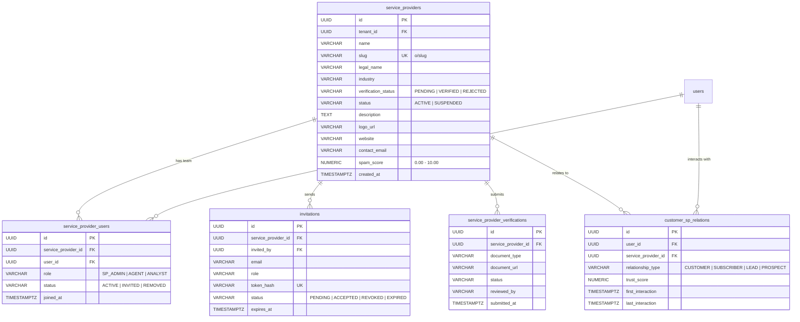
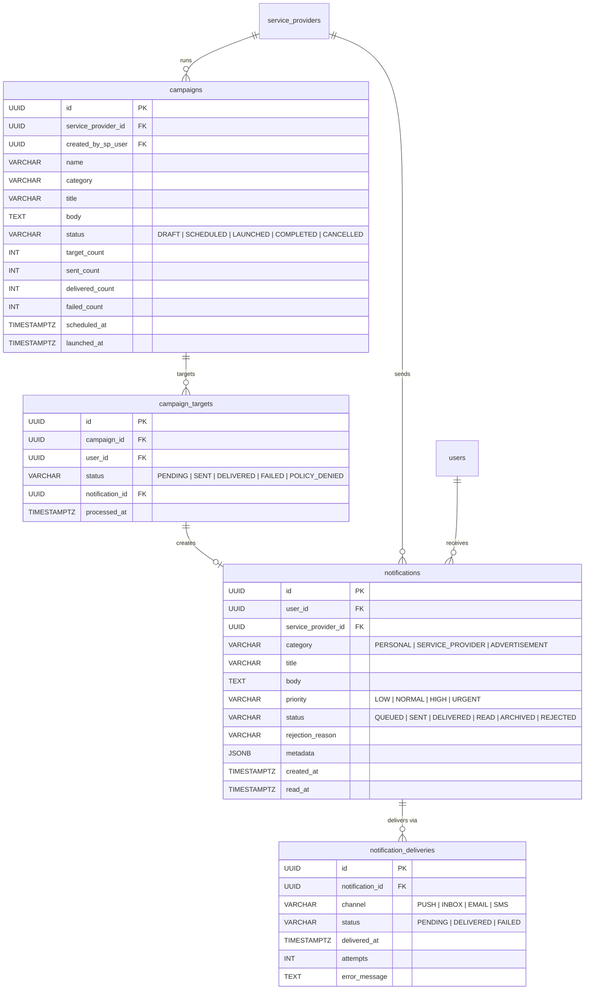
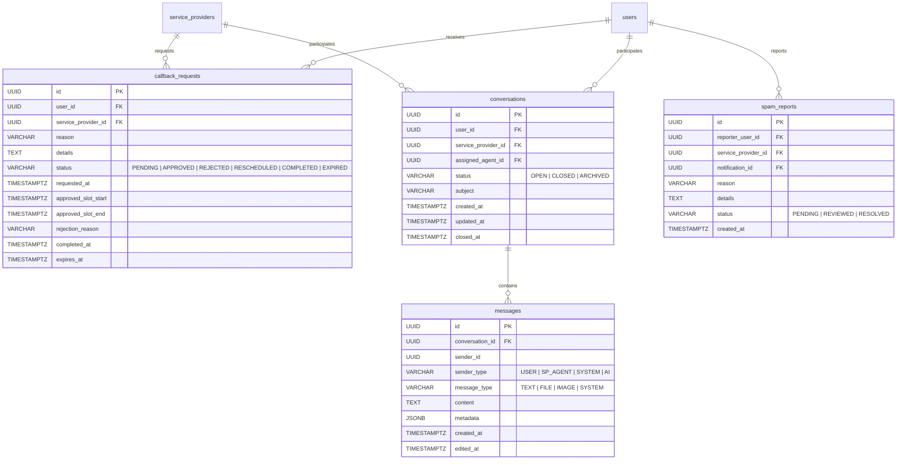
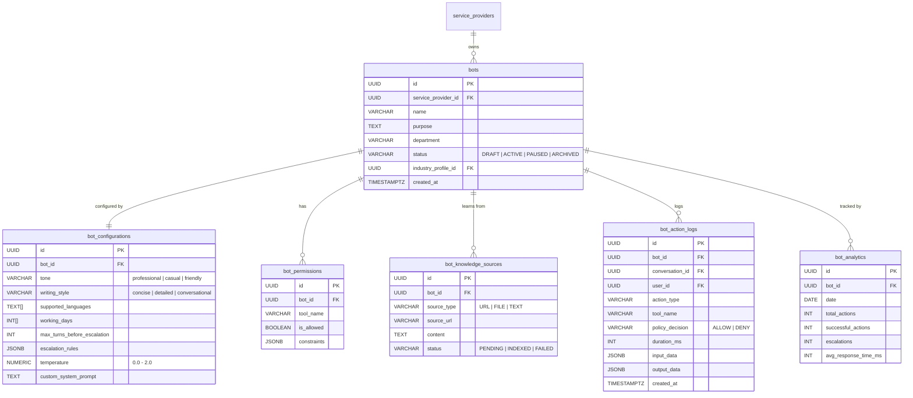
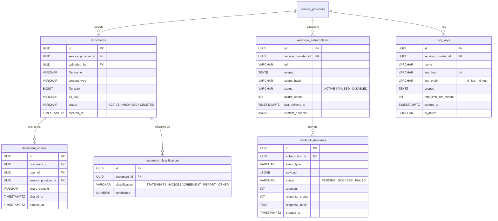
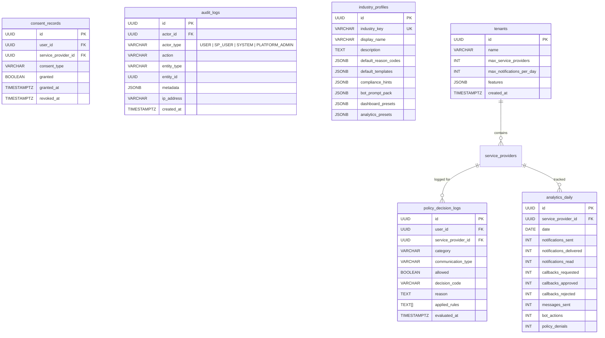

# 04 — Data Model (Entity-Relationship Diagram)

> PostgreSQL 16 schema — all tables, relationships, and key columns.

## Core Domain Model

## Service Provider Domain

## Notification & Campaign Domain

## Communication Domain

## Bot & AI Domain

## Document & Webhook Domain

## Compliance & Analytics Domain

