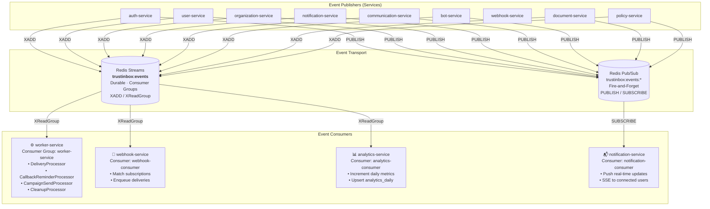
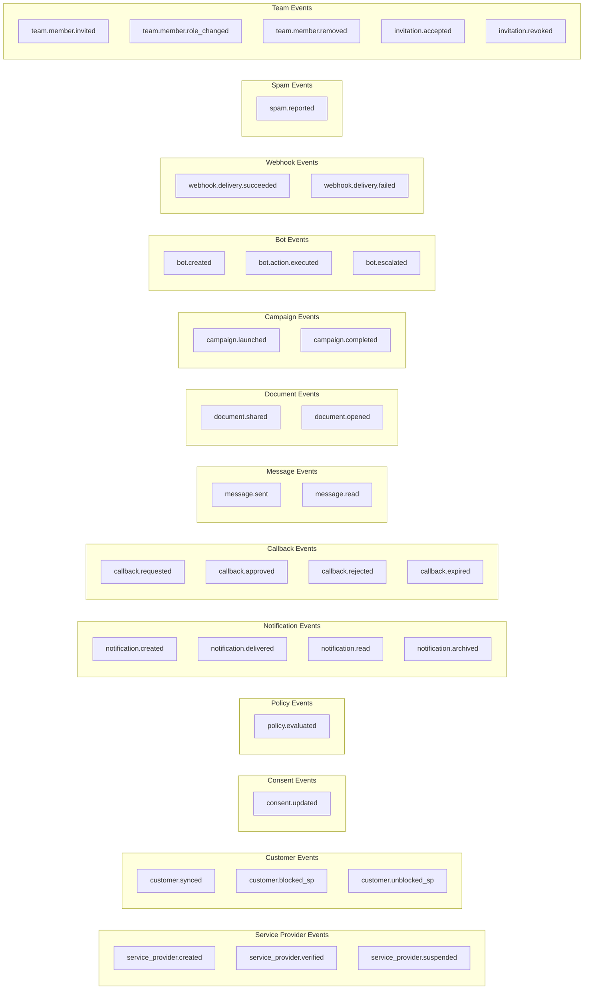
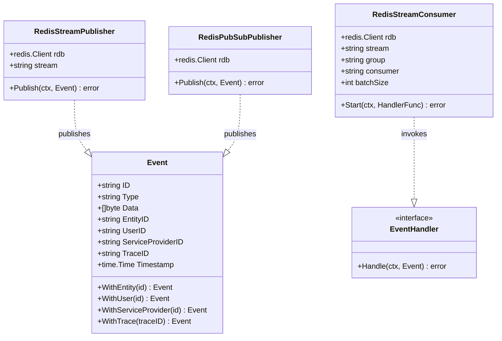
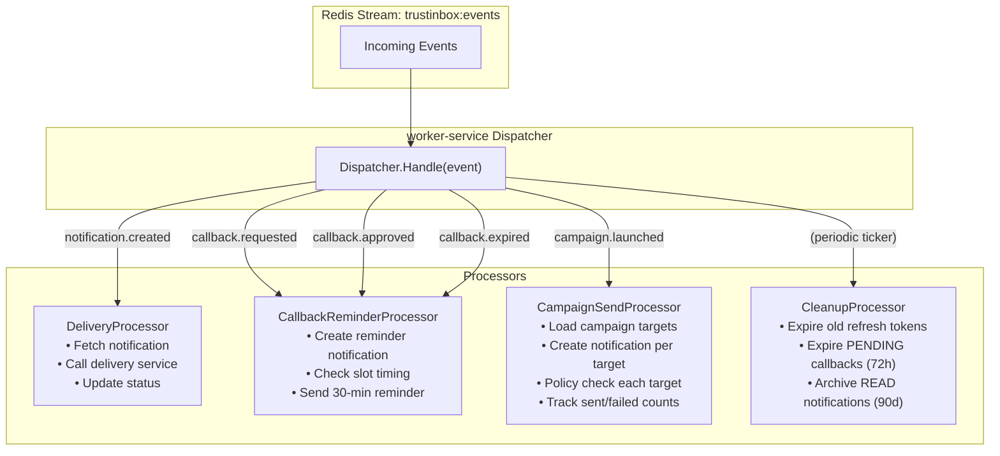
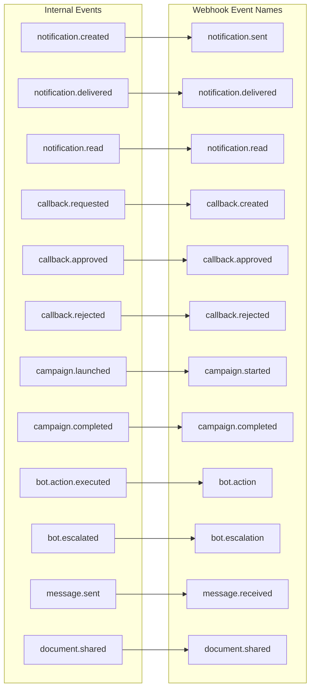
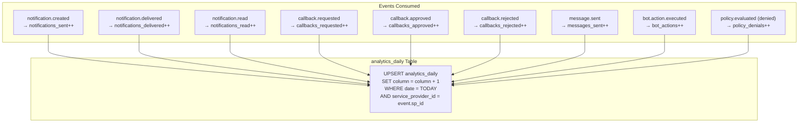

# 05 — Event-Driven Architecture

> Redis Streams (durable) and Pub/Sub (fire-and-forget) event topology with all 40+ event types.

## Event Flow Overview

## Complete Event Type Catalog

## Event Structure

## Worker Service Event Routing

## Webhook Event Mapping

## Analytics Event Aggregation

