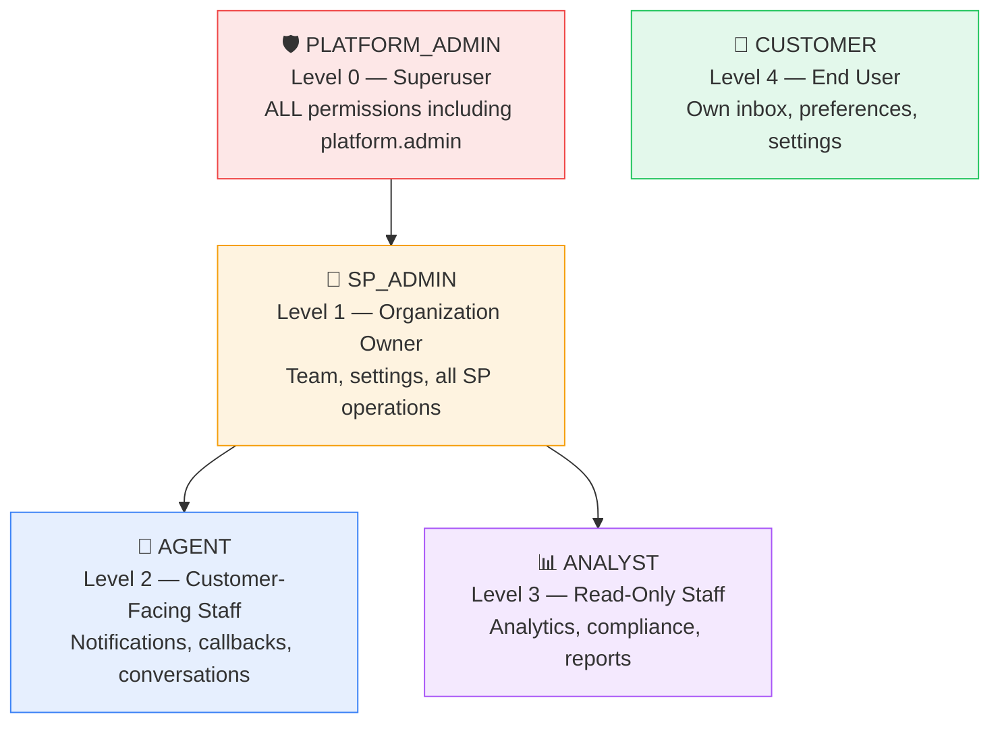
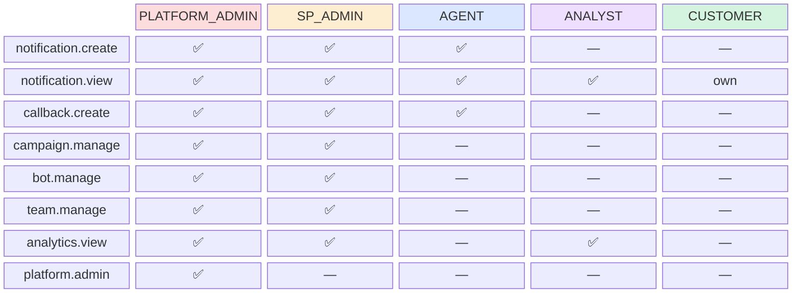
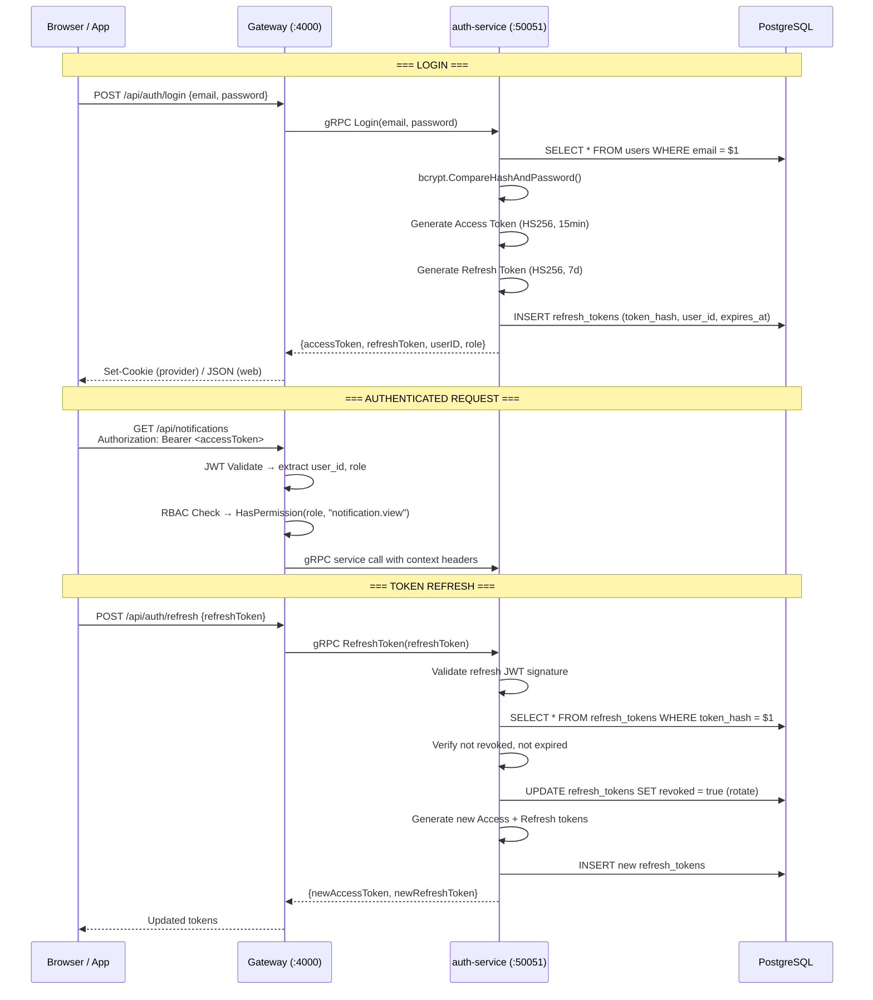
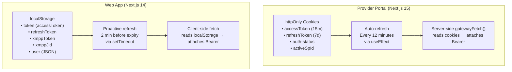
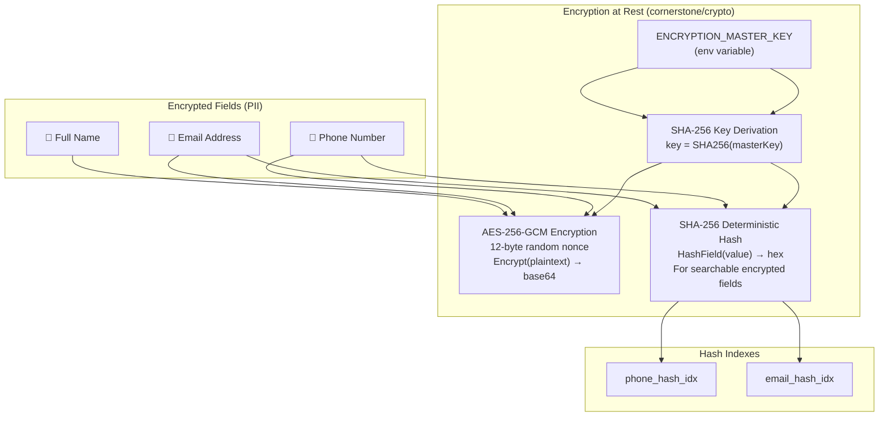
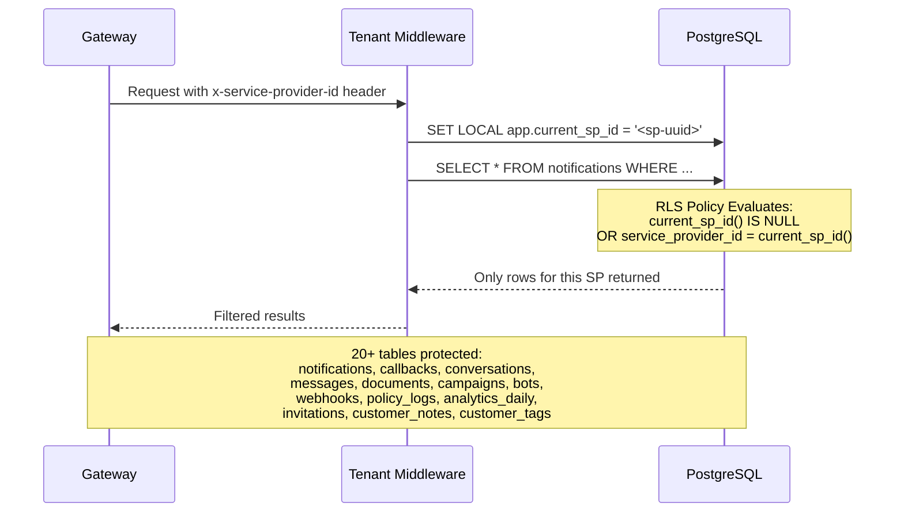
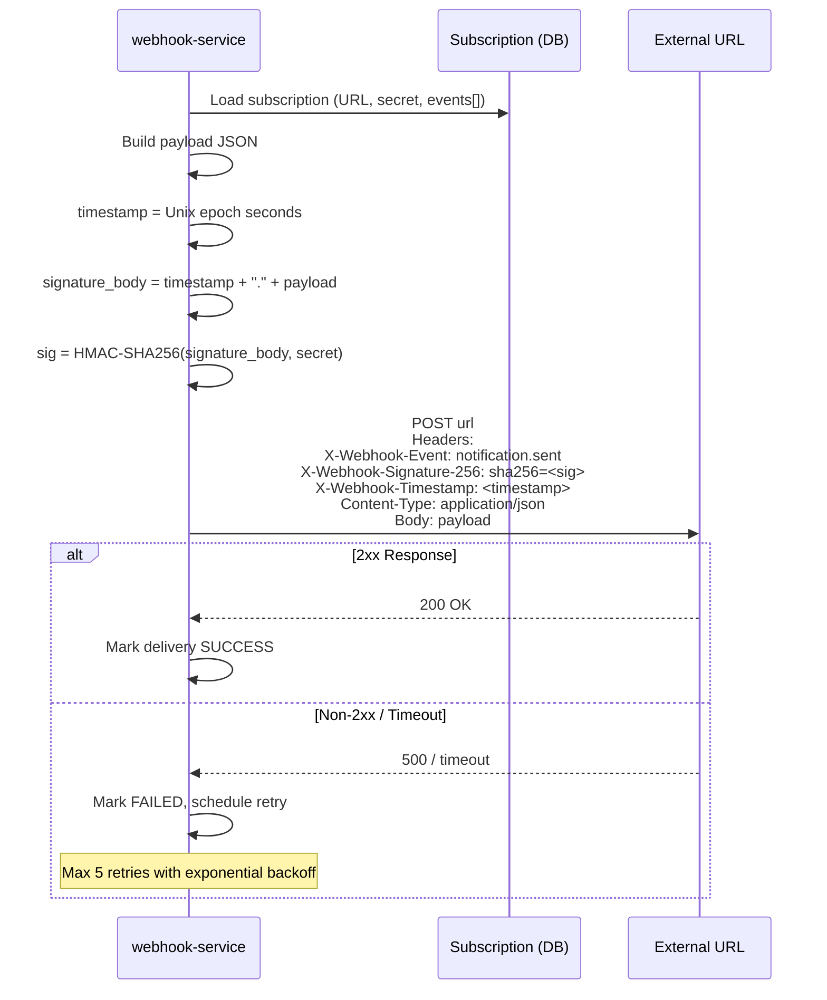

# 06 — RBAC & Security Model

> Roles, permissions, JWT lifecycle, encryption, Row-Level Security, and middleware chain.

## Role Hierarchy

## Permission Matrix

```mermaid
graph TB
    subgraph "Notification"
        NC["notification.create"]
        NV["notification.view"]
    end
    subgraph "Callback"
        CC["callback.create"]
        CV["callback.view"]
    end
    subgraph "Conversation"
        COC["conversation.create"]
        COV["conversation.view"]
    end
    subgraph "Document"
        DU["document.upload"]
        DS["document.share"]
        DV["document.view"]
    end
    subgraph "Campaign"
        CAC["campaign.create"]
        CAM["campaign.manage"]
        CAV["campaign.view"]
    end
    subgraph "Bot"
        BC["bot.create"]
        BM["bot.manage"]
        BV["bot.view"]
    end
    subgraph "Analytics"
        AV["analytics.view"]
    end
    subgraph "Compliance"
        CLV["compliance.view"]
        CLE["compliance.export"]
    end
    subgraph "Team"
        TM["team.manage"]
        TV["team.view"]
    end
    subgraph "Settings"
        SSM["sp.settings.manage"]
    end
    subgraph "Integration"
        IM["integration.manage"]
        IV["integration.view"]
    end
    subgraph "Webhook"
        WM["webhook.manage"]
        WV["webhook.view"]
    end
    subgraph "API Key"
        AKM["apikey.manage"]
        AKV["apikey.view"]
    end
    subgraph "Platform"
        PADM["platform.admin"]
    end
```

## Role → Permission Mapping

## JWT Token Lifecycle

## Provider vs Web App Auth Model

## Data Encryption Model

## Row-Level Security (PostgreSQL RLS)

## Gateway Middleware Chain

```mermaid
graph TB
    subgraph "HTTP Request Flow"
        Req["Incoming HTTP Request"]
        CORS["1. CORS Middleware<br/>Allow-Origin: localhost:3000,6060,3001"]
        RBACMid["2. RBAC Middleware<br/>Extract JWT → Validate → Extract role<br/>Check HasPermission(role, route)"]
        TenantMid["3. Tenant Middleware<br/>Extract x-service-provider-id<br/>SET LOCAL app.current_sp_id"]
        RateLim["4. Rate Limiter (API v1 only)<br/>500 req/min sustained<br/>50-req burst"]
        Handler["5. Route Handler<br/>gRPC call → response mapping"]
    end

    Req --> CORS --> RBACMid --> TenantMid --> RateLim --> Handler

    subgraph "gRPC Interceptor Chain (Per Service)"
        I1["1. ContextPropagationInterceptor<br/>Extract: x-request-id, x-user-id,<br/>x-service-provider-id, x-role"]
        I2["2. TracingInterceptor<br/>Create span: service + method<br/>Inject business attributes"]
        I3["3. LoggingInterceptor<br/>Log method + request_id (INFO)<br/>Log errors (ERROR)"]
        I4["4. RBACInterceptor (optional)<br/>Method → permission mapping<br/>Verify role has permission"]
    end

    I1 --> I2 --> I3 --> I4
```

## Webhook HMAC Signing

