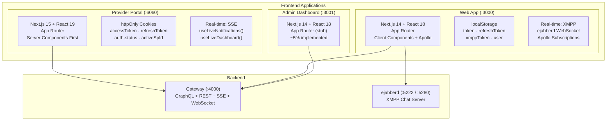
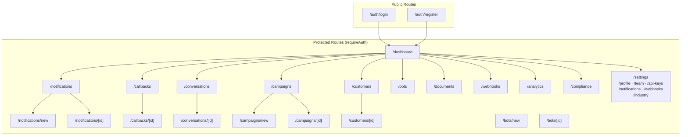
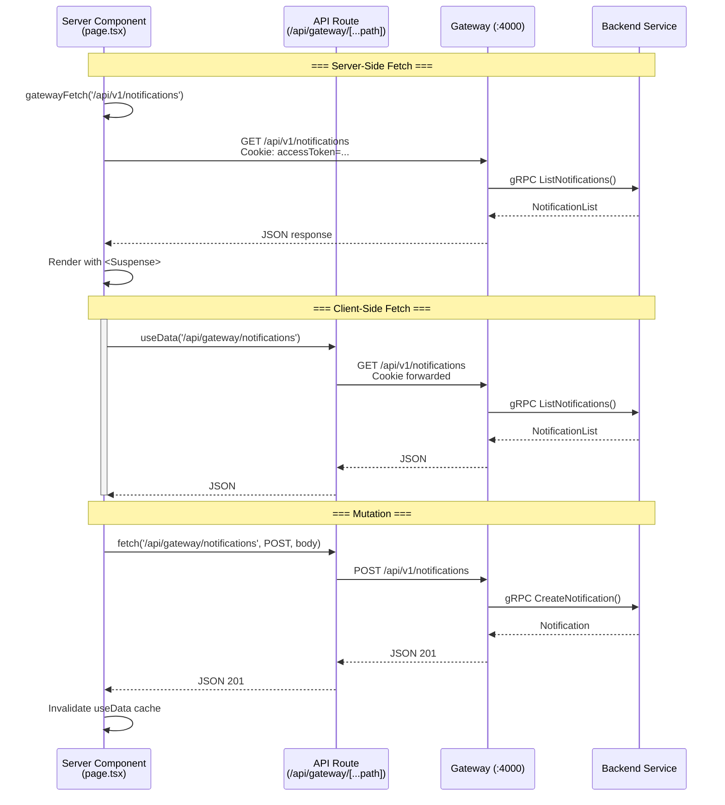
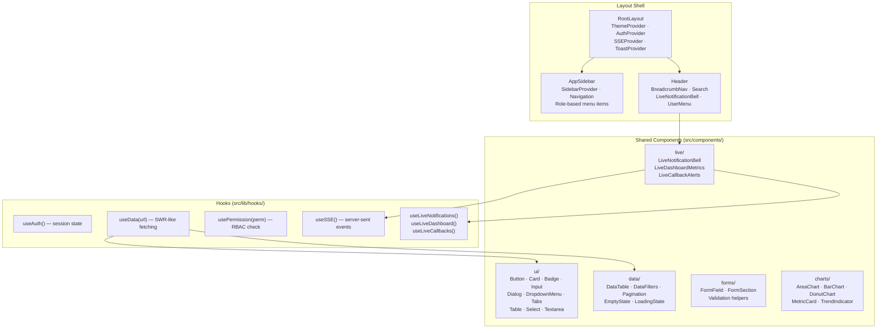
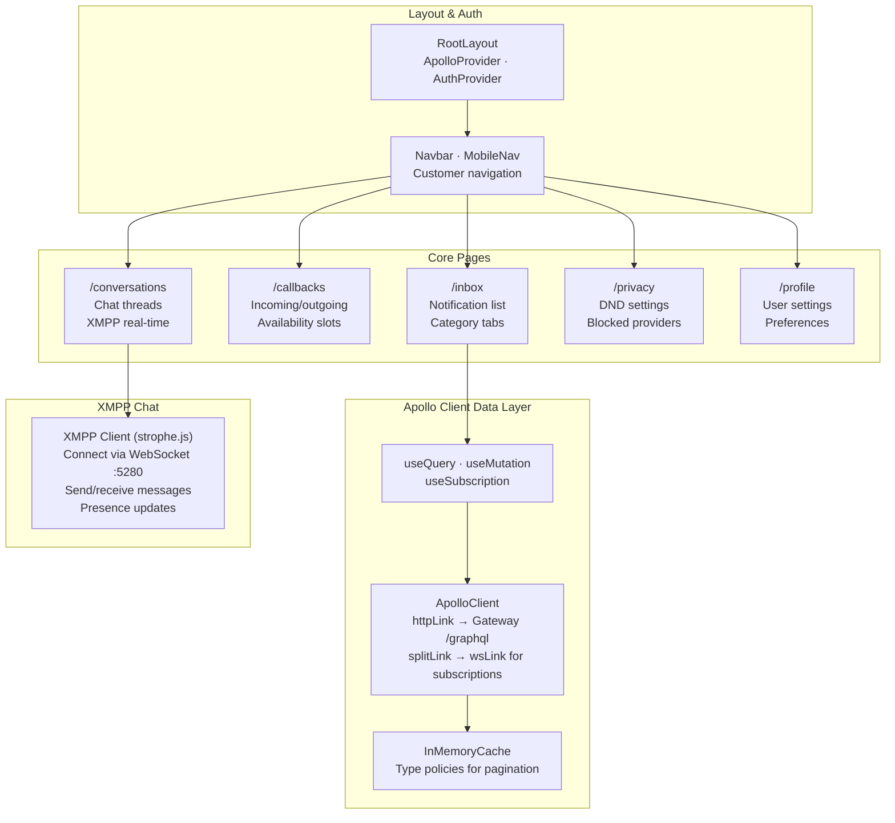
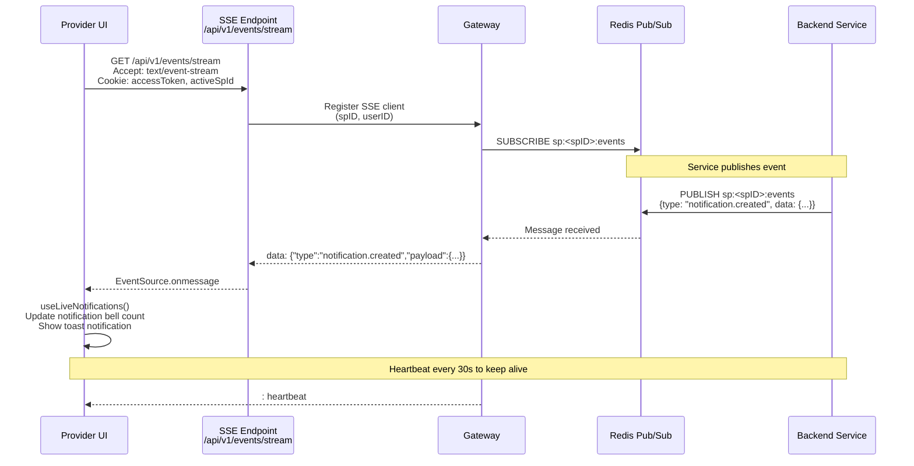
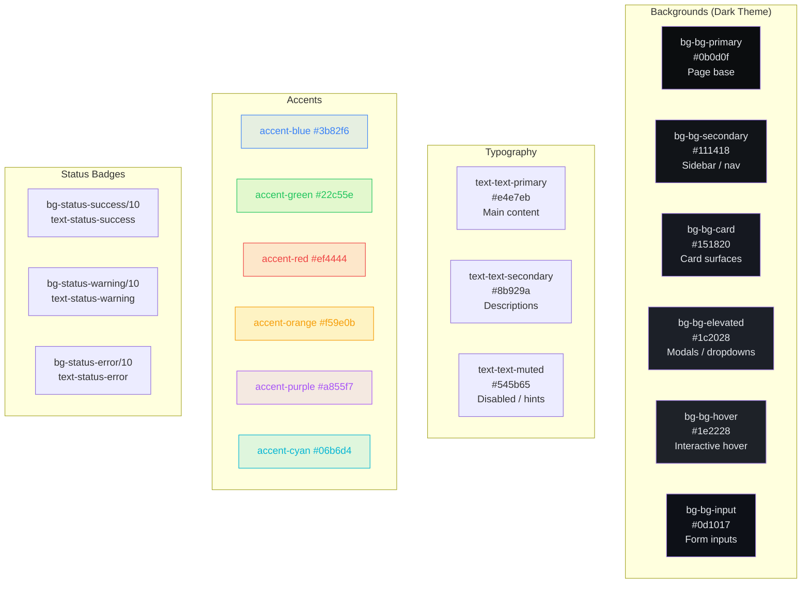

# 07 — Frontend Architecture

> Provider Portal, Web App, and Admin dashboard architecture, routing, data flows, and component patterns.

## Three-App Architecture

## Provider Portal Route Map

## Provider Portal Data Flow

## Provider Portal Component Architecture

## Web App Component Architecture

## SSE Real-Time Architecture (Provider)

## Provider Portal Color System

