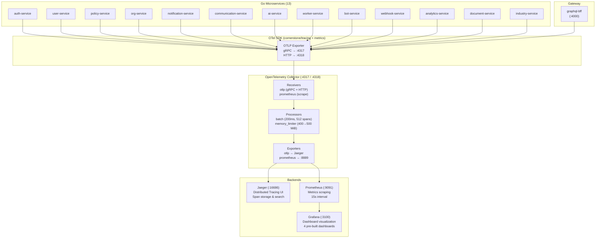
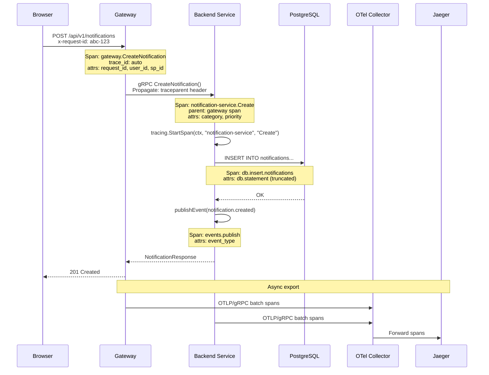
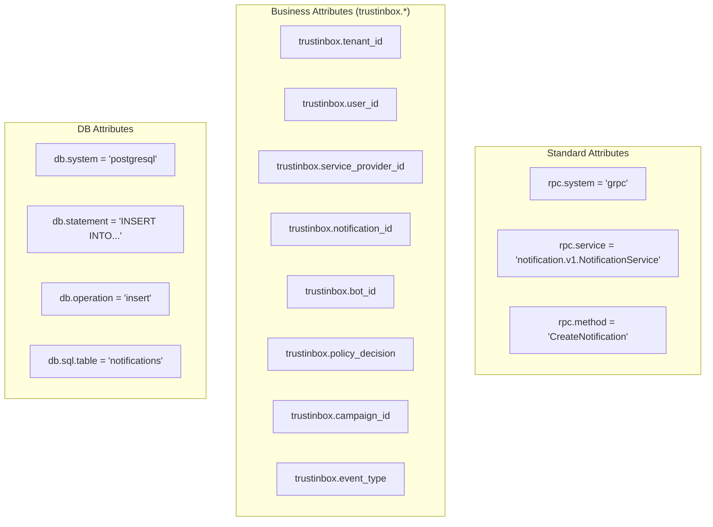
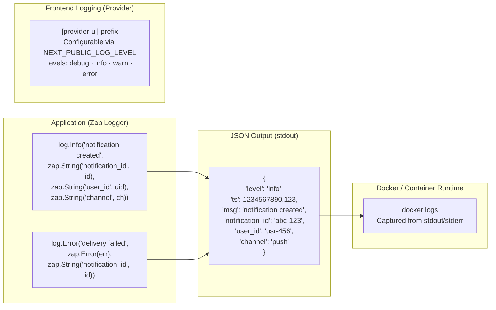
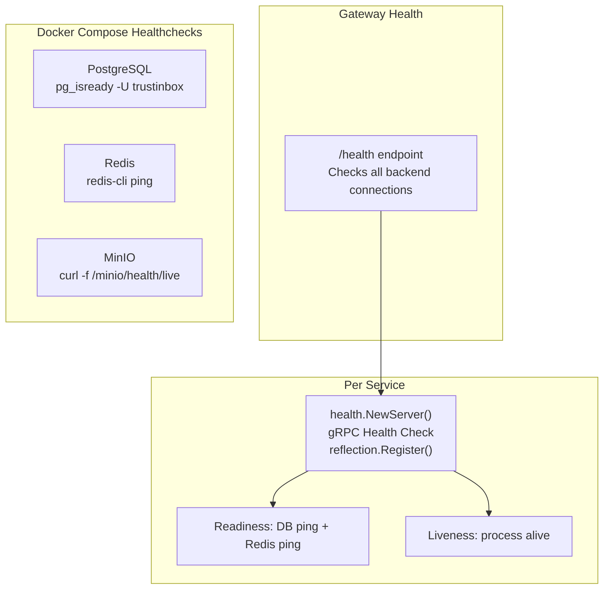

# 08 — Observability Stack

> OpenTelemetry pipeline, tracing, metrics, logging, and monitoring infrastructure.

## Observability Infrastructure

## Tracing Pipeline

## Span Attributes Convention

## Metrics Architecture

```mermaid
graph TB
    subgraph "Application Metrics (OTel SDK)"
        M1["trustinbox.notifications.sent<br/>Counter — per channel, category"]
        M2["trustinbox.notifications.delivered<br/>Counter — per channel"]
        M3["trustinbox.notifications.read<br/>Counter"]
        M4["trustinbox.notifications.rejected<br/>Counter — per reason"]
        M5["trustinbox.callbacks.requested<br/>Counter"]
        M6["trustinbox.callbacks.approved<br/>Counter"]
        M7["trustinbox.callbacks.rejected<br/>Counter"]
        M8["trustinbox.policy.evaluations<br/>Counter — per decision"]
        M9["trustinbox.policy.denials<br/>Counter — per reason"]
        M10["trustinbox.bot.actions<br/>Counter — per tool"]
        M11["trustinbox.bot.escalations<br/>Counter"]
        M12["trustinbox.webhooks.deliveries<br/>Counter — per status"]
        M13["trustinbox.webhooks.failures<br/>Counter"]
        M14["trustinbox.request.duration<br/>Histogram — per service, method"]
    end

    subgraph "Infrastructure Metrics (Prometheus Scrape)"
        IM1["go_goroutines"]
        IM2["go_memstats_alloc_bytes"]
        IM3["process_cpu_seconds_total"]
        IM4["grpc_server_handled_total"]
        IM5["grpc_server_handling_seconds"]
    end

    subgraph "Prometheus (:9091)"
        PS["Scrape Targets<br/>• OTel Collector :8889 (15s)<br/>• Each service :900X/metrics (15s)"]
    end

    subgraph "Grafana (:3100)"
        G1["Dashboard: Service Overview<br/>Request rate, error rate, latency"]
        G2["Dashboard: Notification Pipeline<br/>Sent → Delivered → Read funnel"]
        G3["Dashboard: Policy Engine<br/>Evaluations, denials by reason"]
        G4["Dashboard: Infrastructure<br/>CPU, memory, goroutines per service"]
    end

    M1 & M2 & M3 & M4 & M5 & M6 & M7 & M8 & M9 & M10 & M11 & M12 & M13 & M14 --> PS
    IM1 & IM2 & IM3 & IM4 & IM5 --> PS
    PS --> G1 & G2 & G3 & G4
```

## Structured Logging Pipeline

## Health Check Architecture

