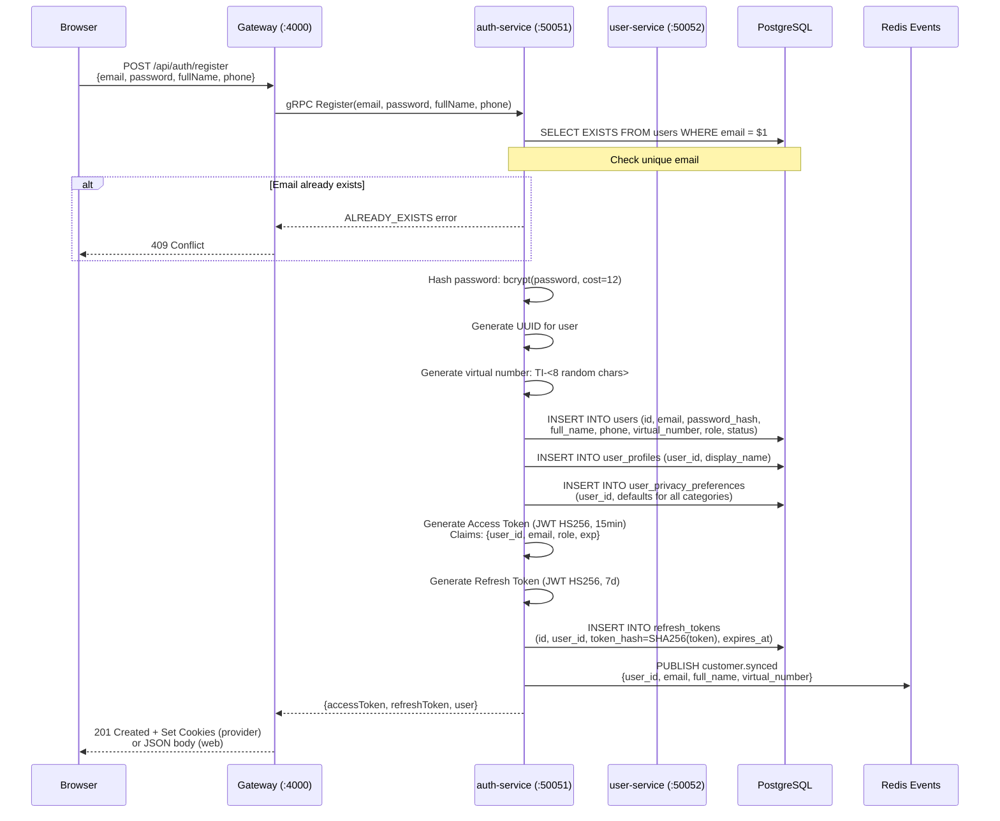
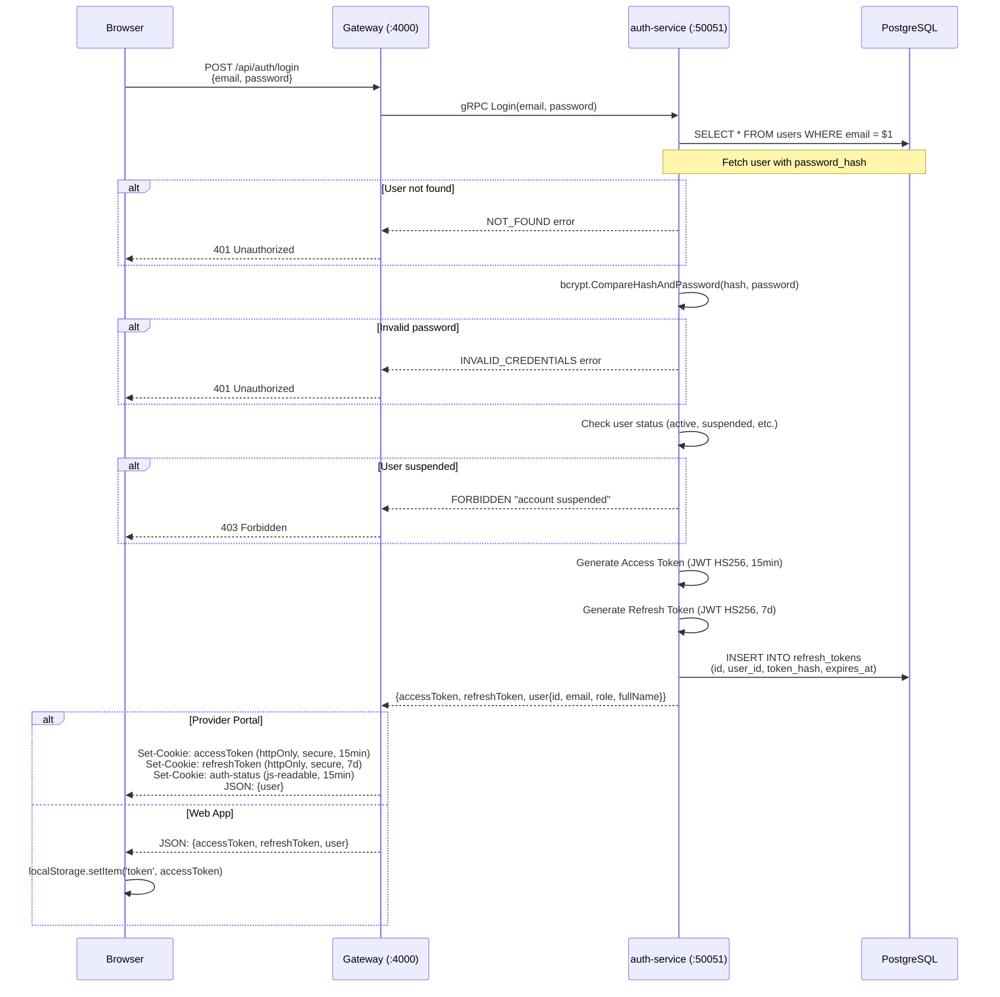
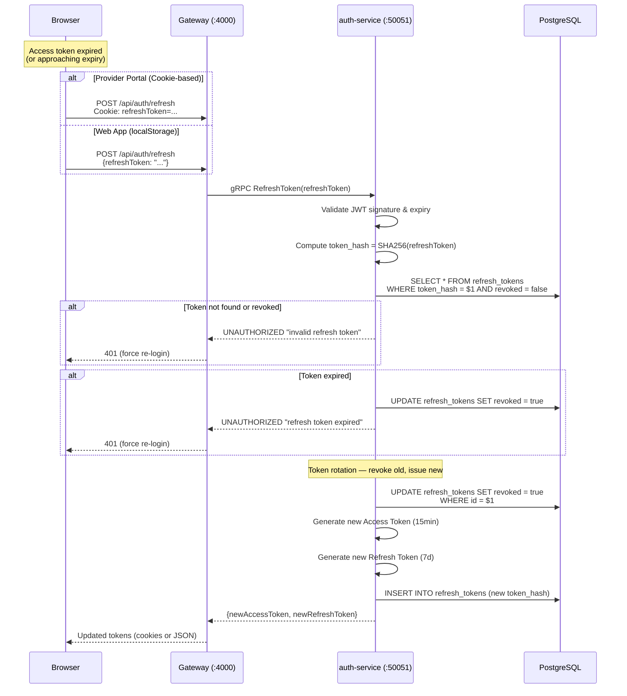
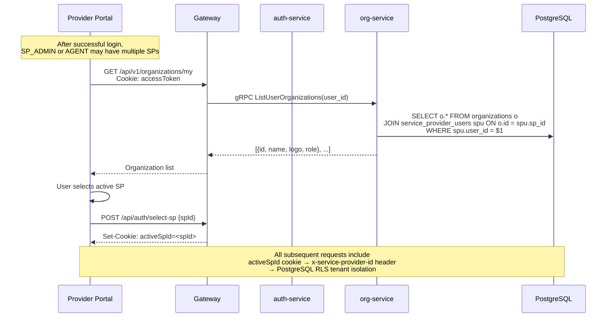
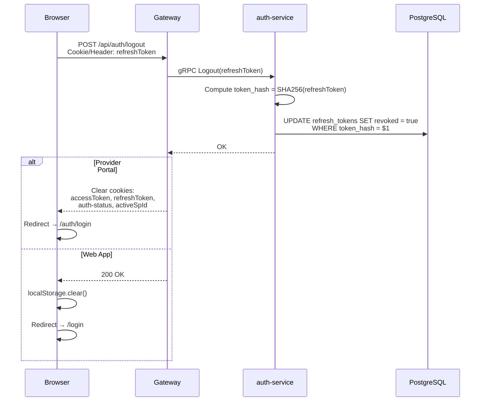
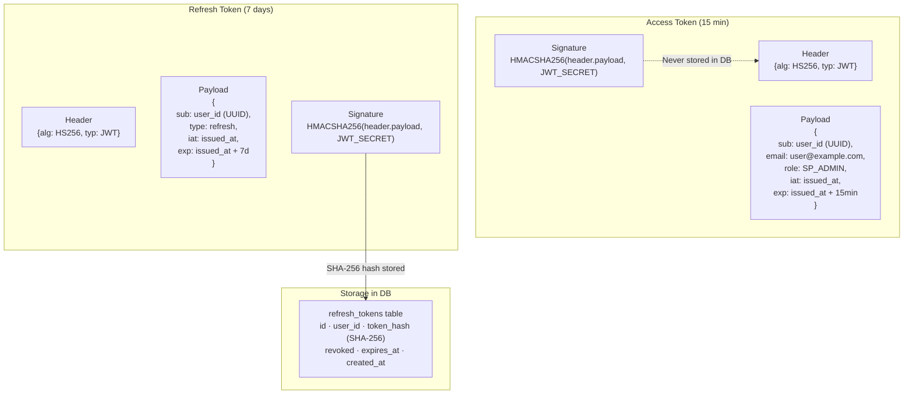

# 09 — Authentication Flow

> Login, registration, token lifecycle, password reset, and session management.

## User Registration

## User Login

## Token Refresh Flow

## Service Provider Login & SP Selection

## Auto-Refresh Timelines

```mermaid
gantt
    title Token Lifecycle (Not to Scale)
    dateFormat HH:mm
    axisFormat %H:%M

    section Access Token
    Active (15 min)           :active, at, 00:00, 15m
    Expired                  :crit, ate, after at, 5m

    section Provider Auto-Refresh
    Timer fires at 12min     :milestone, m1, 00:12, 0m
    New token issued         :done, rt, 00:12, 1m
    New active period        :active, at2, 00:12, 15m

    section Refresh Token
    Valid (7 days)           :active, rft, 00:00, 168h
```

## Logout Flow

## JWT Token Structure

