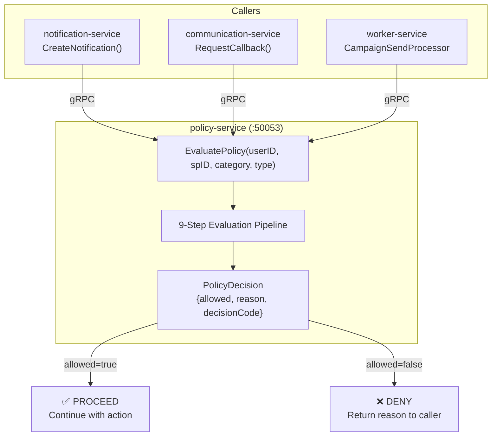
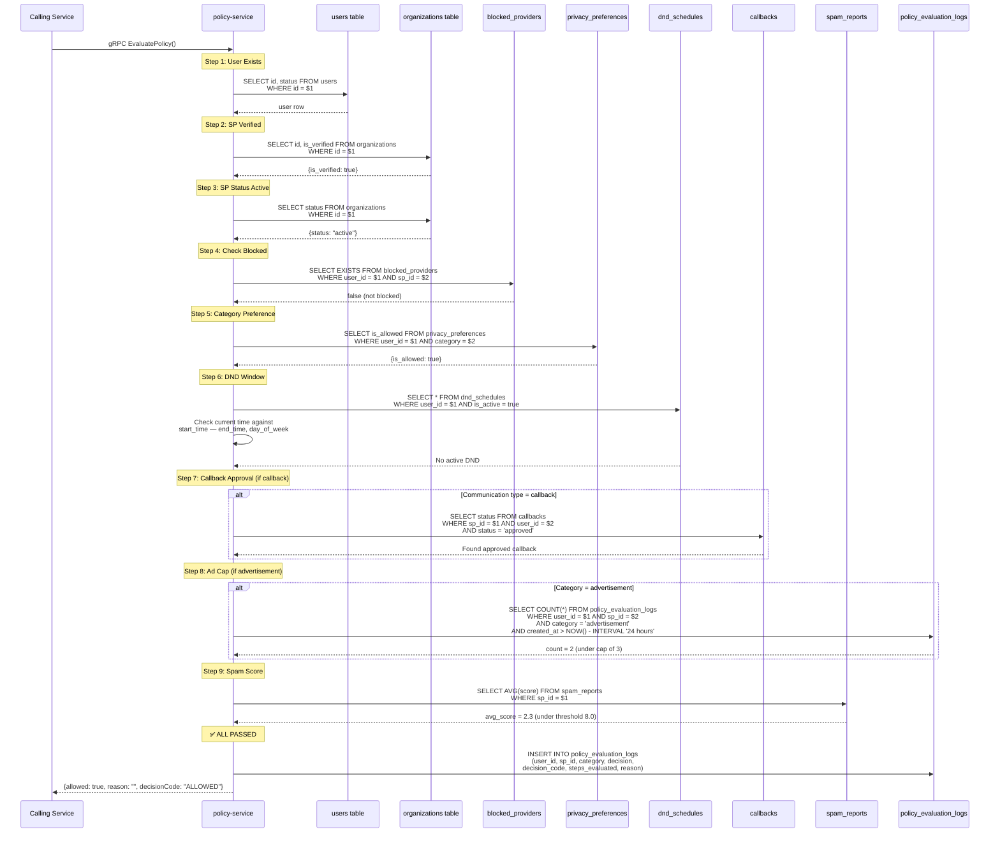
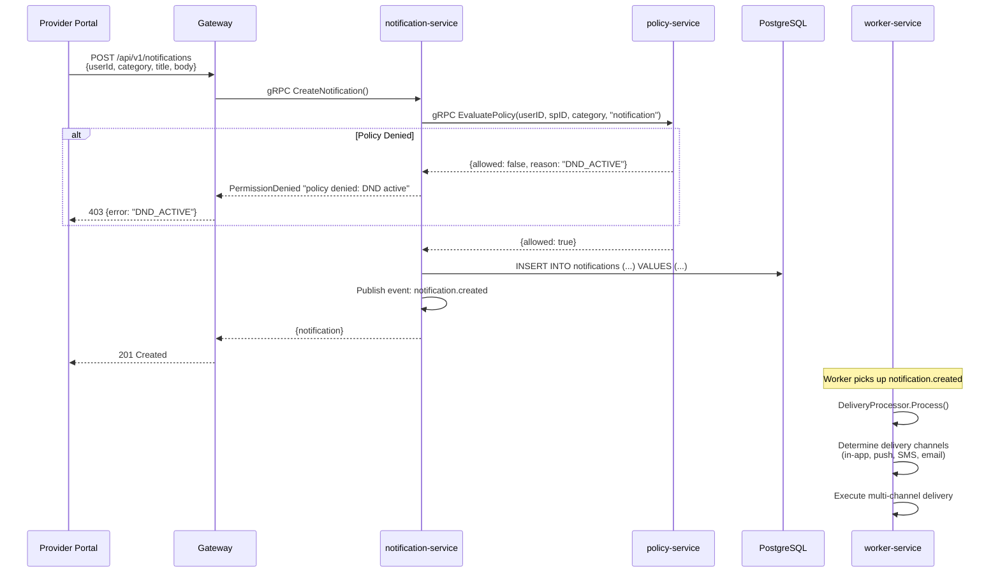
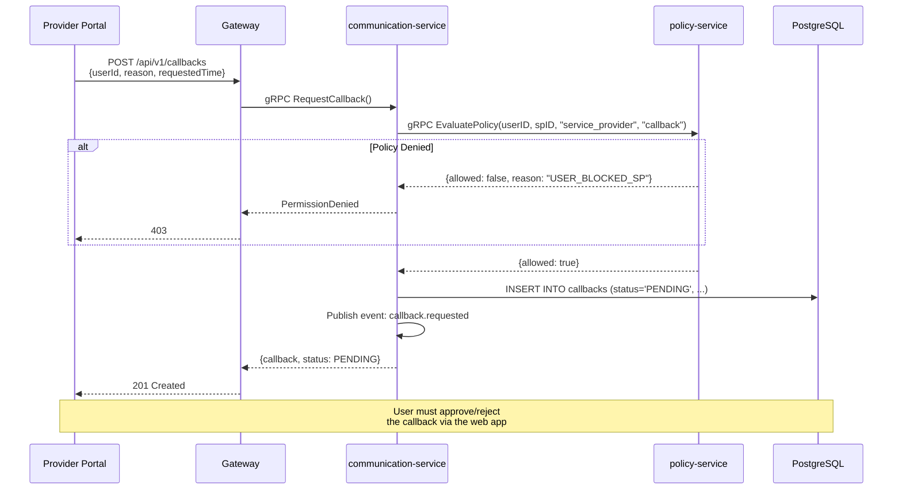
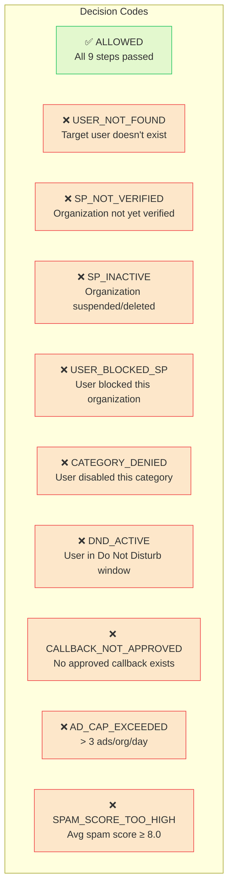

# 10 — Policy Evaluation Flow

> Mandatory 9-step gatekeeper for all communication — notifications, callbacks, and campaigns.

## Policy Evaluation Overview



## 9-Step Evaluation Pipeline

```mermaid
flowchart TB
    Start(["EvaluatePolicy<br/>(userID, spID, category, communicationType)"])

    S1{"Step 1<br/>User Exists?"}
    S2{"Step 2<br/>SP Verified?"}
    S3{"Step 3<br/>SP Status Active?"}
    S4{"Step 4<br/>User Blocked SP?"}
    S5{"Step 5<br/>Category Allowed?"}
    S6{"Step 6<br/>DND Active?"}
    S7{"Step 7<br/>Callback Approved?<br/>(callback type only)"}
    S8{"Step 8<br/>Ad Cap Exceeded?<br/>(advertisement only)"}
    S9{"Step 9<br/>Spam Score OK?"}

    D1["❌ USER_NOT_FOUND"]
    D2["❌ SP_NOT_VERIFIED"]
    D3["❌ SP_INACTIVE"]
    D4["❌ USER_BLOCKED_SP"]
    D5["❌ CATEGORY_DENIED"]
    D6["❌ DND_ACTIVE"]
    D7["❌ CALLBACK_NOT_APPROVED"]
    D8["❌ AD_CAP_EXCEEDED"]
    D9["❌ SPAM_SCORE_TOO_HIGH"]
    OK["✅ ALLOWED"]

    Start --> S1
    S1 -->|No| D1
    S1 -->|Yes| S2
    S2 -->|No| D2
    S2 -->|Yes| S3
    S3 -->|No| D3
    S3 -->|Yes| S4
    S4 -->|Yes, blocked| D4
    S4 -->|No| S5
    S5 -->|Denied| D5
    S5 -->|Allowed| S6
    S6 -->|Active| D6
    S6 -->|Inactive| S7
    S7 -->|Not approved<br/>(callback only)| D7
    S7 -->|Approved / N/A| S8
    S8 -->|Over 3/org/day<br/>(ads only)| D8
    S8 -->|Under cap / N/A| S9
    S9 -->|Score ≥ 8.0| D9
    S9 -->|Score < 8.0| OK

    style D1 fill:#ef444420,stroke:#ef4444
    style D2 fill:#ef444420,stroke:#ef4444
    style D3 fill:#ef444420,stroke:#ef4444
    style D4 fill:#ef444420,stroke:#ef4444
    style D5 fill:#ef444420,stroke:#ef4444
    style D6 fill:#ef444420,stroke:#ef4444
    style D7 fill:#ef444420,stroke:#ef4444
    style D8 fill:#ef444420,stroke:#ef4444
    style D9 fill:#ef444420,stroke:#ef4444
    style OK fill:#22c55e20,stroke:#22c55e
```

## Detailed Step Evaluation



## Policy in Notification Flow



## Policy in Callback Flow



## Decision Codes Reference


