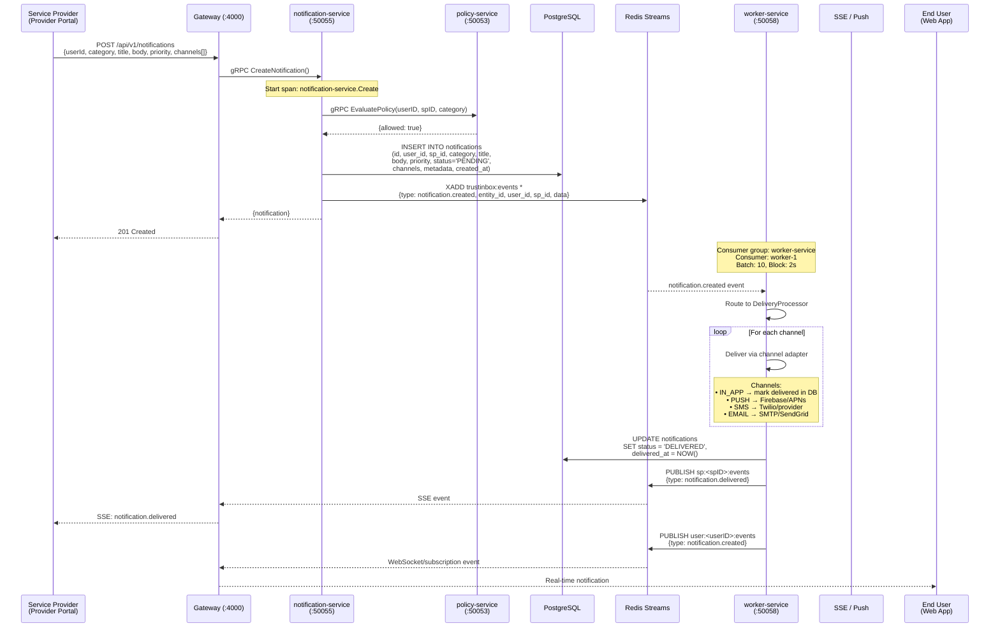
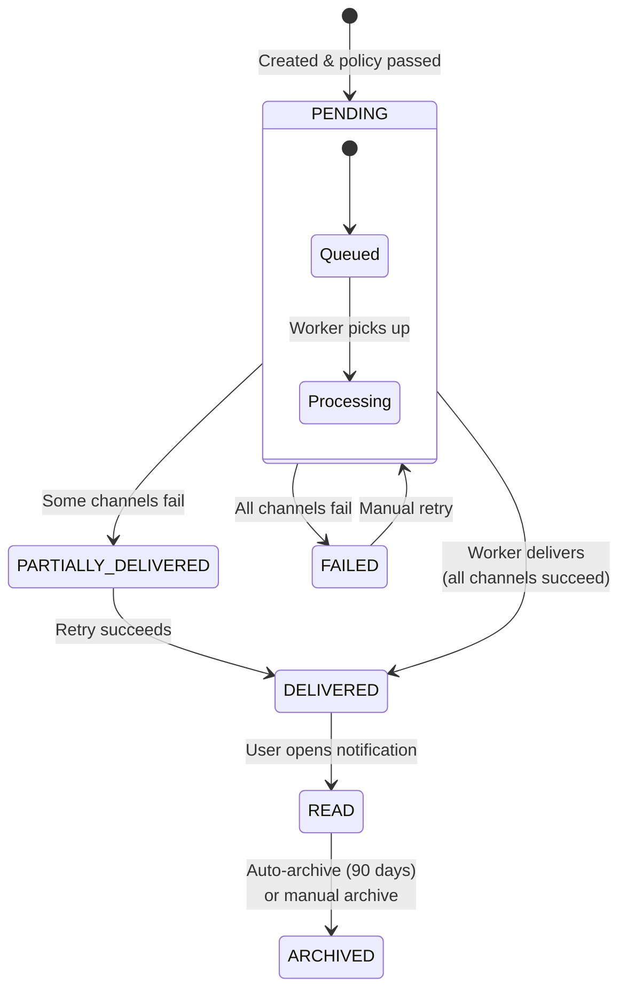
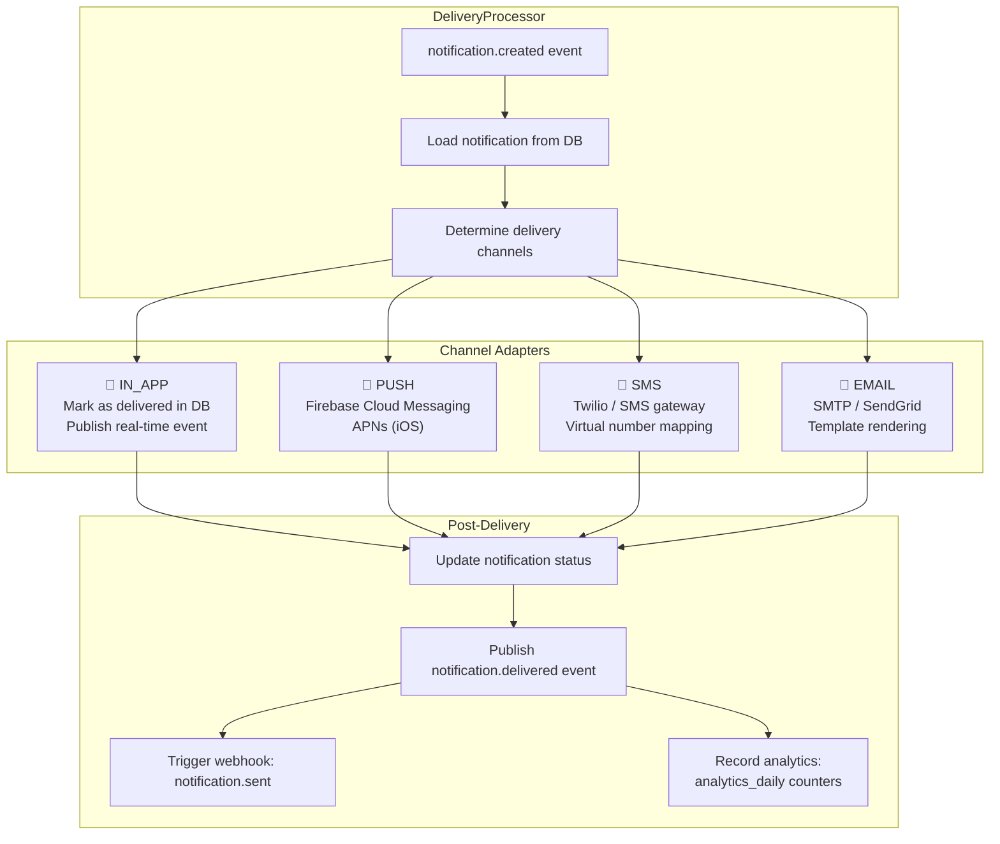
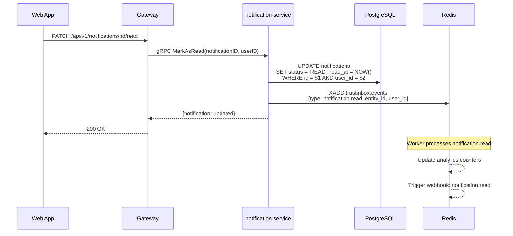
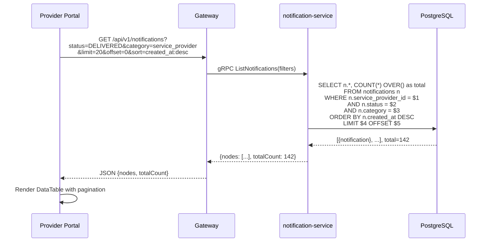
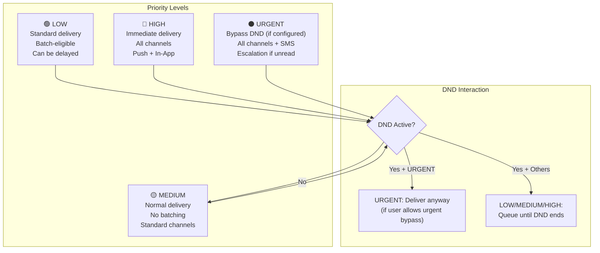
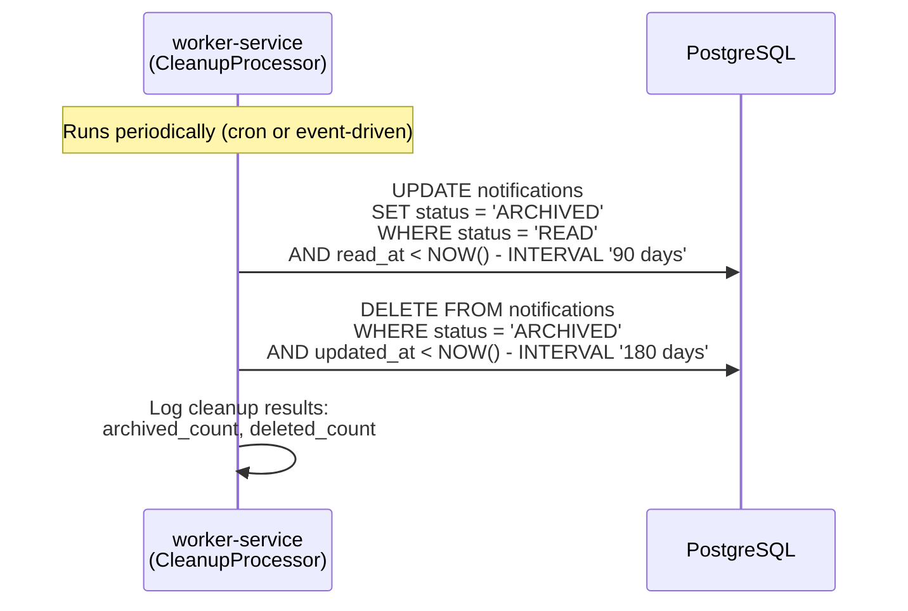

# 11 — Notification Delivery Flow

> End-to-end flow from creation through policy, queuing, multi-channel delivery, and real-time updates.

## End-to-End Notification Flow

## Notification State Machine

## Multi-Channel Delivery

## Notification Read Flow

## Notification Listing & Filtering

## Notification Priority Handling

## Cleanup: Auto-Archive

