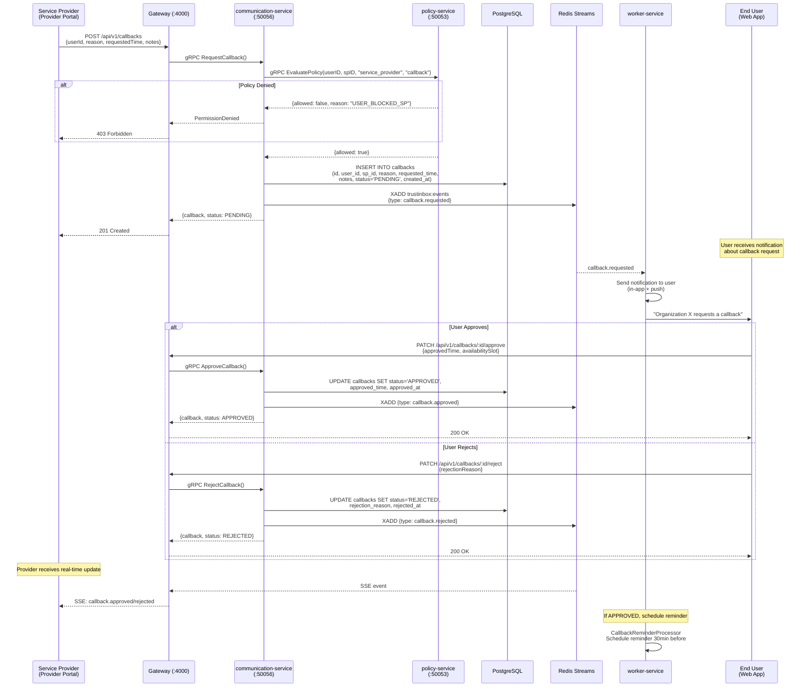
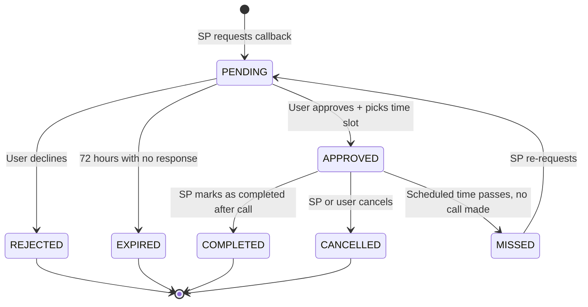
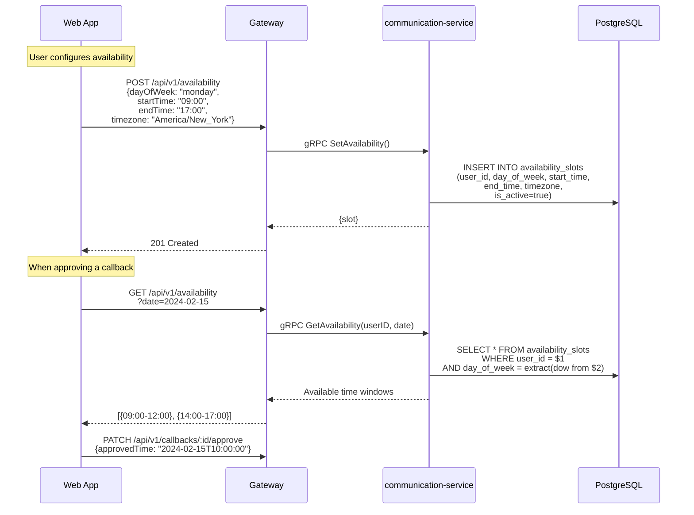
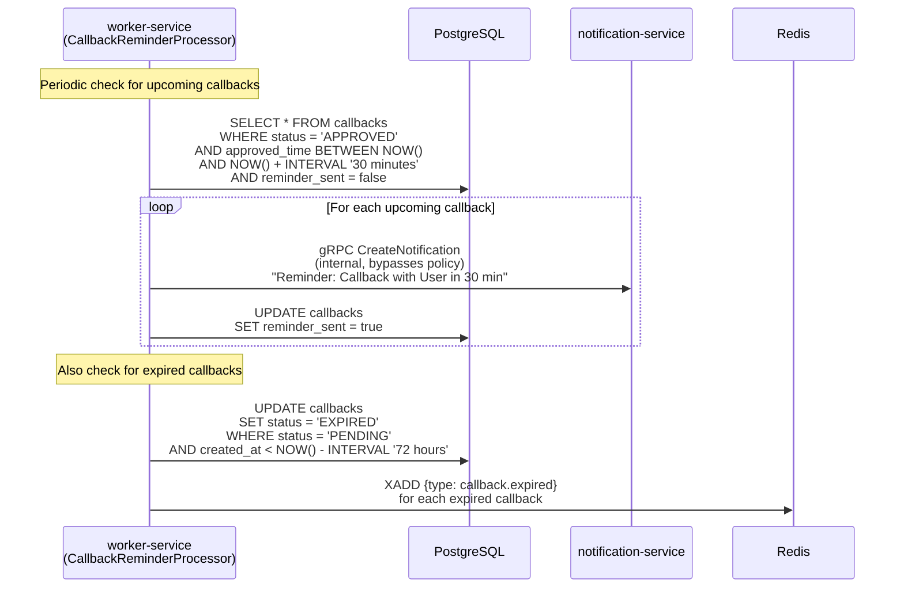
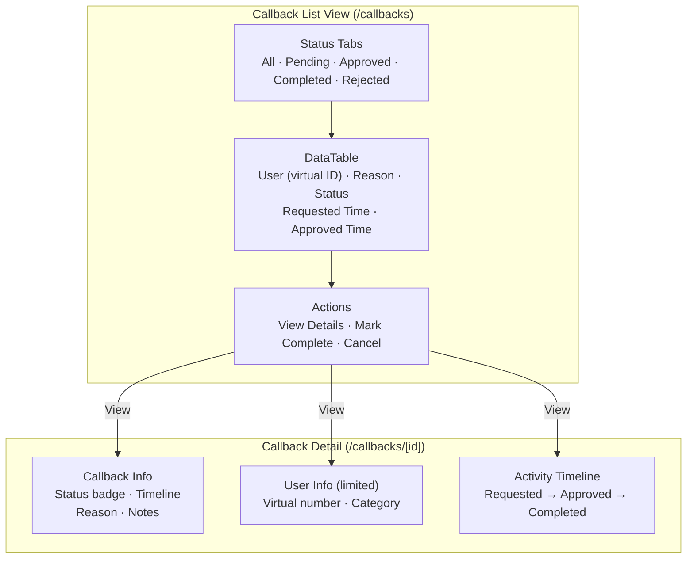

# 12 — Callback Request Flow

> User-approved callback scheduling with availability slots, policy gating, and lifecycle management.

## End-to-End Callback Flow

## Callback State Machine

## Availability Slots

## Callback Reminder Processing

## Provider Callback Dashboard

