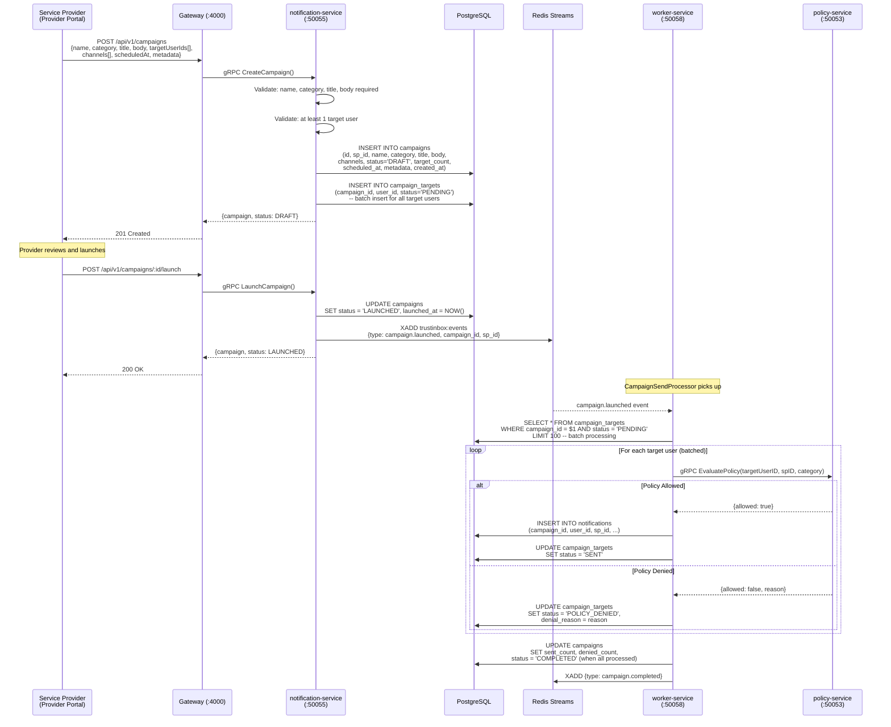
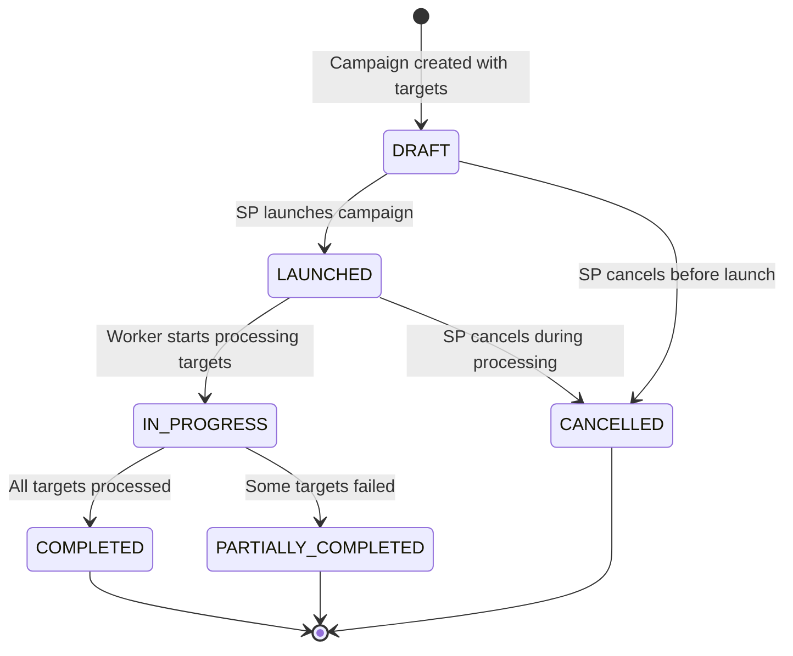
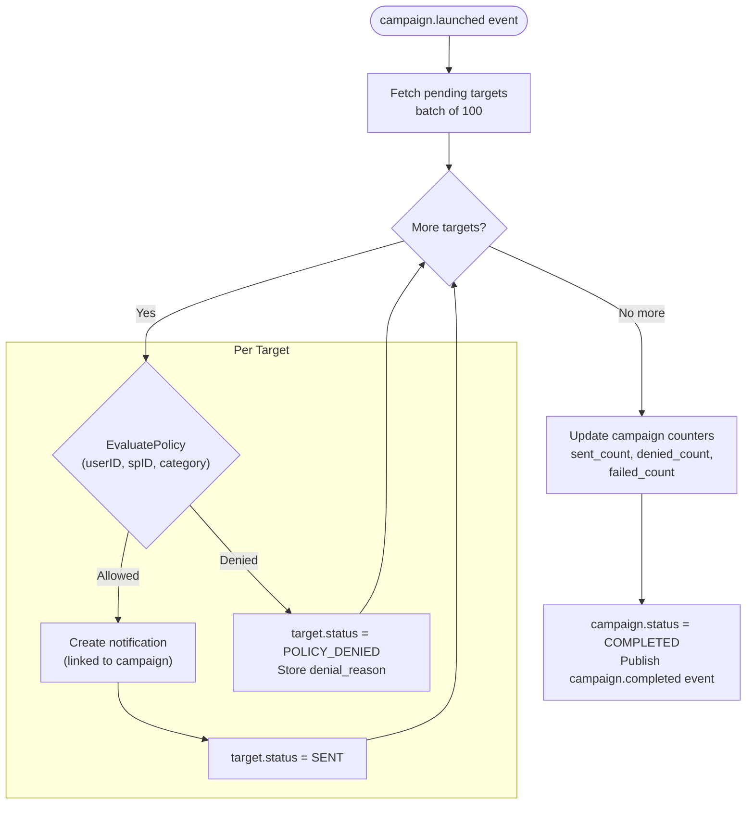
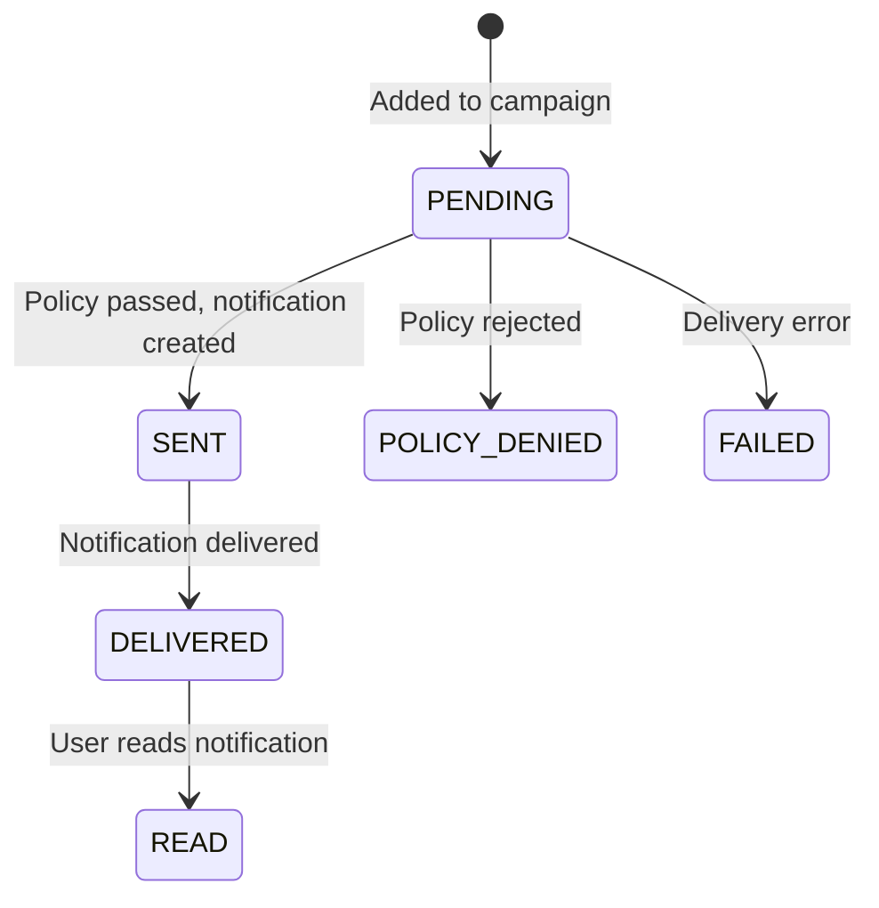
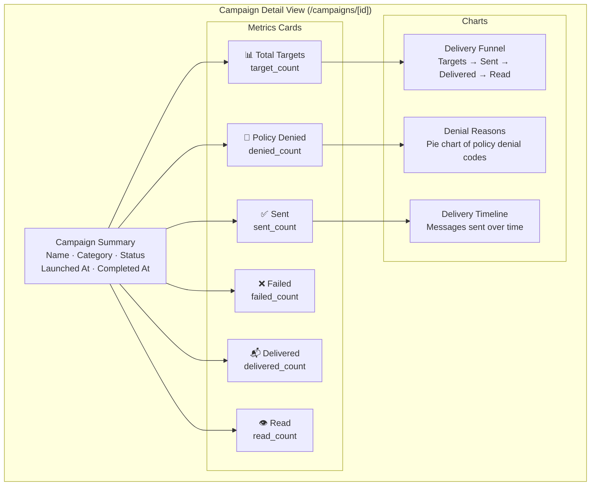
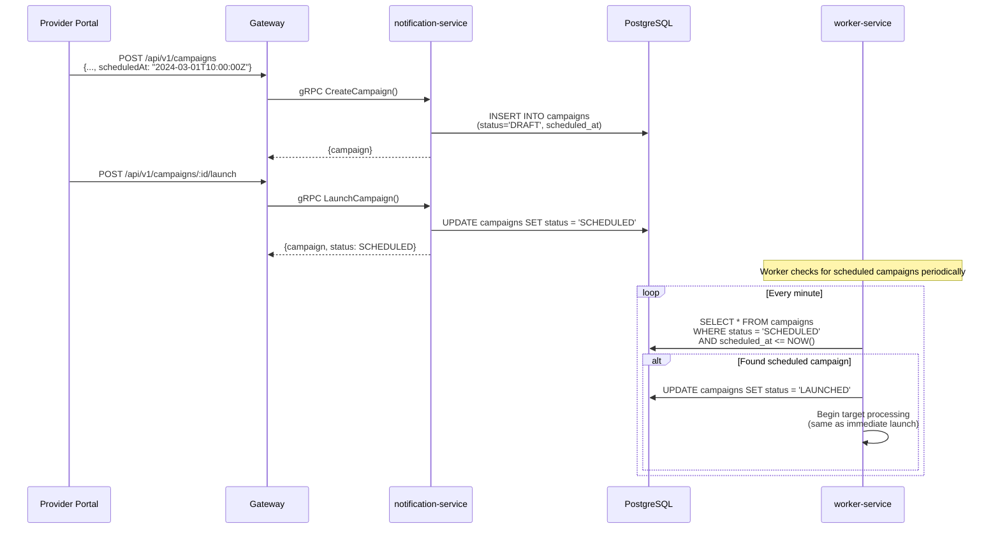

# 13 — Campaign Launch Flow

> Bulk notification campaigns with target fan-out, per-target policy evaluation, delivery tracking, and analytics.

## End-to-End Campaign Flow

## Campaign State Machine

## Campaign Target Processing

## Campaign Target States

## Campaign Analytics

## Scheduled Campaign Flow

