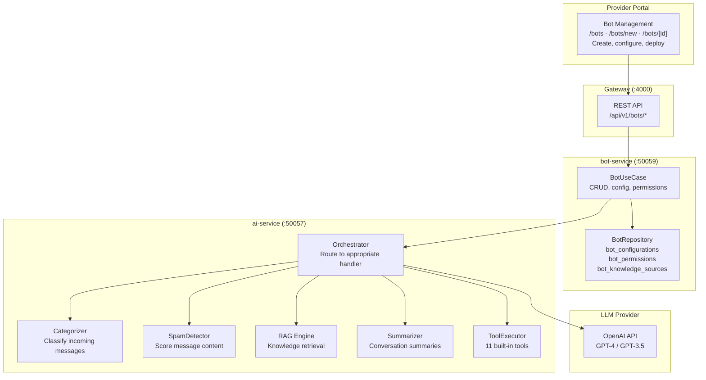
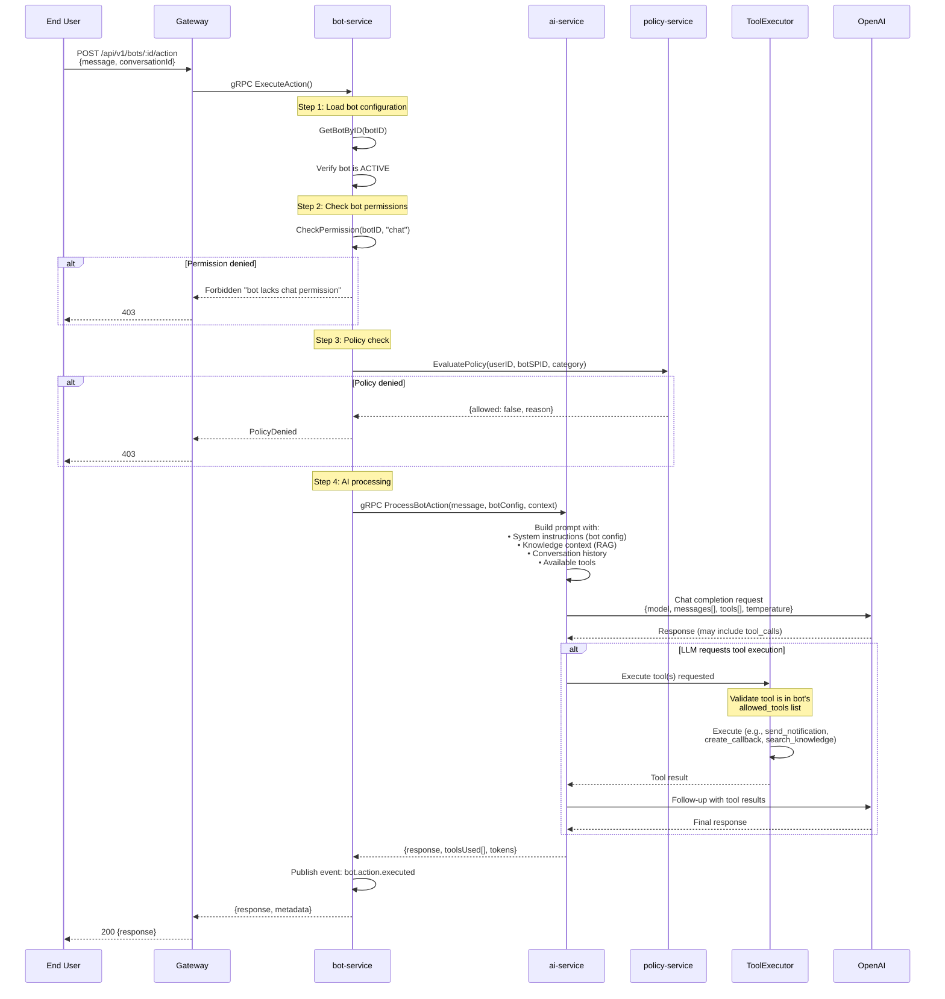
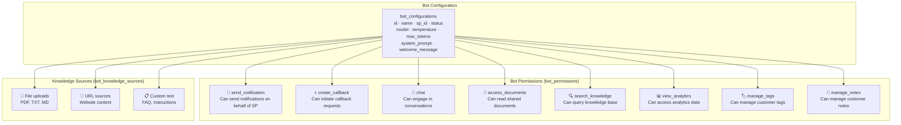
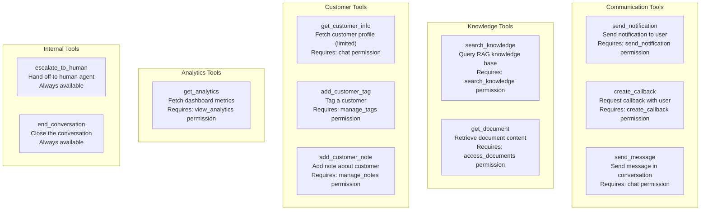
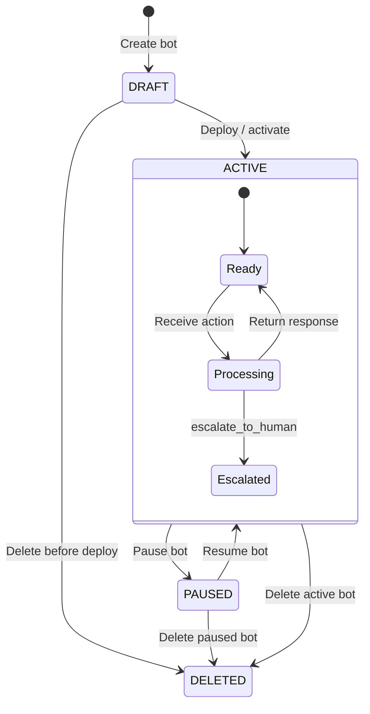
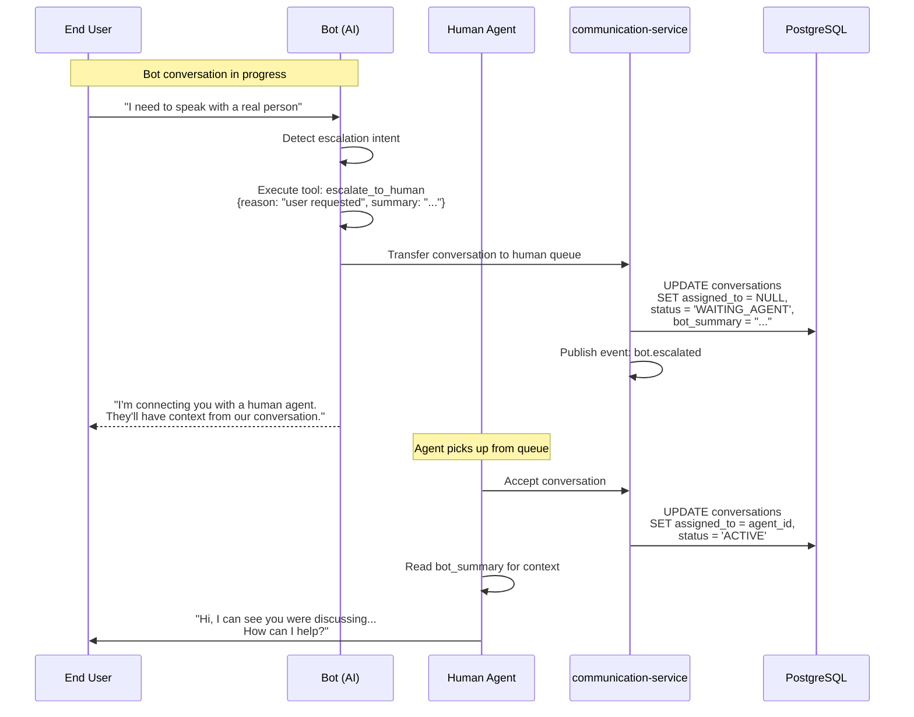
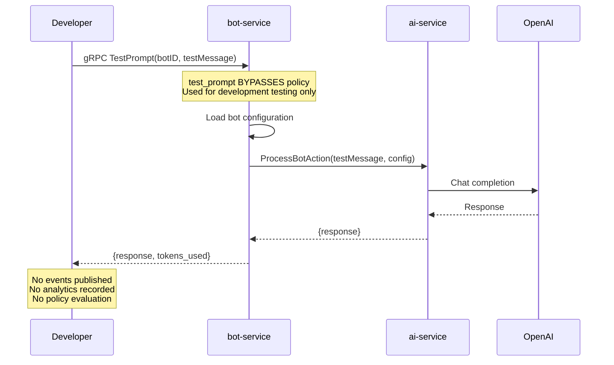

# 14 — Bot Action Execution Flow

> AI bot lifecycle, permission model, tool execution, policy gating, and LLM integration.

## Bot Architecture Overview

## Bot Action Execution Flow

## Bot Permission Model

## 11 Built-in Tools

## Bot Lifecycle

## Bot Chat Handoff Flow

## Test Prompt Flow (Development Only)

