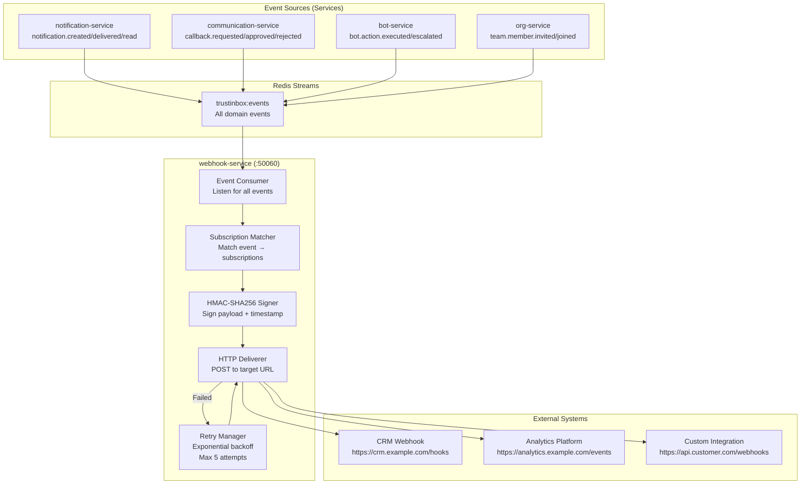
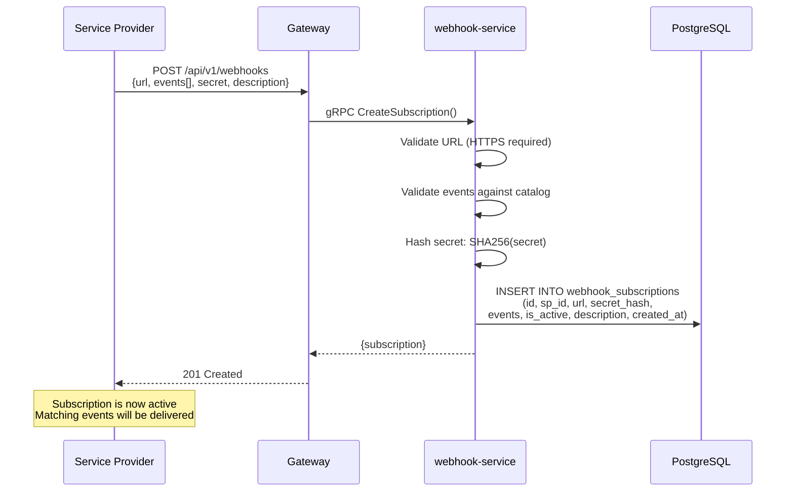
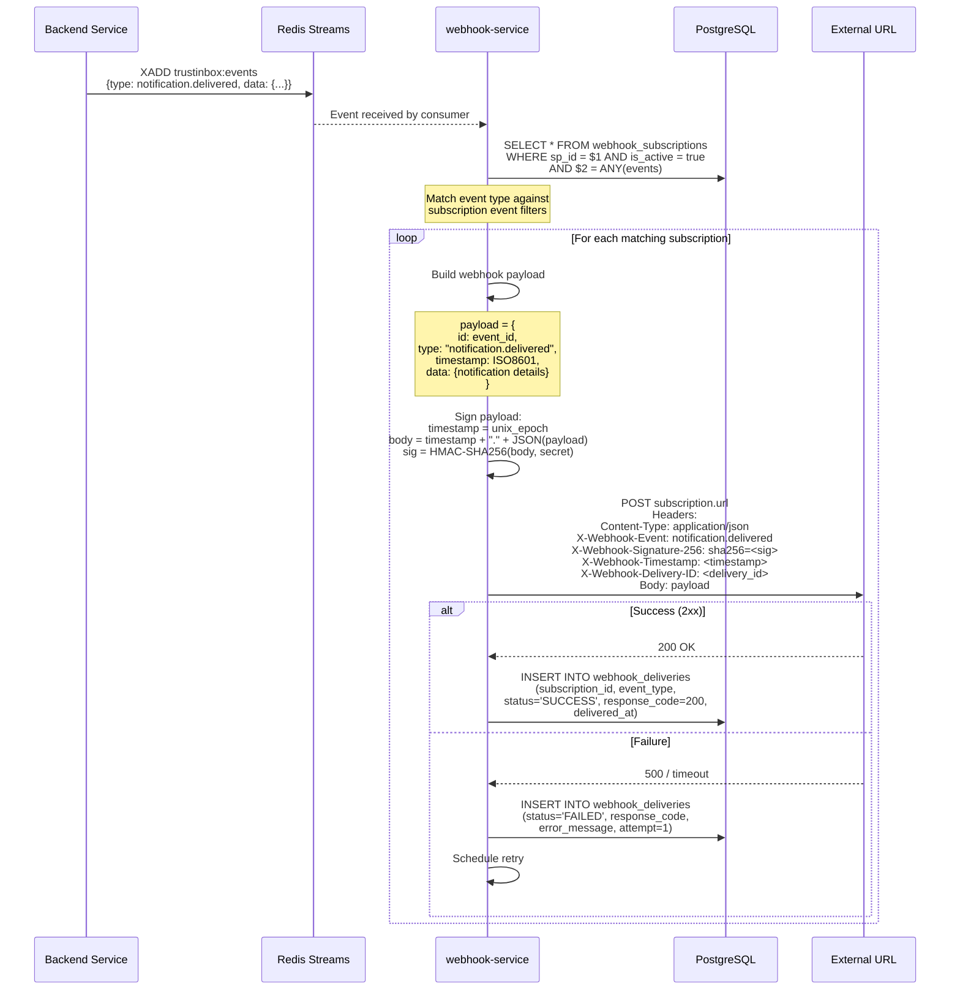
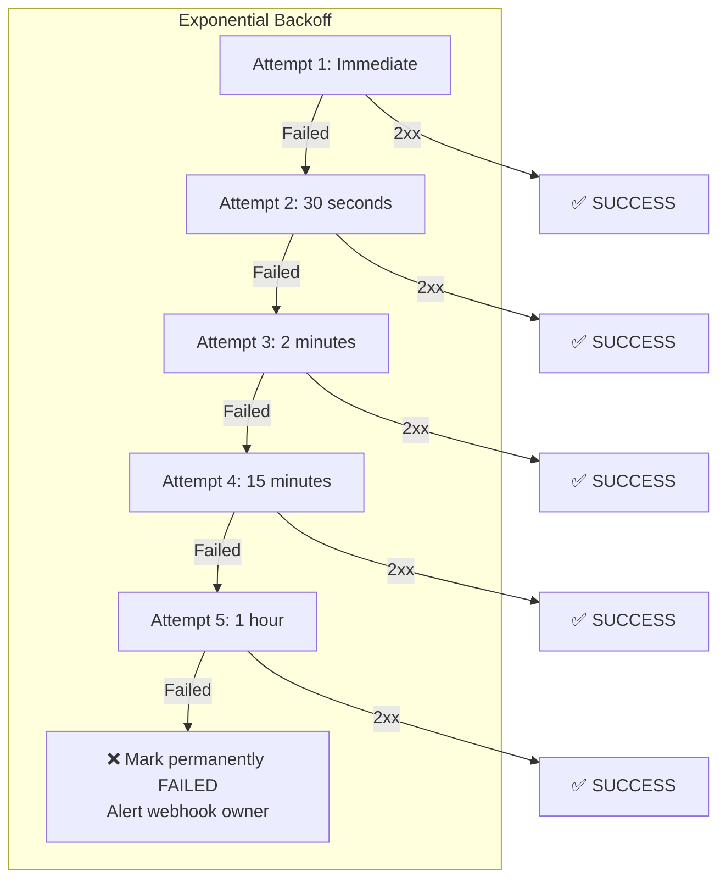
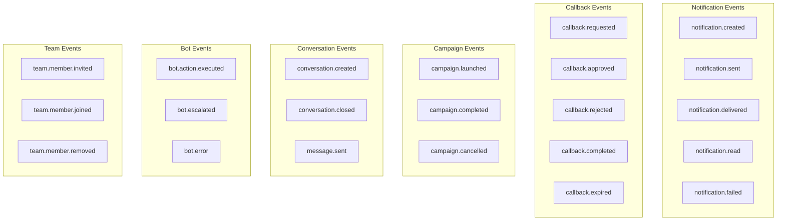
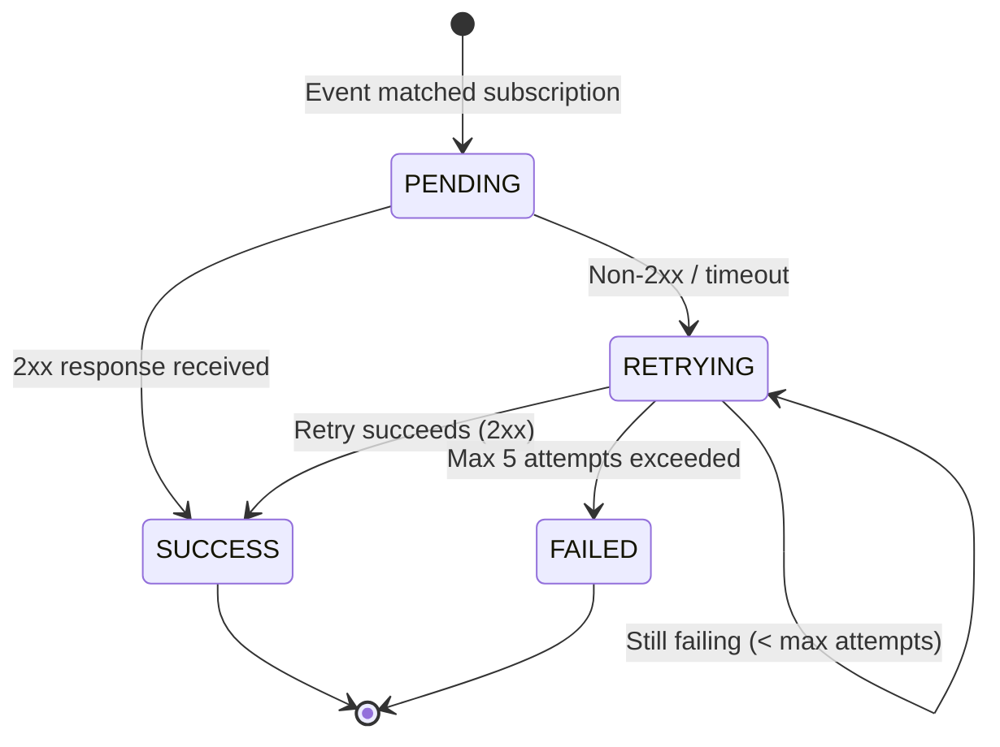
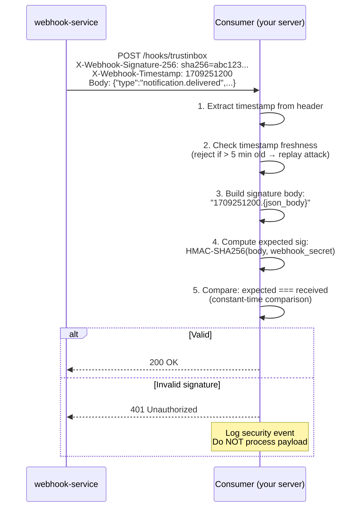

# 15 — Webhook Delivery Flow

> Event-driven webhook subscriptions, HMAC-SHA256 signing, delivery, retry logic, and failure handling.

## Webhook Architecture

## Webhook Subscription Management

## Webhook Event Delivery

## Retry Strategy

## Webhook Event Catalog

## Webhook Delivery States

## Webhook Signature Verification (Consumer Side)

