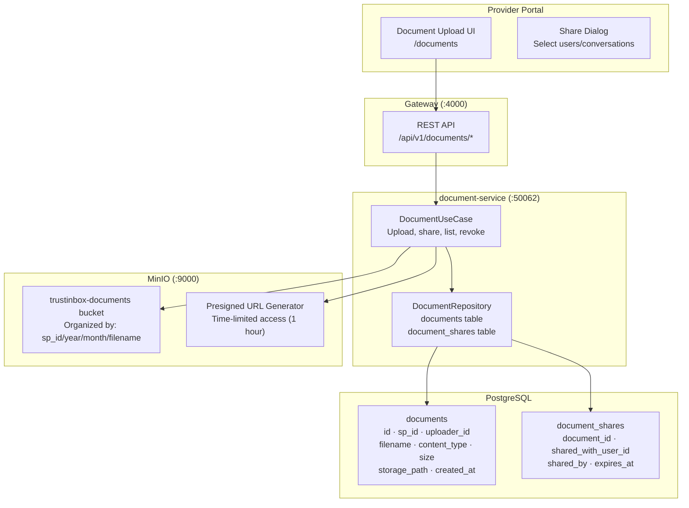
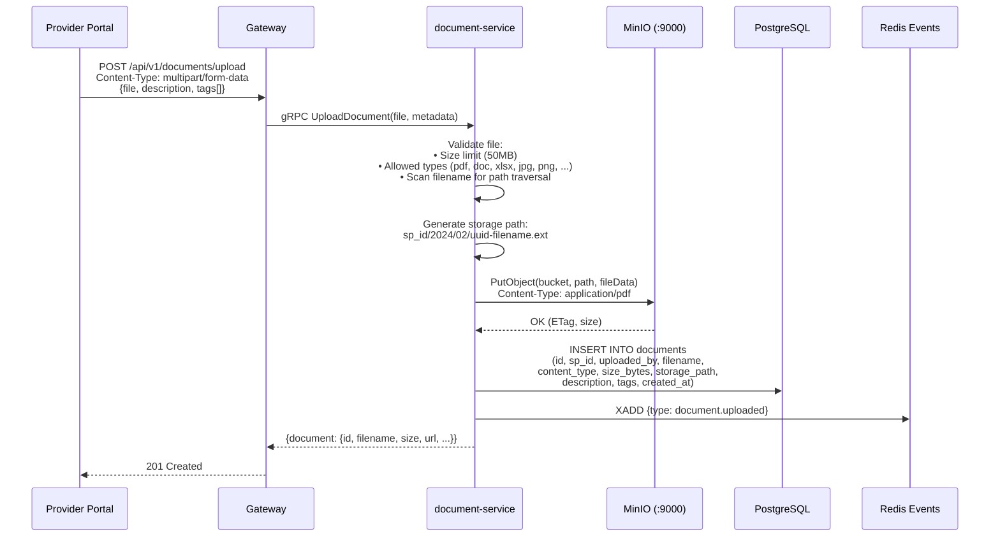
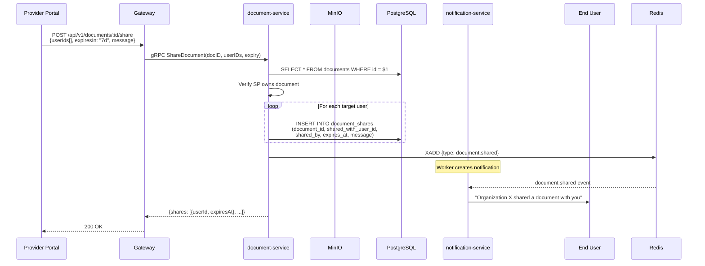
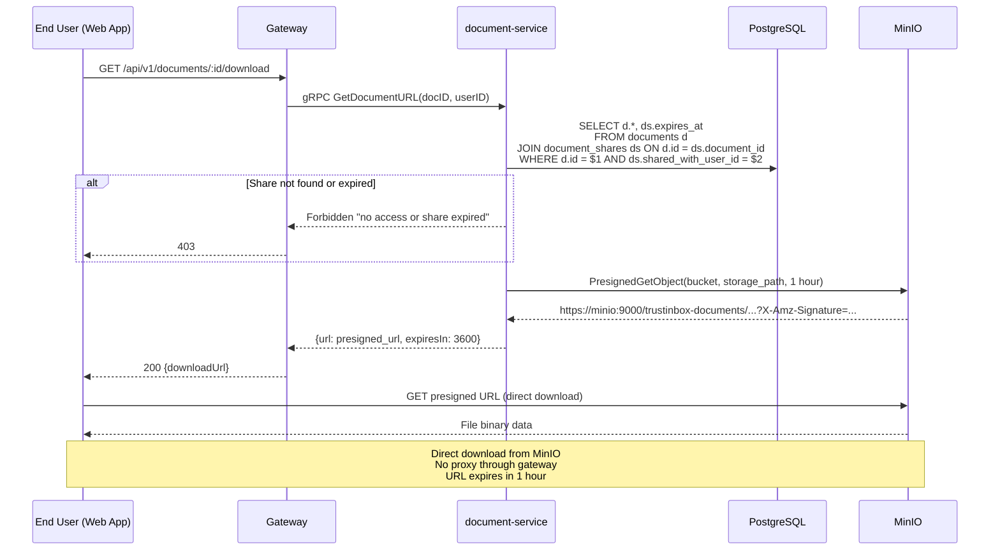
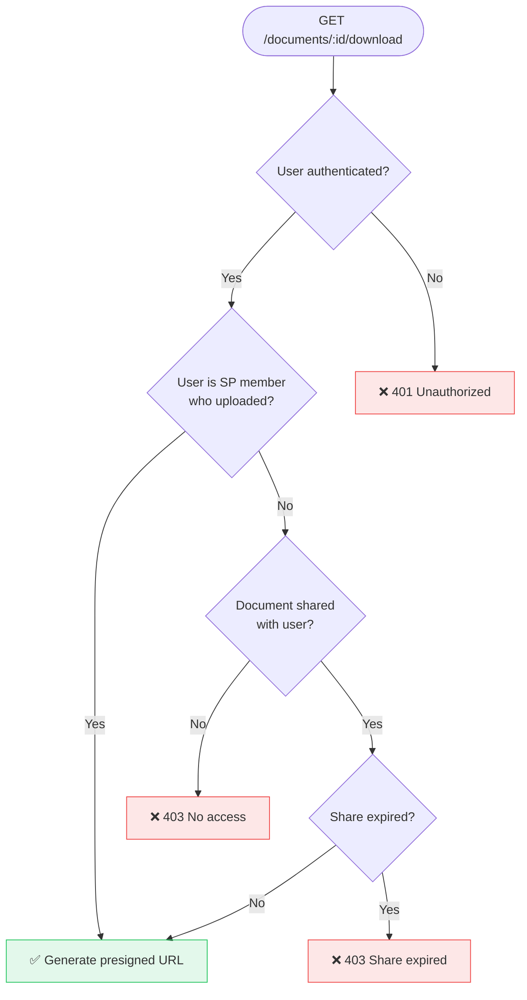
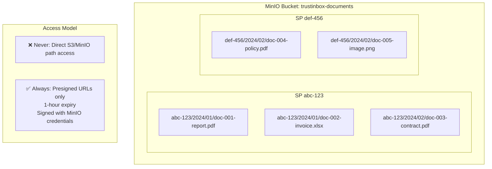

# 16 — Document Sharing Flow

> Secure document upload via MinIO, sharing with presigned URLs, access control, and metadata tracking.

## Document Architecture

## Document Upload Flow

## Document Sharing Flow

## Document Download (Presigned URL)

## Document Access Control

## Document Storage Layout (MinIO)

