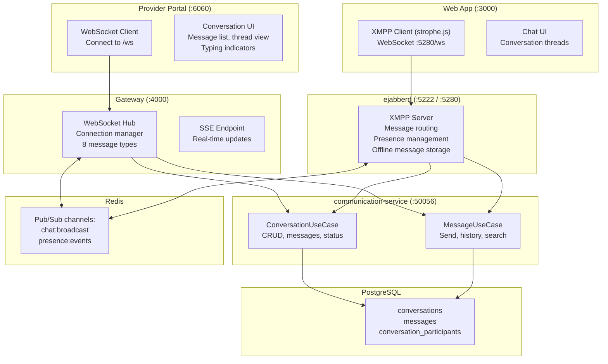
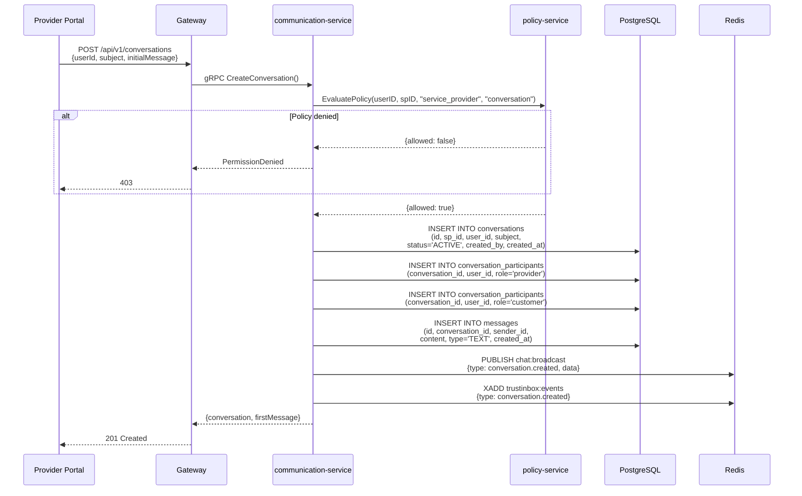
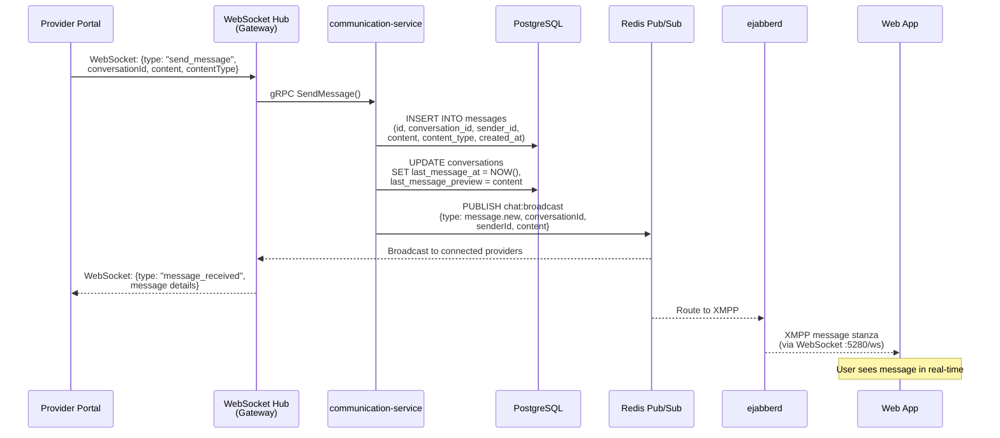
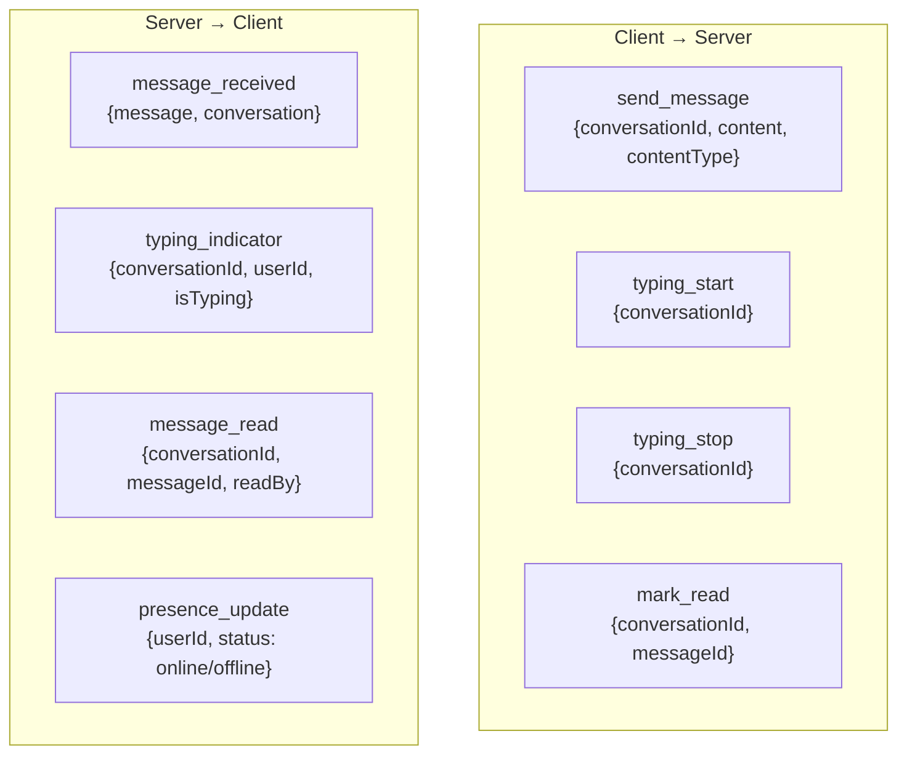
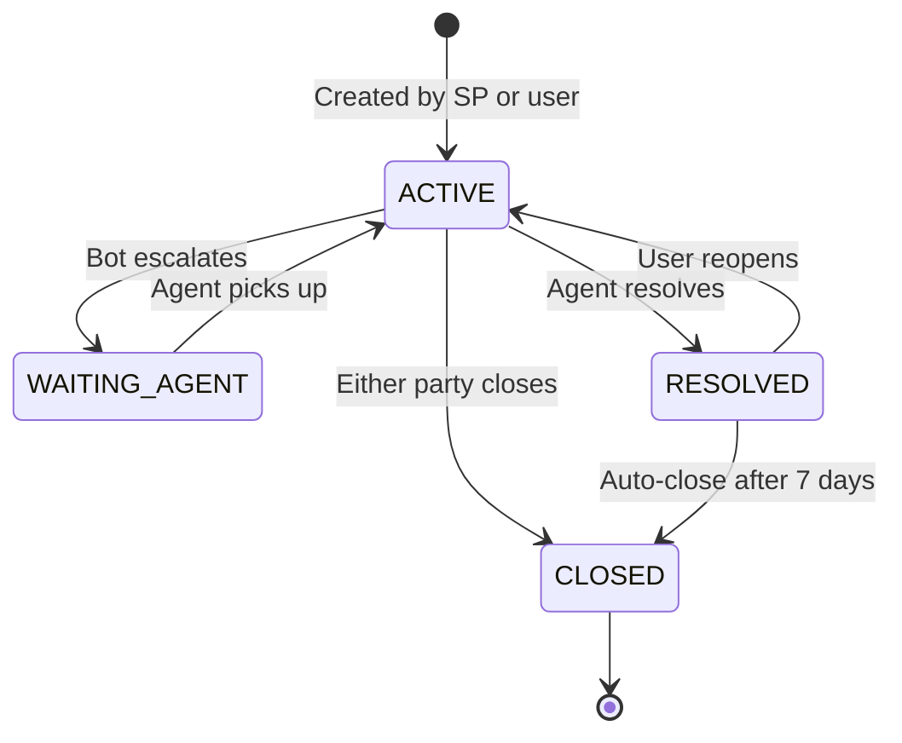
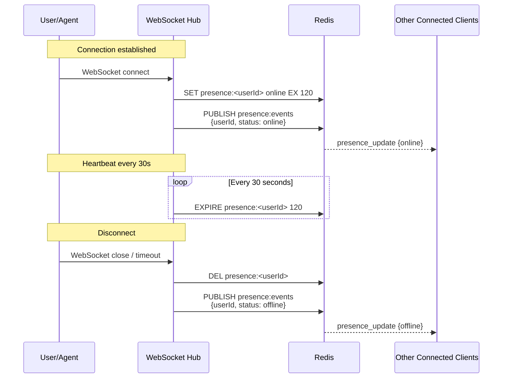
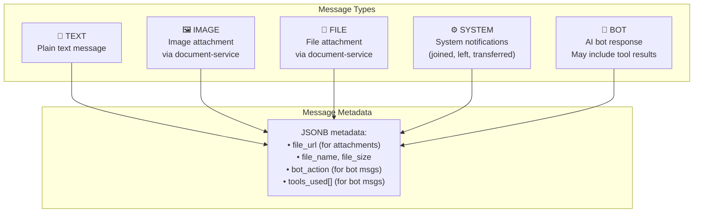
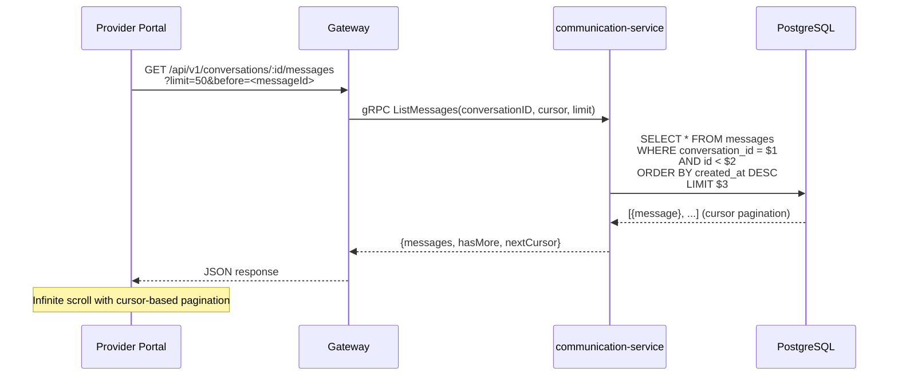

# 17 — Conversation & Chat Flow

> Secure messaging between users and service providers via WebSocket hub, XMPP, and persistence layer.

## Chat Architecture

## Conversation Creation Flow

## Real-Time Message Flow (Provider → User)

## WebSocket Message Types

## Conversation State Machine

## Presence Management

## Message Types & Content

## Conversation Search & History

