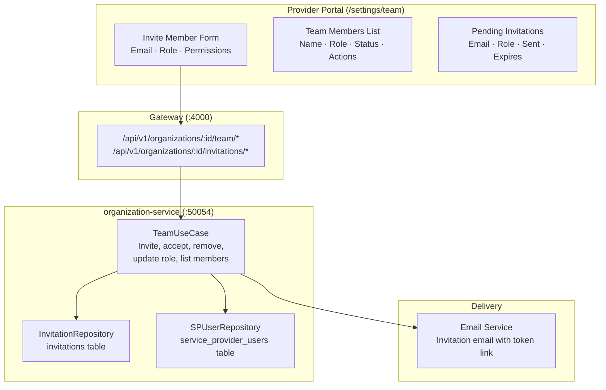
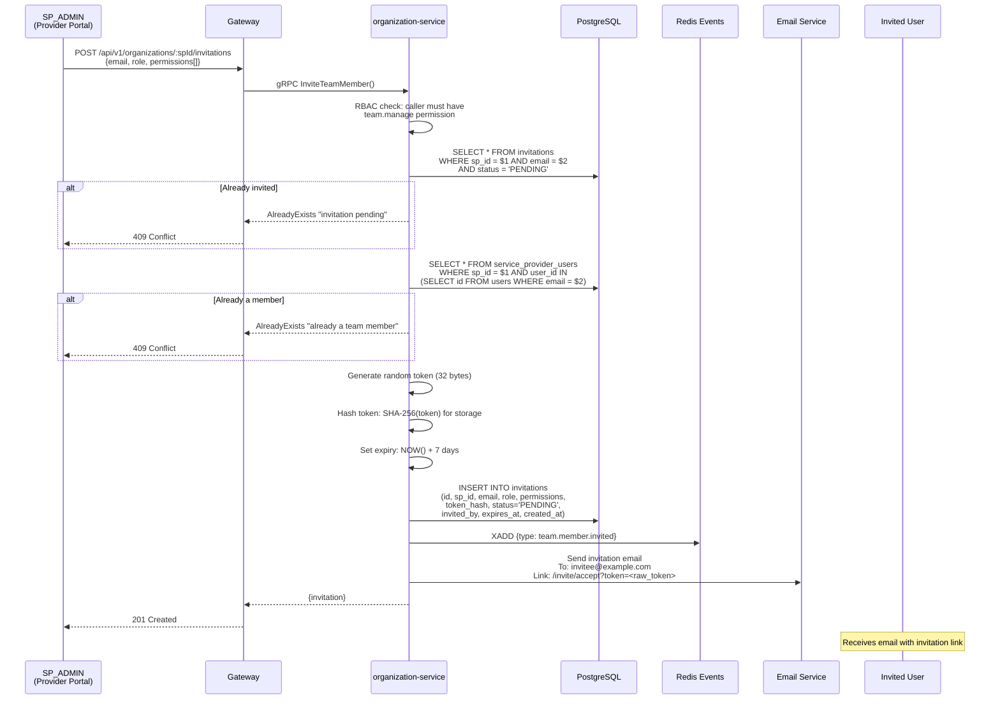
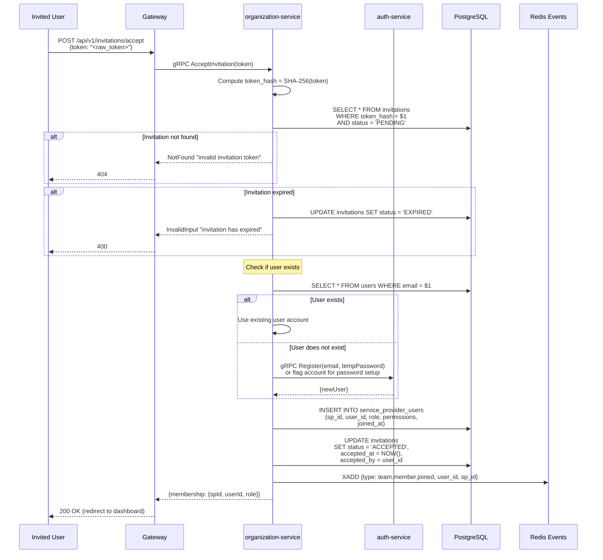
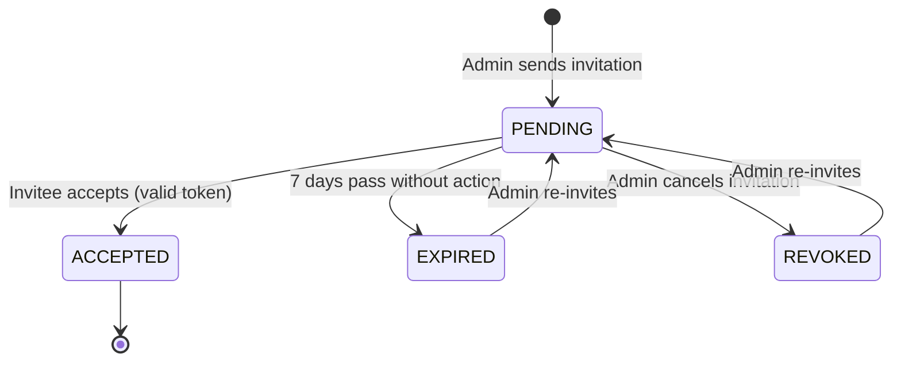
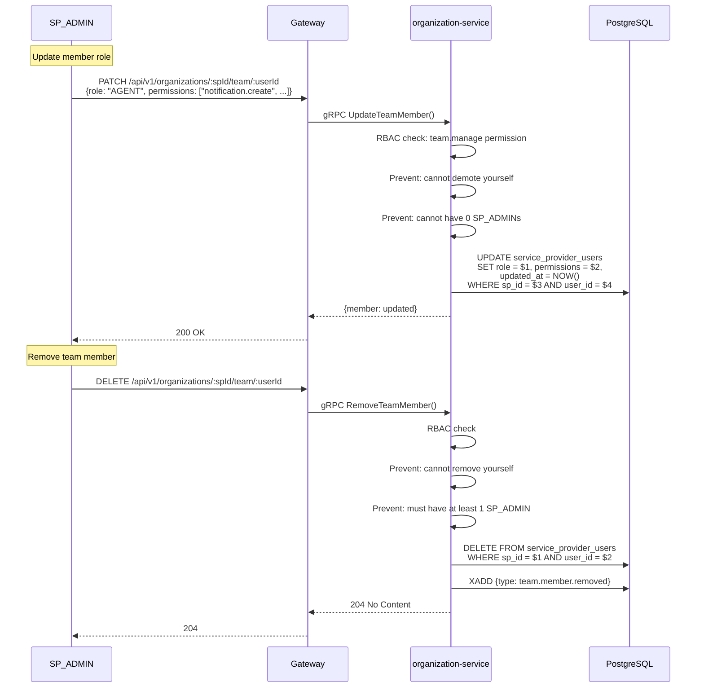
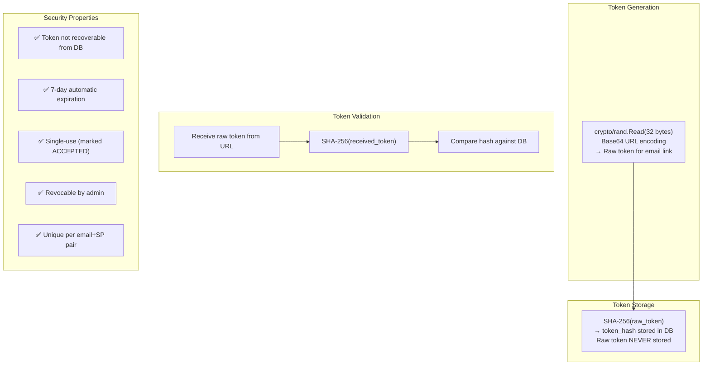
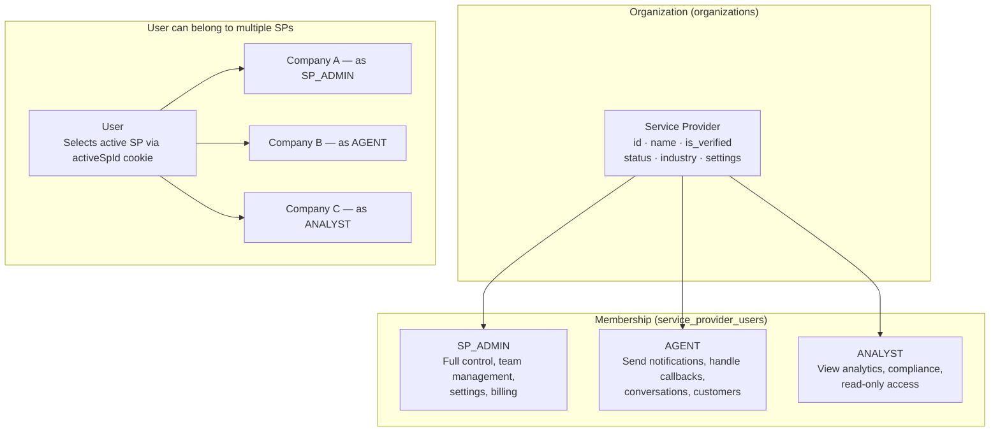

# 18 — Team Invitation Flow

> Service provider team management with token-based invitations, role assignment, and org membership lifecycle.

## Team Management Architecture

## Invitation Flow

## Invitation Acceptance Flow

## Invitation State Machine

## Team Role Management

## Token Security Model

## Organization Membership Model

