# 19 — Twin Sequence Diagrams (Provider ↔ Customer)

> Each feature is shown as a **twin pair**: the left lane shows the Service Provider's side (what they initiate) and the right lane shows the Customer's side (what they experience). Both flows share the same backend pipeline.
>
> **Observation notes** are embedded after each diagram.

---

## Feature 01 · Authentication & Token Lifecycle

### Provider-Side Login

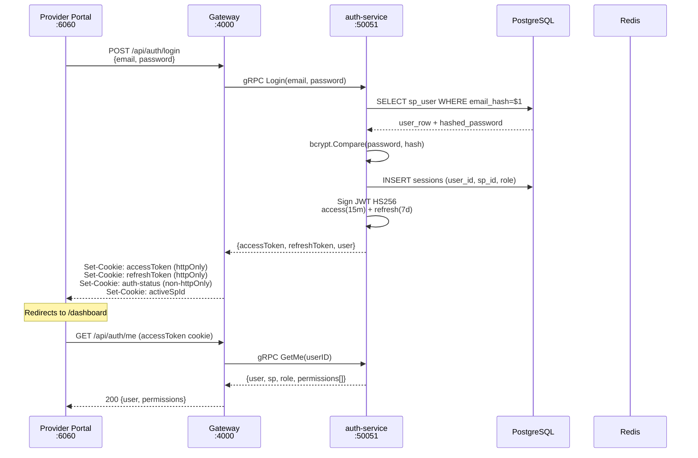
```mermaid
sequenceDiagram
    participant PUI as Provider Portal<br/>:6060
    participant GW as Gateway<br/>:4000
    participant Auth as auth-service<br/>:50051
    participant PG as PostgreSQL
    participant Redis as Redis

    PUI->>GW: POST /api/auth/login<br/>{email, password}
    GW->>Auth: gRPC Login(email, password)
    Auth->>PG: SELECT sp_user WHERE email_hash=$1
    PG-->>Auth: user_row + hashed_password
    Auth->>Auth: bcrypt.Compare(password, hash)
    Auth->>PG: INSERT sessions (user_id, sp_id, role)
    Auth->>Auth: Sign JWT HS256<br/>access(15m) + refresh(7d)
    Auth-->>GW: {accessToken, refreshToken, user}
    GW-->>PUI: Set-Cookie: accessToken (httpOnly)<br/>Set-Cookie: refreshToken (httpOnly)<br/>Set-Cookie: auth-status (non-httpOnly)<br/>Set-Cookie: activeSpId
    Note over PUI: Redirects to /dashboard
    PUI->>GW: GET /api/auth/me (accessToken cookie)
    GW->>Auth: gRPC GetMe(userID)
    Auth-->>GW: {user, sp, role, permissions[]}
    GW-->>PUI: 200 {user, permissions}
```

### Customer-Side Login

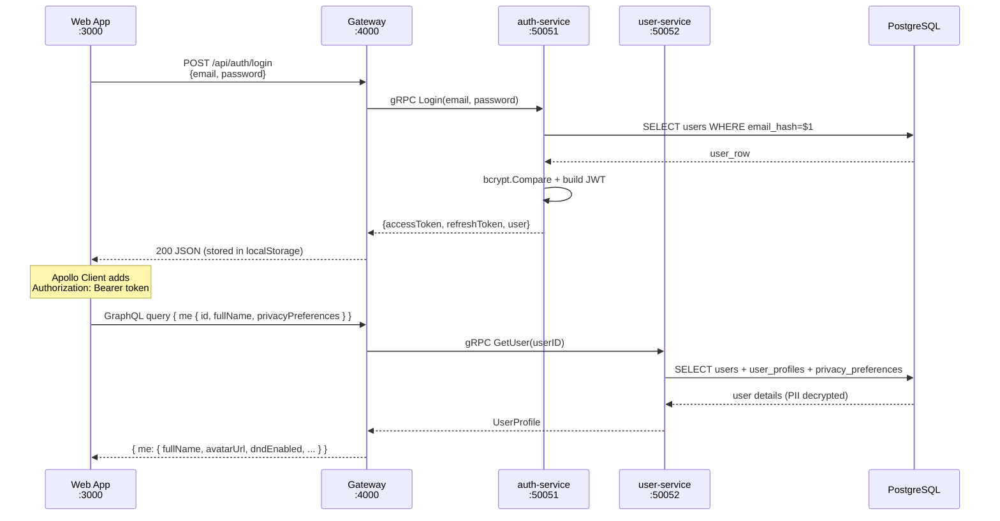
```mermaid
sequenceDiagram
    participant WEB as Web App<br/>:3000
    participant GW as Gateway<br/>:4000
    participant Auth as auth-service<br/>:50051
    participant User as user-service<br/>:50052
    participant PG as PostgreSQL

    WEB->>GW: POST /api/auth/login<br/>{email, password}
    GW->>Auth: gRPC Login(email, password)
    Auth->>PG: SELECT users WHERE email_hash=$1
    PG-->>Auth: user_row
    Auth->>Auth: bcrypt.Compare + build JWT
    Auth-->>GW: {accessToken, refreshToken, user}
    GW-->>WEB: 200 JSON (stored in localStorage)
    Note over WEB: Apollo Client adds<br/>Authorization: Bearer token
    WEB->>GW: GraphQL query { me { id, fullName, privacyPreferences } }
    GW->>User: gRPC GetUser(userID)
    User->>PG: SELECT users + user_profiles + privacy_preferences
    PG-->>User: user details (PII decrypted)
    User-->>GW: UserProfile
    GW-->>WEB: { me: { fullName, avatarUrl, dndEnabled, ... } }
```

> **Observations:**
> - Provider uses httpOnly cookies (no XSS risk). Web app uses localStorage (legacy — migration to cookies planned for Next.js 15 upgrade).
> - JWT is HS256 with 15-minute access + 7-day refresh rotation.
> - PII fields (email, phone) are AES-256-GCM encrypted in PostgreSQL; only decrypted at the service layer.
> - `auth-status` cookie is non-httpOnly intentionally — read by Next.js middleware to determine redirect without a network call.

---

## Feature 02 · Notification Delivery

### Provider-Side: Send Notification

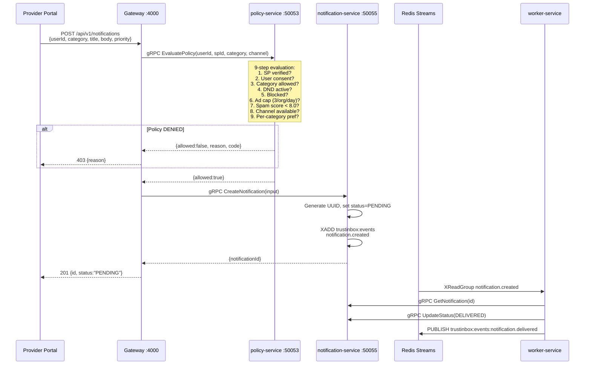
```mermaid
sequenceDiagram
    participant PUI as Provider Portal
    participant GW as Gateway :4000
    participant PS as policy-service :50053
    participant NS as notification-service :50055
    participant Redis as Redis Streams
    participant Worker as worker-service

    PUI->>GW: POST /api/v1/notifications<br/>{userId, category, title, body, priority}
    GW->>PS: gRPC EvaluatePolicy(userId, spId, category, channel)

    Note over PS: 9-step evaluation:<br/>1. SP verified?<br/>2. User consent?<br/>3. Category allowed?<br/>4. DND active?<br/>5. Blocked?<br/>6. Ad cap (3/org/day)?<br/>7. Spam score < 8.0?<br/>8. Channel available?<br/>9. Per-category pref?

    alt Policy DENIED
        PS-->>GW: {allowed:false, reason, code}
        GW-->>PUI: 403 {reason}
    end

    PS-->>GW: {allowed:true}
    GW->>NS: gRPC CreateNotification(input)
    NS->>NS: Generate UUID, set status=PENDING
    NS->>NS: XADD trustinbox:events<br/>notification.created
    NS-->>GW: {notificationId}
    GW-->>PUI: 201 {id, status:"PENDING"}

    Redis->>Worker: XReadGroup notification.created
    Worker->>NS: gRPC GetNotification(id)
    Worker->>NS: gRPC UpdateStatus(DELIVERED)
    Worker->>Redis: PUBLISH trustinbox:events:notification.delivered
```

### Customer-Side: Receive Notification

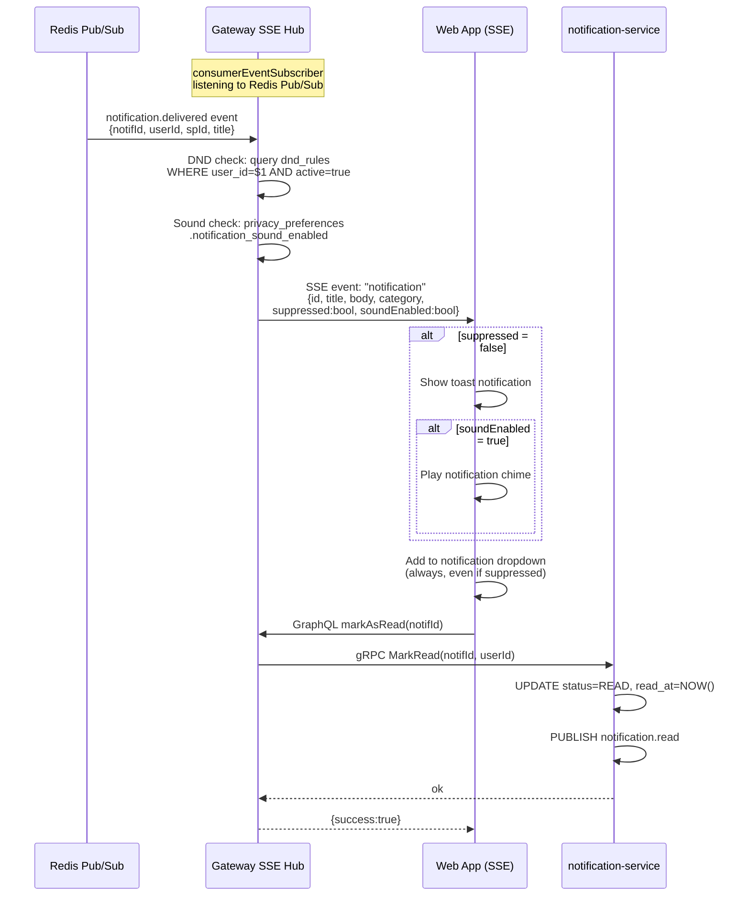
```mermaid
sequenceDiagram
    participant Redis as Redis Pub/Sub
    participant GW as Gateway SSE Hub
    participant WEB as Web App (SSE)
    participant NS as notification-service

    Note over GW: consumerEventSubscriber<br/>listening to Redis Pub/Sub
    Redis->>GW: notification.delivered event<br/>{notifId, userId, spId, title}

    GW->>GW: DND check: query dnd_rules<br/>WHERE user_id=$1 AND active=true
    GW->>GW: Sound check: privacy_preferences<br/>.notification_sound_enabled

    GW->>WEB: SSE event: "notification"<br/>{id, title, body, category,<br/>suppressed:bool, soundEnabled:bool}

    alt suppressed = false
        WEB->>WEB: Show toast notification
        alt soundEnabled = true
            WEB->>WEB: Play notification chime
        end
    end

    WEB->>WEB: Add to notification dropdown<br/>(always, even if suppressed)
    WEB->>GW: GraphQL markAsRead(notifId)
    GW->>NS: gRPC MarkRead(notifId, userId)
    NS->>NS: UPDATE status=READ, read_at=NOW()
    NS->>NS: PUBLISH notification.read
    NS-->>GW: ok
    GW-->>WEB: {success:true}
```

> **Observations:**
> - Policy evaluation is the mandatory gatekeeper — 9 sequential checks. If any fails, the notification never reaches the queue.
> - SSE is the real-time channel for provider portal and web app. XMPP (ejabberd) handles chat only.
> - The `suppressed` flag decouples DND from dropdown visibility — user still sees suppressed notifications in their inbox, just without sound/toast.
> - Ad cap (3/org/day) is enforced at policy level using a Redis counter, not a DB query, for performance.

---

## Feature 03 · Callback Request Flow

### Provider-Side: Request Callback

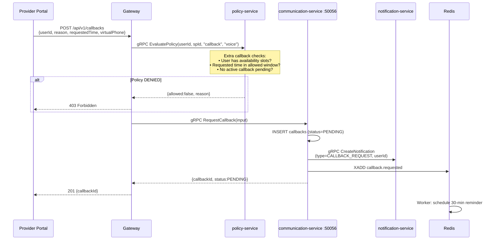
```mermaid
sequenceDiagram
    participant PUI as Provider Portal
    participant GW as Gateway
    participant PS as policy-service
    participant Comm as communication-service :50056
    participant NS as notification-service
    participant Redis as Redis

    PUI->>GW: POST /api/v1/callbacks<br/>{userId, reason, requestedTime, virtualPhone}
    GW->>PS: gRPC EvaluatePolicy(userId, spId, "callback", "voice")

    Note over PS: Extra callback checks:<br/>• User has availability slots?<br/>• Requested time in allowed window?<br/>• No active callback pending?

    alt Policy DENIED
        PS-->>GW: {allowed:false, reason}
        GW-->>PUI: 403 Forbidden
    end

    GW->>Comm: gRPC RequestCallback(input)
    Comm->>Comm: INSERT callbacks (status=PENDING)
    Comm->>NS: gRPC CreateNotification<br/>(type=CALLBACK_REQUEST, userId)
    Comm->>Redis: XADD callback.requested
    Comm-->>GW: {callbackId, status:PENDING}
    GW-->>PUI: 201 {callbackId}

    Redis->>Redis: Worker: schedule 30-min reminder
```

### Customer-Side: Approve/Reject

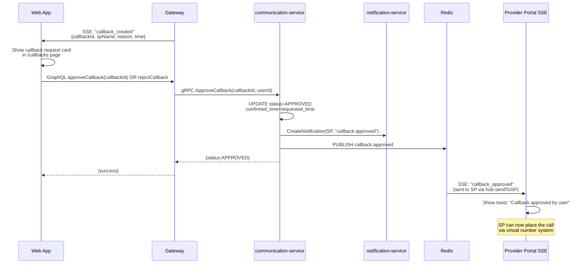
```mermaid
sequenceDiagram
    participant WEB as Web App
    participant GW as Gateway
    participant Comm as communication-service
    participant NS as notification-service
    participant Redis as Redis
    participant SSESP as Provider Portal SSE

    GW->>WEB: SSE: "callback_created"<br/>{callbackId, spName, reason, time}
    WEB->>WEB: Show callback request card<br/>in /callbacks page
    WEB->>GW: GraphQL approveCallback(callbackId) OR rejectCallback
    GW->>Comm: gRPC ApproveCallback(callbackId, userId)
    Comm->>Comm: UPDATE status=APPROVED<br/>confirmed_time=requested_time
    Comm->>NS: CreateNotification(SP, "callback approved")
    Comm->>Redis: PUBLISH callback.approved
    Comm-->>GW: {status:APPROVED}
    GW-->>WEB: {success}

    Redis->>SSESP: SSE: "callback_approved"<br/>(sent to SP via hub.sendToSP)
    SSESP->>SSESP: Show toast: "Callback approved by user"
    Note over SSESP: SP can now place the call<br/>via virtual number system
```

> **Observations:**
> - Callbacks require explicit user approval unless `policy.allow_direct_calls = true`.
> - Virtual phone numbers ensure real numbers are never exposed to SPs.
> - The 30-min reminder is scheduled as a delayed job in worker-service using Redis Streams TTL.
> - Callback expiry (72h) is handled by the CleanupProcessor in worker-service.

---

## Feature 04 · Campaign Launch & Fan-out

### Provider-Side: Create & Launch Campaign

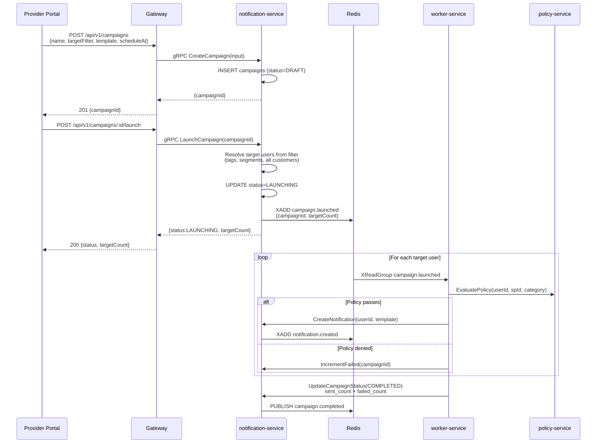
```mermaid
sequenceDiagram
    participant PUI as Provider Portal
    participant GW as Gateway
    participant NS as notification-service
    participant Redis as Redis
    participant Worker as worker-service
    participant PS as policy-service

    PUI->>GW: POST /api/v1/campaigns<br/>{name, targetFilter, template, scheduleAt}
    GW->>NS: gRPC CreateCampaign(input)
    NS->>NS: INSERT campaigns (status=DRAFT)
    NS-->>GW: {campaignId}
    GW-->>PUI: 201 {campaignId}

    PUI->>GW: POST /api/v1/campaigns/:id/launch
    GW->>NS: gRPC LaunchCampaign(campaignId)
    NS->>NS: Resolve target users from filter<br/>(tags, segments, all customers)
    NS->>NS: UPDATE status=LAUNCHING
    NS->>Redis: XADD campaign.launched<br/>{campaignId, targetCount}
    NS-->>GW: {status:LAUNCHING, targetCount}
    GW-->>PUI: 200 {status, targetCount}

    loop For each target user
        Redis->>Worker: XReadGroup campaign.launched
        Worker->>PS: EvaluatePolicy(userId, spId, category)
        alt Policy passes
            Worker->>NS: CreateNotification(userId, template)
            NS->>Redis: XADD notification.created
        else Policy denied
            Worker->>NS: IncrementFailed(campaignId)
        end
    end

    Worker->>NS: UpdateCampaignStatus(COMPLETED)<br/>sent_count + failed_count
    NS->>Redis: PUBLISH campaign.completed
```

### Customer-Side: Receive Campaign Notification

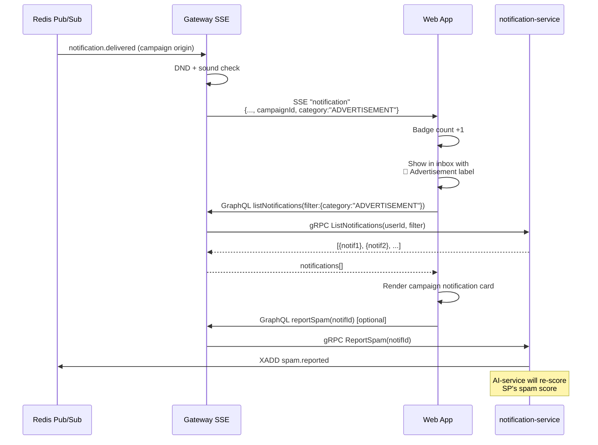
```mermaid
sequenceDiagram
    participant Redis as Redis Pub/Sub
    participant GW as Gateway SSE
    participant WEB as Web App
    participant NS as notification-service

    Redis->>GW: notification.delivered (campaign origin)
    GW->>GW: DND + sound check
    GW->>WEB: SSE "notification"<br/>{..., campaignId, category:"ADVERTISEMENT"}
    WEB->>WEB: Badge count +1
    WEB->>WEB: Show in inbox with<br/>📢 Advertisement label
    WEB->>GW: GraphQL listNotifications(filter:{category:"ADVERTISEMENT"})
    GW->>NS: gRPC ListNotifications(userId, filter)
    NS-->>GW: [{notif1}, {notif2}, ...]
    GW-->>WEB: notifications[]
    WEB->>WEB: Render campaign notification card
    WEB->>GW: GraphQL reportSpam(notifId) [optional]
    GW->>NS: gRPC ReportSpam(notifId)
    NS->>Redis: XADD spam.reported
    Note over NS: AI-service will re-score<br/>SP's spam score
```

> **Observations:**
> - Fan-out is fully async via Redis Streams — even 100k-target campaigns don't block the launch API call.
> - Per-target policy evaluation happens inside the worker, not the gateway — the SP never knows which users were blocked (privacy).
> - Ad cap enforcement during fan-out is per-user, so different users hit different caps at different times during the same campaign.

---

## Feature 05 · Secure Conversation & Chat

### Provider-Side: Initiate Conversation

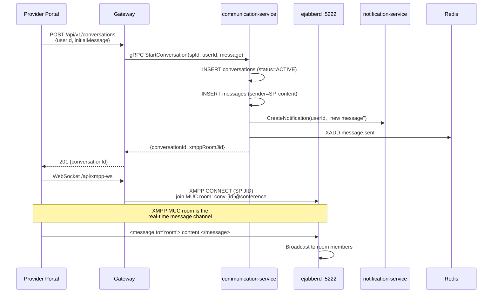
```mermaid
sequenceDiagram
    participant PUI as Provider Portal
    participant GW as Gateway
    participant Comm as communication-service
    participant XMPP as ejabberd :5222
    participant NS as notification-service
    participant Redis as Redis

    PUI->>GW: POST /api/v1/conversations<br/>{userId, initialMessage}
    GW->>Comm: gRPC StartConversation(spId, userId, message)
    Comm->>Comm: INSERT conversations (status=ACTIVE)
    Comm->>Comm: INSERT messages (sender=SP, content)
    Comm->>NS: CreateNotification(userId, "new message")
    Comm->>Redis: XADD message.sent
    Comm-->>GW: {conversationId, xmppRoomJid}
    GW-->>PUI: 201 {conversationId}

    PUI->>GW: WebSocket /api/xmpp-ws
    GW->>XMPP: XMPP CONNECT (SP JID)<br/>join MUC room: conv-{id}@conference
    Note over PUI,XMPP: XMPP MUC room is the<br/>real-time message channel
    PUI->>XMPP: <message to="room"> content </message>
    XMPP->>XMPP: Broadcast to room members
```

### Customer-Side: Receive & Reply

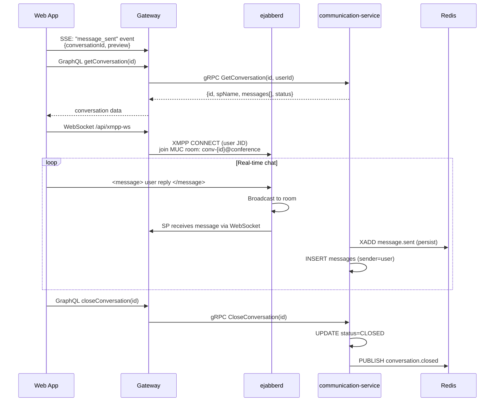
```mermaid
sequenceDiagram
    participant WEB as Web App
    participant GW as Gateway
    participant XMPP as ejabberd
    participant Comm as communication-service
    participant Redis as Redis

    WEB->>GW: SSE: "message_sent" event<br/>{conversationId, preview}
    WEB->>GW: GraphQL getConversation(id)
    GW->>Comm: gRPC GetConversation(id, userId)
    Comm-->>GW: {id, spName, messages[], status}
    GW-->>WEB: conversation data

    WEB->>GW: WebSocket /api/xmpp-ws
    GW->>XMPP: XMPP CONNECT (user JID)<br/>join MUC room: conv-{id}@conference

    loop Real-time chat
        WEB->>XMPP: <message> user reply </message>
        XMPP->>XMPP: Broadcast to room
        XMPP->>GW: SP receives message via WebSocket
        Comm->>Redis: XADD message.sent (persist)
        Comm->>Comm: INSERT messages (sender=user)
    end

    WEB->>GW: GraphQL closeConversation(id)
    GW->>Comm: gRPC CloseConversation(id)
    Comm->>Comm: UPDATE status=CLOSED
    Comm->>Redis: PUBLISH conversation.closed
```

> **Observations:**
> - XMPP (ejabberd) handles real-time message delivery. PostgreSQL is the persistent message store.
> - The Gateway acts as an XMPP proxy for web clients — they connect via WebSocket, not native XMPP.
> - SP can never initiate a conversation if policy denies it. Once a conversation exists, messages flow through the XMPP MUC room.
> - Messages are persisted in `communication-service` regardless of XMPP delivery status (offline delivery).

---

## Feature 06 · Document Upload & Secure Sharing

### Provider-Side: Upload & Share

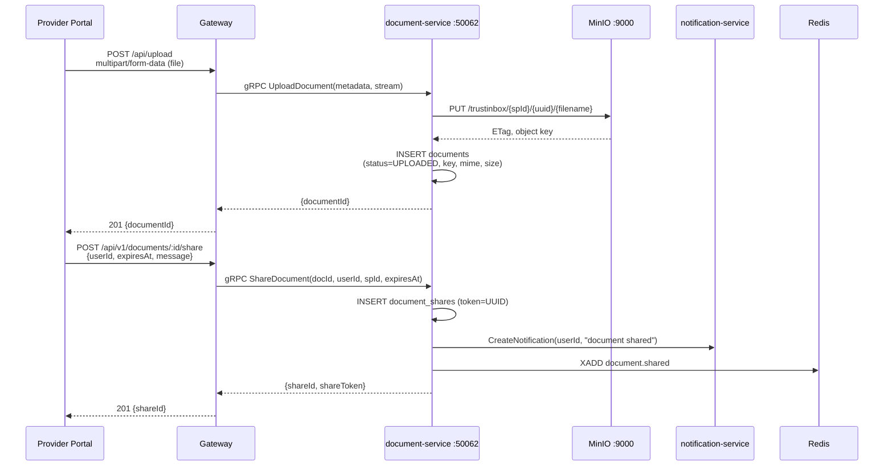
```mermaid
sequenceDiagram
    participant PUI as Provider Portal
    participant GW as Gateway
    participant Doc as document-service :50062
    participant MinIO as MinIO :9000
    participant NS as notification-service
    participant Redis as Redis

    PUI->>GW: POST /api/upload<br/>multipart/form-data (file)
    GW->>Doc: gRPC UploadDocument(metadata, stream)
    Doc->>MinIO: PUT /trustinbox/{spId}/{uuid}/{filename}
    MinIO-->>Doc: ETag, object key
    Doc->>Doc: INSERT documents<br/>(status=UPLOADED, key, mime, size)
    Doc-->>GW: {documentId}
    GW-->>PUI: 201 {documentId}

    PUI->>GW: POST /api/v1/documents/:id/share<br/>{userId, expiresAt, message}
    GW->>Doc: gRPC ShareDocument(docId, userId, spId, expiresAt)
    Doc->>Doc: INSERT document_shares (token=UUID)
    Doc->>NS: CreateNotification(userId, "document shared")
    Doc->>Redis: XADD document.shared
    Doc-->>GW: {shareId, shareToken}
    GW-->>PUI: 201 {shareId}
```

### Customer-Side: View & Download

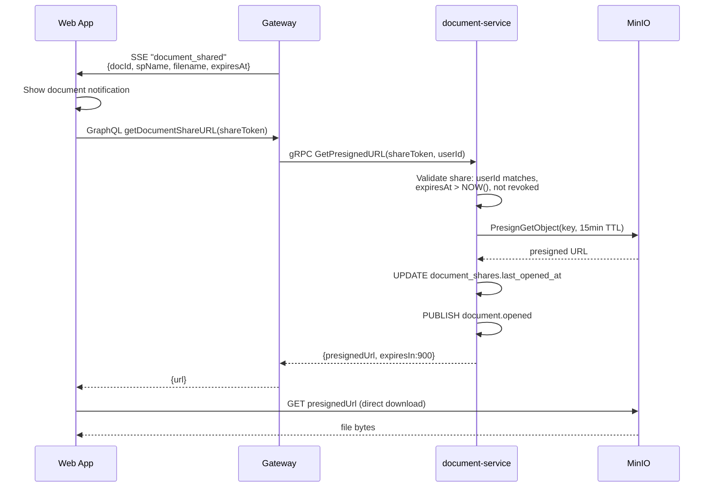
```mermaid
sequenceDiagram
    participant WEB as Web App
    participant GW as Gateway
    participant Doc as document-service
    participant MinIO as MinIO

    GW->>WEB: SSE "document_shared"<br/>{docId, spName, filename, expiresAt}
    WEB->>WEB: Show document notification
    WEB->>GW: GraphQL getDocumentShareURL(shareToken)
    GW->>Doc: gRPC GetPresignedURL(shareToken, userId)
    Doc->>Doc: Validate share: userId matches,<br/>expiresAt > NOW(), not revoked
    Doc->>MinIO: PresignGetObject(key, 15min TTL)
    MinIO-->>Doc: presigned URL
    Doc->>Doc: UPDATE document_shares.last_opened_at
    Doc->>Doc: PUBLISH document.opened
    Doc-->>GW: {presignedUrl, expiresIn:900}
    GW-->>WEB: {url}
    WEB->>MinIO: GET presignedUrl (direct download)
    MinIO-->>WEB: file bytes
```

> **Observations:**
> - Real file paths are never exposed — only 15-minute presigned URLs are served to customers.
> - Document access is validated at the service layer: wrong user = 403, expired = 410.
> - MinIO serves files directly to the browser (not proxied through the backend) for performance.
> - `last_opened_at` tracking enables the SP to see read receipts in analytics.

---

## Feature 07 · AI Bot — Conversation + Tool Execution

### Provider-Side: Configure & Deploy Bot

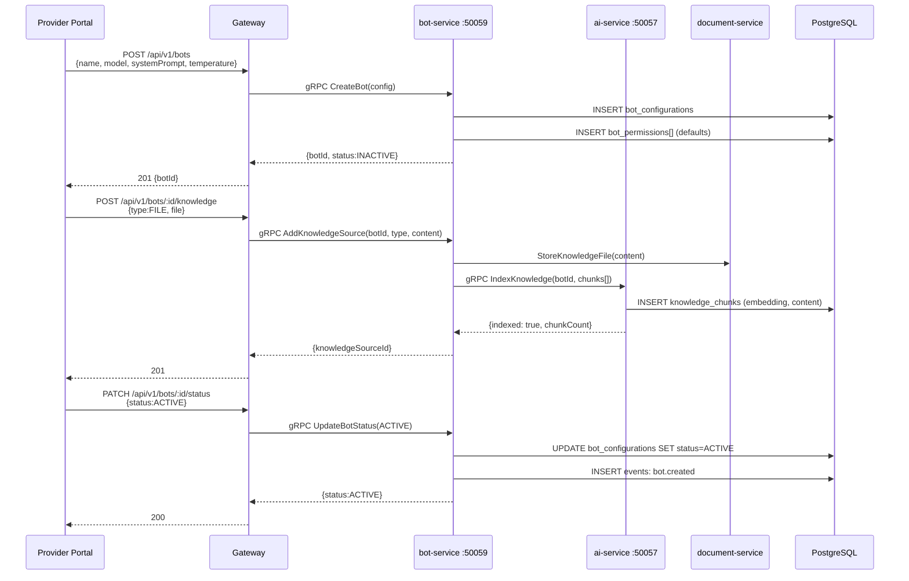
```mermaid
sequenceDiagram
    participant PUI as Provider Portal
    participant GW as Gateway
    participant Bot as bot-service :50059
    participant AI as ai-service :50057
    participant Doc as document-service
    participant PG as PostgreSQL

    PUI->>GW: POST /api/v1/bots<br/>{name, model, systemPrompt, temperature}
    GW->>Bot: gRPC CreateBot(config)
    Bot->>PG: INSERT bot_configurations
    Bot->>PG: INSERT bot_permissions[] (defaults)
    Bot-->>GW: {botId, status:INACTIVE}
    GW-->>PUI: 201 {botId}

    PUI->>GW: POST /api/v1/bots/:id/knowledge<br/>{type:FILE, file}
    GW->>Bot: gRPC AddKnowledgeSource(botId, type, content)
    Bot->>Doc: StoreKnowledgeFile(content)
    Bot->>AI: gRPC IndexKnowledge(botId, chunks[])
    AI->>PG: INSERT knowledge_chunks (embedding, content)
    AI-->>Bot: {indexed: true, chunkCount}
    Bot-->>GW: {knowledgeSourceId}
    GW-->>PUI: 201

    PUI->>GW: PATCH /api/v1/bots/:id/status<br/>{status:ACTIVE}
    GW->>Bot: gRPC UpdateBotStatus(ACTIVE)
    Bot->>PG: UPDATE bot_configurations SET status=ACTIVE
    Bot->>PG: INSERT events: bot.created
    Bot-->>GW: {status:ACTIVE}
    GW-->>PUI: 200
```

### Customer-Side: Chat With Bot

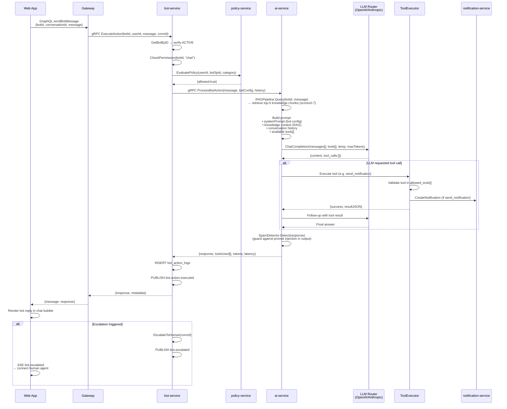
```mermaid
sequenceDiagram
    participant WEB as Web App
    participant GW as Gateway
    participant Bot as bot-service
    participant PS as policy-service
    participant AI as ai-service
    participant LLM as LLM Router<br/>(OpenAI/Anthropic)
    participant Tool as ToolExecutor
    participant NS as notification-service

    WEB->>GW: GraphQL sendBotMessage<br/>{botId, conversationId, message}
    GW->>Bot: gRPC ExecuteAction(botId, userId, message, convId)

    Bot->>Bot: GetBotByID → verify ACTIVE
    Bot->>Bot: CheckPermission(botId, "chat")
    Bot->>PS: EvaluatePolicy(userId, botSpId, category)
    PS-->>Bot: {allowed:true}

    Bot->>AI: gRPC ProcessBotAction(message, botConfig, history)

    AI->>AI: RAGPipeline.Query(botId, message)<br/>→ retrieve top-5 knowledge chunks (score≥0.7)
    AI->>AI: Build prompt:<br/>• systemPrompt (bot config)<br/>• knowledge context (RAG)<br/>• conversation history<br/>• available tools[]

    AI->>LLM: ChatCompletion(messages[], tools[], temp, maxTokens)
    LLM-->>AI: {content, tool_calls:[]}

    alt LLM requested tool call
        AI->>Tool: Execute tool (e.g. send_notification)
        Tool->>Tool: Validate tool in allowed_tools[]
        Tool->>NS: CreateNotification (if send_notification)
        Tool-->>AI: {success, resultJSON}
        AI->>LLM: Follow-up with tool result
        LLM-->>AI: Final answer
    end

    AI->>AI: SpamDetector.Detect(response)<br/>(guard against prompt injection in output)
    AI-->>Bot: {response, toolsUsed[], tokens, latency}
    Bot->>Bot: INSERT bot_action_logs
    Bot->>Bot: PUBLISH bot.action.executed
    Bot-->>GW: {response, metadata}
    GW-->>WEB: {message: response}
    WEB->>WEB: Render bot reply in chat bubble

    alt Escalation triggered
        Bot->>Bot: EscalateToHuman(convId)
        Bot->>Bot: PUBLISH bot.escalated
        WEB->>WEB: SSE bot.escalated<br/>→ connect human agent
    end
```

> **Observations:**
> - The bot pipeline is: Policy → RAG → LLM → Tool execution (optional) → Spam guard on output.
> - Spam detection runs on the **bot's output** too — prevents LLM prompt injection from reaching users.
> - n8n workflow dispatcher is an alternative trigger path — complex multi-step automations use n8n webhooks instead of direct LLM calls.
> - Knowledge chunks use cosine similarity search with configurable `top_k=5` and `min_score=0.7`.
> - The LLM Router supports OpenAI and Anthropic — fallback provider is configurable per bot.

---

## Feature 08 · Webhook Delivery

### Provider-Side: Create Subscription

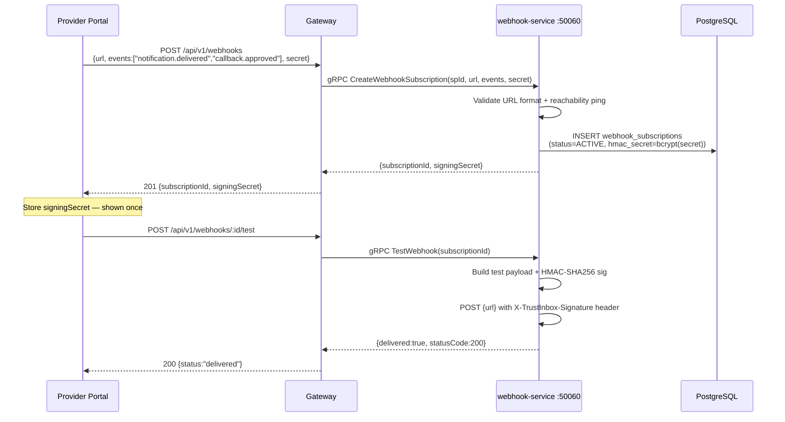
```mermaid
sequenceDiagram
    participant PUI as Provider Portal
    participant GW as Gateway
    participant WH as webhook-service :50060
    participant PG as PostgreSQL

    PUI->>GW: POST /api/v1/webhooks<br/>{url, events:["notification.delivered","callback.approved"], secret}
    GW->>WH: gRPC CreateWebhookSubscription(spId, url, events, secret)
    WH->>WH: Validate URL format + reachability ping
    WH->>PG: INSERT webhook_subscriptions<br/>(status=ACTIVE, hmac_secret=bcrypt(secret))
    WH-->>GW: {subscriptionId, signingSecret}
    GW-->>PUI: 201 {subscriptionId, signingSecret}
    Note over PUI: Store signingSecret — shown once

    PUI->>GW: POST /api/v1/webhooks/:id/test
    GW->>WH: gRPC TestWebhook(subscriptionId)
    WH->>WH: Build test payload + HMAC-SHA256 sig
    WH->>WH: POST {url} with X-TrustInbox-Signature header
    WH-->>GW: {delivered:true, statusCode:200}
    GW-->>PUI: 200 {status:"delivered"}
```

### Event → Webhook Delivery Pipeline

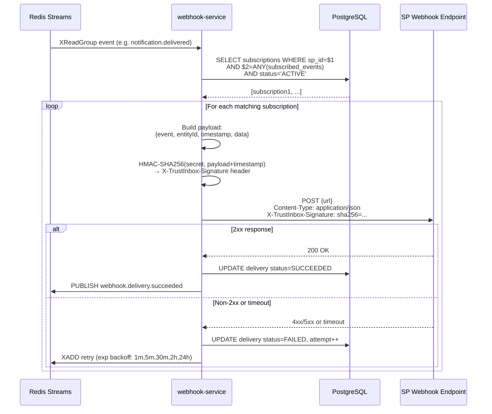
```mermaid
sequenceDiagram
    participant Redis as Redis Streams
    participant WH as webhook-service
    participant PG as PostgreSQL
    participant Endpoint as SP Webhook Endpoint

    Redis->>WH: XReadGroup event (e.g. notification.delivered)
    WH->>PG: SELECT subscriptions WHERE sp_id=$1<br/>AND $2=ANY(subscribed_events)<br/>AND status='ACTIVE'
    PG-->>WH: [subscription1, ...]

    loop For each matching subscription
        WH->>WH: Build payload:<br/>{event, entityId, timestamp, data}
        WH->>WH: HMAC-SHA256(secret, payload+timestamp)<br/>→ X-TrustInbox-Signature header
        WH->>Endpoint: POST {url}<br/>Content-Type: application/json<br/>X-TrustInbox-Signature: sha256=...
        alt 2xx response
            Endpoint-->>WH: 200 OK
            WH->>PG: UPDATE delivery status=SUCCEEDED
            WH->>Redis: PUBLISH webhook.delivery.succeeded
        else Non-2xx or timeout
            Endpoint-->>WH: 4xx/5xx or timeout
            WH->>PG: UPDATE delivery status=FAILED, attempt++
            WH->>Redis: XADD retry (exp backoff: 1m,5m,30m,2h,24h)
        end
    end
```

> **Observations:**
> - HMAC-SHA256 signing with timestamp prevents replay attacks (signature includes `X-TrustInbox-Timestamp`).
> - Retry schedule: 5 attempts with exponential backoff (1m → 5m → 30m → 2h → 24h). After 5 failures, subscription is marked FAILED.
> - Webhook secrets are one-time-shown and bcrypt-hashed in the database.
> - 17 subscribable event types covering the full domain lifecycle.

---

## Feature 09 · Analytics Dashboard

### Provider-Side: Dashboard Data

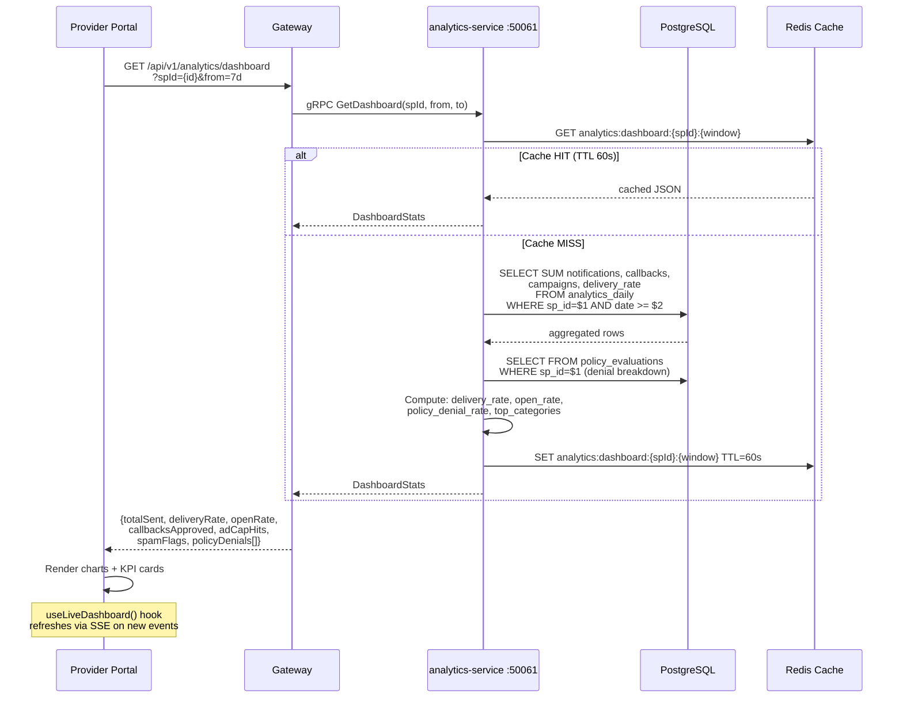
```mermaid
sequenceDiagram
    participant PUI as Provider Portal
    participant GW as Gateway
    participant Ana as analytics-service :50061
    participant PG as PostgreSQL
    participant Redis as Redis Cache

    PUI->>GW: GET /api/v1/analytics/dashboard<br/>?spId={id}&from=7d
    GW->>Ana: gRPC GetDashboard(spId, from, to)
    Ana->>Redis: GET analytics:dashboard:{spId}:{window}
    alt Cache HIT (TTL 60s)
        Redis-->>Ana: cached JSON
        Ana-->>GW: DashboardStats
    else Cache MISS
        Ana->>PG: SELECT SUM notifications, callbacks,<br/>campaigns, delivery_rate<br/>FROM analytics_daily<br/>WHERE sp_id=$1 AND date >= $2
        PG-->>Ana: aggregated rows
        Ana->>PG: SELECT FROM policy_evaluations<br/>WHERE sp_id=$1 (denial breakdown)
        Ana->>Ana: Compute: delivery_rate, open_rate,<br/>policy_denial_rate, top_categories
        Ana->>Redis: SET analytics:dashboard:{spId}:{window} TTL=60s
        Ana-->>GW: DashboardStats
    end
    GW-->>PUI: {totalSent, deliveryRate, openRate,<br/>callbacksApproved, adCapHits,<br/>spamFlags, policyDenials[]}
    PUI->>PUI: Render charts + KPI cards
    Note over PUI: useLiveDashboard() hook<br/>refreshes via SSE on new events
```

### Customer-Side: Privacy Analytics

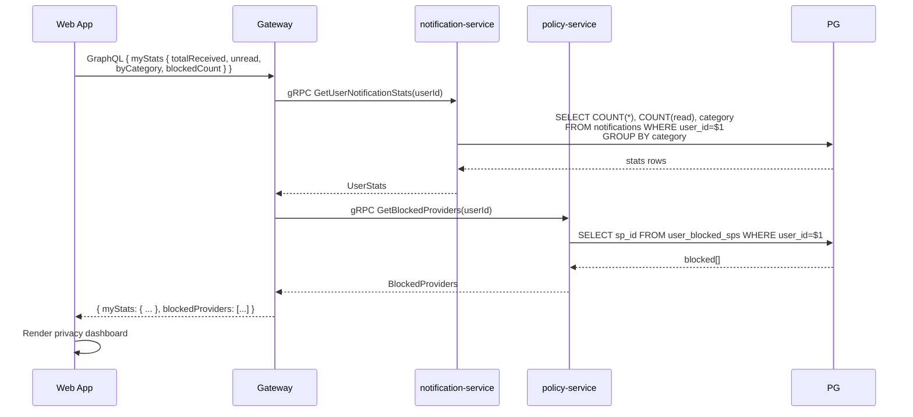
```mermaid
sequenceDiagram
    participant WEB as Web App
    participant GW as Gateway
    participant NS as notification-service
    participant PS as policy-service

    WEB->>GW: GraphQL { myStats { totalReceived, unread,<br/>byCategory, blockedCount } }
    GW->>NS: gRPC GetUserNotificationStats(userId)
    NS->>PG: SELECT COUNT(*), COUNT(read), category<br/>FROM notifications WHERE user_id=$1<br/>GROUP BY category
    PG-->>NS: stats rows
    NS-->>GW: UserStats
    GW->>PS: gRPC GetBlockedProviders(userId)
    PS->>PG: SELECT sp_id FROM user_blocked_sps WHERE user_id=$1
    PG-->>PS: blocked[]
    PS-->>GW: BlockedProviders
    GW-->>WEB: { myStats: { ... }, blockedProviders: [...] }
    WEB->>WEB: Render privacy dashboard
```

> **Observations:**
> - Analytics are pre-aggregated into `analytics_daily` by the analytics-service consumer on every domain event — no expensive COUNT(*) queries at dashboard load time.
> - 60-second Redis cache prevents stampede on the dashboard endpoint during peak usage.
> - The provider can never see individual user data — only aggregated metrics. Privacy by design.

---

## Feature 10 · Privacy Controls & DND

### Customer-Side: Configure DND

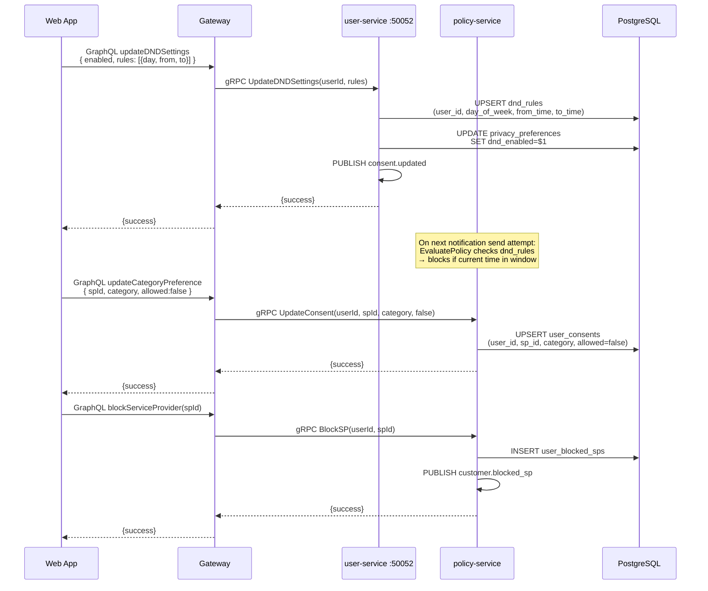
```mermaid
sequenceDiagram
    participant WEB as Web App
    participant GW as Gateway
    participant User as user-service :50052
    participant PS as policy-service
    participant PG as PostgreSQL

    WEB->>GW: GraphQL updateDNDSettings<br/>{ enabled, rules: [{day, from, to}] }
    GW->>User: gRPC UpdateDNDSettings(userId, rules)
    User->>PG: UPSERT dnd_rules<br/>(user_id, day_of_week, from_time, to_time)
    User->>PG: UPDATE privacy_preferences<br/>SET dnd_enabled=$1
    User->>User: PUBLISH consent.updated
    User-->>GW: {success}
    GW-->>WEB: {success}

    Note over PS: On next notification send attempt:<br/>EvaluatePolicy checks dnd_rules<br/>→ blocks if current time in window

    WEB->>GW: GraphQL updateCategoryPreference<br/>{ spId, category, allowed:false }
    GW->>PS: gRPC UpdateConsent(userId, spId, category, false)
    PS->>PG: UPSERT user_consents<br/>(user_id, sp_id, category, allowed=false)
    PS-->>GW: {success}
    GW-->>WEB: {success}

    WEB->>GW: GraphQL blockServiceProvider(spId)
    GW->>PS: gRPC BlockSP(userId, spId)
    PS->>PG: INSERT user_blocked_sps
    PS->>PS: PUBLISH customer.blocked_sp
    PS-->>GW: {success}
    GW-->>WEB: {success}
```

> **Observations:**
> - DND changes take effect on the next policy evaluation — no cache invalidation needed since policy queries `dnd_rules` live.
> - DND supports overnight windows (e.g., 22:00–07:00) via day-of-week + time range pairs.
> - Blocking an SP is immediate — all in-flight notifications from that SP are denied at next evaluation.
> - Category preferences are per-SP-per-category for fine-grained control.

---

## Feature 11 · Team Management & Invitations

### Provider-Side: Invite Team Member

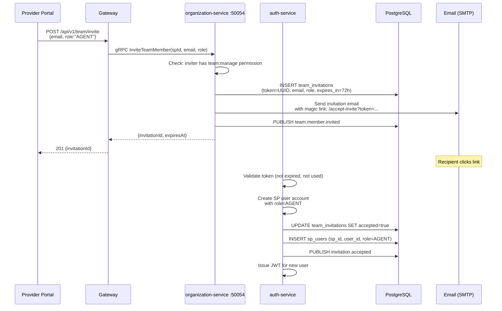
```mermaid
sequenceDiagram
    participant PUI as Provider Portal
    participant GW as Gateway
    participant Org as organization-service :50054
    participant Auth as auth-service
    participant PG as PostgreSQL
    participant Email as Email (SMTP)

    PUI->>GW: POST /api/v1/team/invite<br/>{email, role:"AGENT"}
    GW->>Org: gRPC InviteTeamMember(spId, email, role)
    Org->>Org: Check: inviter has team:manage permission
    Org->>PG: INSERT team_invitations<br/>(token=UUID, email, role, expires_in=72h)
    Org->>Email: Send invitation email<br/>with magic link: /accept-invite?token=...
    Org->>PG: PUBLISH team.member.invited
    Org-->>GW: {invitationId, expiresAt}
    GW-->>PUI: 201 {invitationId}

    Note over Email: Recipient clicks link
    Auth->>Auth: Validate token (not expired, not used)
    Auth->>Auth: Create SP user account<br/>with role=AGENT
    Auth->>PG: UPDATE team_invitations SET accepted=true
    Auth->>PG: INSERT sp_users (sp_id, user_id, role=AGENT)
    Auth->>PG: PUBLISH invitation.accepted
    Auth->>Auth: Issue JWT for new user
```

### Provider-Side: Manage Roles

```mermaid
sequenceDiagram
    participant PUI as Provider Portal
    participant GW as Gateway
    participant Org as organization-service
    participant PG as PostgreSQL

    PUI->>GW: PATCH /api/v1/team/:memberId/role<br/>{role:"ANALYST"}
    GW->>GW: RBAC check: requester has SP_ADMIN role
    GW->>Org: gRPC UpdateMemberRole(spId, memberId, ANALYST)
    Org->>PG: UPDATE sp_users SET role=ANALYST
    Org->>PG: PUBLISH team.member.role_changed
    Org-->>GW: {success}
    GW-->>PUI: 200

    PUI->>GW: DELETE /api/v1/team/:memberId
    GW->>Org: gRPC RemoveTeamMember(spId, memberId)
    Org->>PG: DELETE sp_users WHERE id=$1 AND sp_id=$2
    Org->>PG: PUBLISH team.member.removed
    Org-->>GW: 204
    GW-->>PUI: 204
```

> **Observations:**
> - Invitation tokens are single-use, 72h TTL. Expired or used tokens return 410.
> - Role changes take effect immediately — JWT is re-issued on next login, so active sessions retain old role until token refresh.
> - SP_ADMIN cannot remove themselves — guard enforced at use case layer.

---

## Feature 12 · Industry Profile Templates

### Provider-Side: Apply Industry Profile

```mermaid
sequenceDiagram
    participant PUI as Provider Portal
    participant GW as Gateway
    participant Ind as industry-service :50063
    participant Org as organization-service
    participant PS as policy-service
    participant PG as PostgreSQL

    PUI->>GW: GET /api/v1/industry-profiles
    GW->>Ind: gRPC ListIndustryProfiles()
    Ind->>PG: SELECT * FROM industry_profiles
    PG-->>Ind: [{banking}, {healthcare}, {real_estate}, ...]
    Ind-->>GW: profiles[]
    GW-->>PUI: profiles (with default policy configs)

    PUI->>GW: POST /api/v1/industry-profiles/:id/apply<br/>{spId}
    GW->>Ind: gRPC ApplyProfile(spId, profileId)
    Ind->>Org: gRPC UpdateSPSettings(spId, profileDefaults)
    Ind->>PS: gRPC SetDefaultPolicies(spId, policyTemplate)
    Ind->>PG: INSERT sp_industry_profile (spId, profileId)
    Ind-->>GW: {applied:true, policiesConfigured: 12}
    GW-->>PUI: 200 {applied}
    PUI->>PUI: Show "Industry defaults applied" toast
    Note over PUI: SP can now override<br/>individual policy settings
```

> **Observations:**
> - Industry profiles pre-configure policy rules, notification categories, and compliance hints.
> - Banking profile enforces stricter spam thresholds and mandatory callback approval.
> - Healthcare profile adds HIPAA-aligned data handling hints (though actual compliance is the SP's responsibility).

---

## Summary: End-to-End Request Flow (All Features)

```mermaid
graph LR
    A["👤 User / SP Action"] --> B["Frontend App<br/>:3000 / :6060 / :3001"]
    B --> C["GraphQL BFF / REST Gateway :4000<br/>CORS → JWT/RBAC → Tenant RLS → Rate Limit"]
    C --> D["Target Service<br/>gRPC :5005x"]
    D --> E{"Policy Gate<br/>policy-service :50053"}
    E -->|"DENIED"| F["❌ Return 403<br/>with reason"]
    E -->|"ALLOWED"| G["Business Logic<br/>Usecase layer"]
    G --> H["PostgreSQL 16<br/>Source of Truth"]
    G --> I["Redis Streams<br/>trustinbox:events"]
    I --> J["worker-service<br/>Async processing"]
    I --> K["webhook-service<br/>HTTP delivery"]
    I --> L["analytics-service<br/>Metrics aggregation"]
    J --> M["Real-time delivery<br/>SSE / XMPP / Push"]
    M --> N["👤 Customer receives<br/>notification / message"]
```
