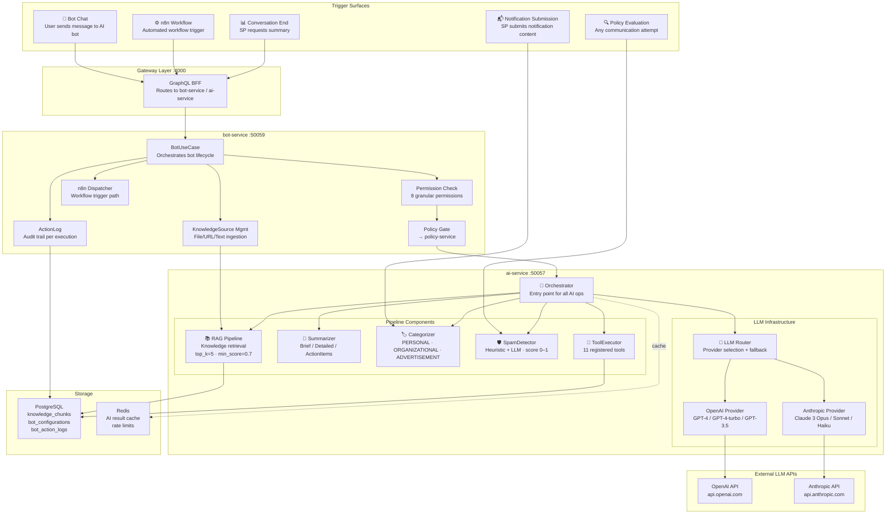
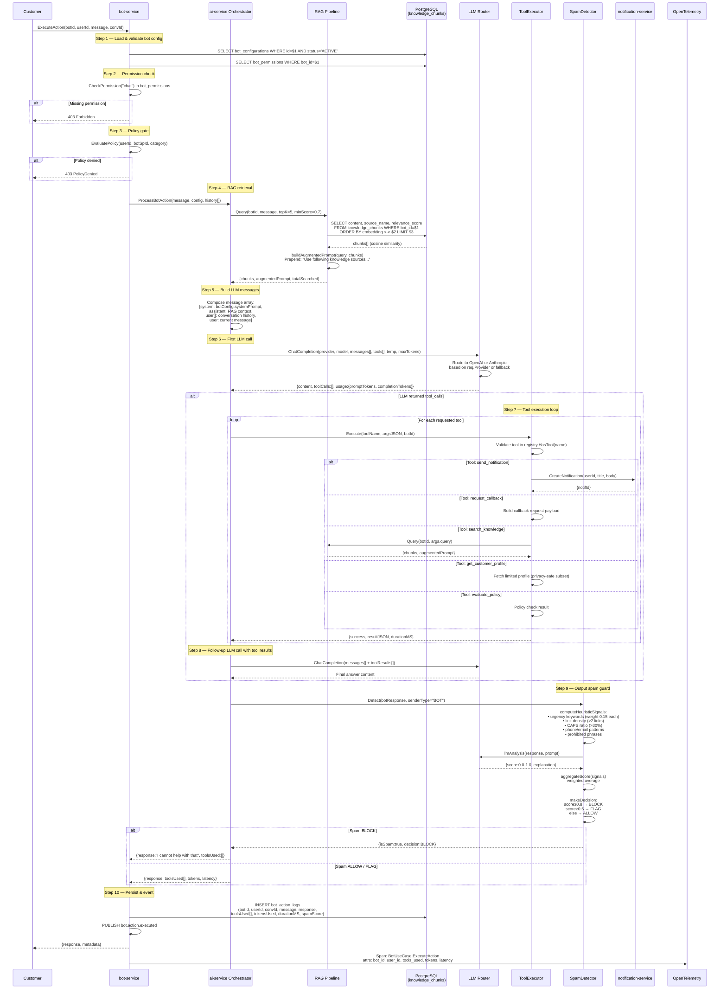
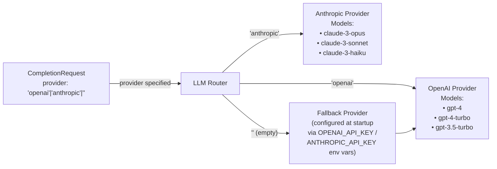
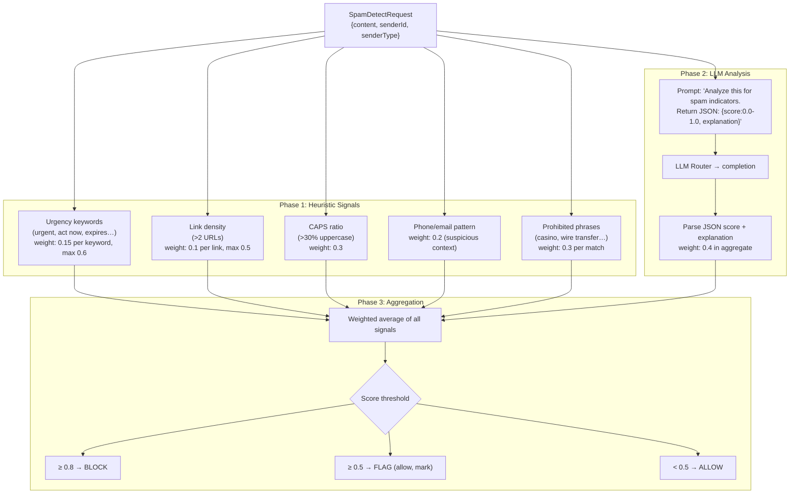
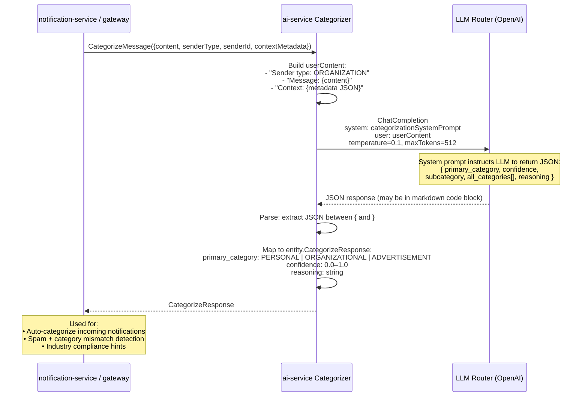
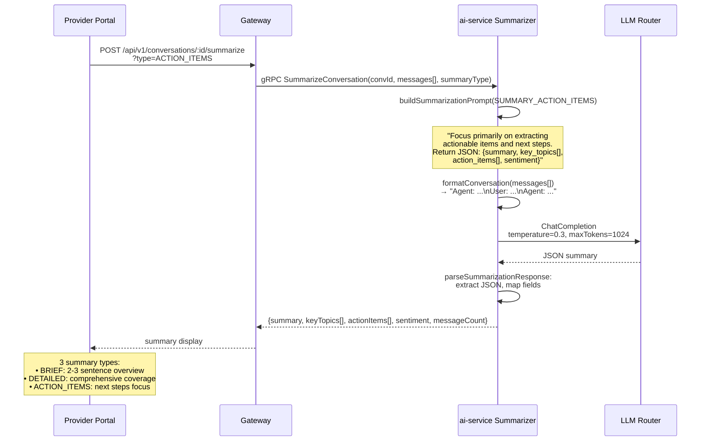
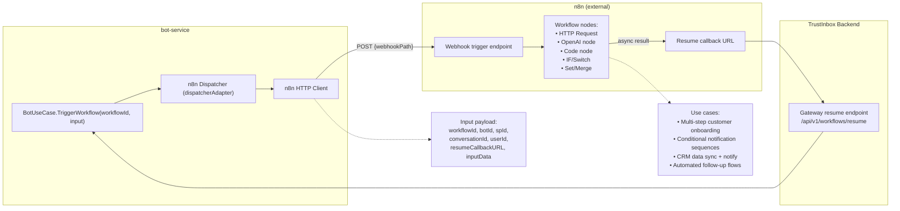
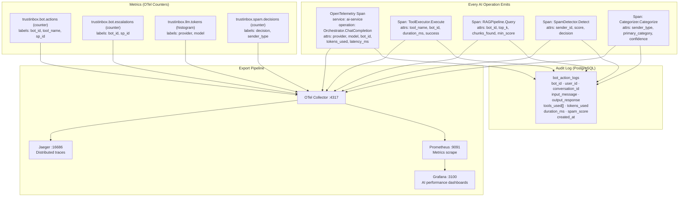
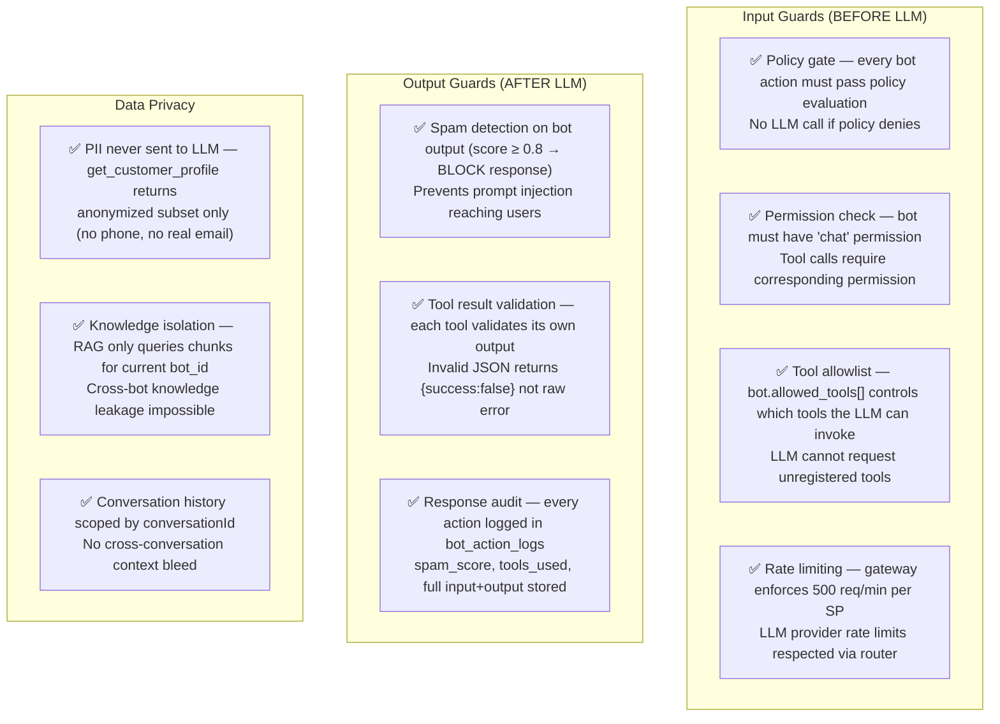

# 20 — End-to-End AI Architecture

> Complete map of every AI capability in TrustInbox: how they are wired, what they do, what models they use, and where each component sits in the clean architecture stack.

---

## AI System Overview



---

## AI Processing Pipeline (Full Detail)



---

## AI Component Architecture (Clean Layers)

```mermaid
graph TB
    subgraph "ai-service — Clean Architecture"
        subgraph "Domain Layer"
            E1["entity.CompletionRequest/Response"]
            E2["entity.RAGQueryRequest/Response"]
            E3["entity.ToolExecutionRequest/Result"]
            E4["entity.SpamDetectRequest/Response"]
            E5["entity.CategorizeRequest/Response"]
            E6["entity.SummarizeRequest/Response"]
            E7["entity.KnowledgeChunk"]
            E8["entity.ToolDefinition"]
            R1["repository.KnowledgeChunkRepository<br/>(interface)"]
        end

        subgraph "UseCase Layer"
            UC1["Orchestrator<br/>Entry point, delegates to sub-components"]
            UC2["RAGPipeline<br/>Retrieve + augment prompt"]
            UC3["Summarizer<br/>LLM-based summarization"]
            UC4["Categorizer<br/>LLM JSON classification"]
            UC5["SpamDetector<br/>Heuristic + LLM scoring"]
            UC6["ToolExecutor + ToolRegistry<br/>Named tool dispatch"]
        end

        subgraph "Infrastructure Layer"
            I1["llm.Router<br/>Provider selection"]
            I2["llm.OpenAIProvider<br/>openai.ChatCompletion"]
            I3["llm.AnthropicProvider<br/>anthropic.Messages"]
            I4["postgres.KnowledgeChunkRepo<br/>pgvector similarity search"]
        end

        subgraph "Delivery Layer"
            D1["grpc.AIHandler<br/>Proto → usecase → proto"]
        end
    end

    D1 --> UC1
    UC1 --> UC2 & UC3 & UC4 & UC5 & UC6
    UC2 --> R1
    UC2 & UC3 & UC4 & UC5 --> I1
    I1 --> I2 & I3
    I4 ..|> R1
```

---

## LLM Provider Routing



---

## RAG Knowledge Pipeline

```mermaid
graph TB
    subgraph "Ingestion (bot-service)"
        I1["SP uploads knowledge source<br/>(PDF / URL / text)"]
        I2["bot-service chunks content<br/>~512 tokens per chunk"]
        I3["ai-service.IndexKnowledge(botId, chunks[])"]
        I4["LLM embedding call<br/>(text-embedding-3-small or similar)"]
        I5["INSERT knowledge_chunks<br/>(bot_id, content, source_name,<br/>embedding vector, chunk_index)"]
    end

    subgraph "Retrieval (at query time)"
        R1["User message arrives"]
        R2["RAGPipeline.Query(botId, query, topK=5, minScore=0.7)"]
        R3["SELECT ... FROM knowledge_chunks<br/>WHERE bot_id=$1<br/>ORDER BY embedding &lt;-&gt; $2 LIMIT $3"]
        R4["Filter: relevanceScore ≥ 0.7"]
        R5["buildAugmentedPrompt:<br/>Prepend source context to query"]
        R6["Augmented prompt → LLM"]
    end

    I1 --> I2 --> I3 --> I4 --> I5
    R1 --> R2 --> R3 --> R4 --> R5 --> R6
```



---

## Spam Detection Signal Pipeline



---

## Smart Categorization Flow



---

## Conversation Summarization Flow



---

## n8n Workflow AI Automation Path



---

## AI Observability



---

## AI Security Model



---

## AI Capabilities Matrix

| Capability | Component | Model Used | Trigger | Output |
|---|---|---|---|---|
| **Chat completion** | `Orchestrator.ChatCompletion` | GPT-4 / Claude 3 (configurable per bot) | Bot chat message | Natural language response |
| **Tool execution** | `ToolExecutor` | n/a (deterministic) | LLM `tool_calls` in response | JSON result passed back to LLM |
| **Knowledge retrieval** | `RAGPipeline` | Embedding model + cosine similarity | Every bot message | Top-5 knowledge chunks + augmented prompt |
| **Spam detection** | `SpamDetector` | GPT-3.5 (LLM phase) + heuristics | Notification submission / bot output | Score 0–1 + ALLOW/FLAG/BLOCK decision |
| **Categorization** | `Categorizer` | GPT-3.5 temperature=0.1 | Incoming message / notification | PERSONAL / ORGANIZATIONAL / ADVERTISEMENT |
| **Summarization** | `Summarizer` | GPT-4 temperature=0.3 | SP requests summary | Brief / Detailed / Action items |
| **Workflow automation** | `n8n Dispatcher` | Delegated to n8n nodes | Bot action or scheduled trigger | Async callback result |

---

## Observations & Key Findings

### What Was Achieved

1. **Dual LLM provider** — OpenAI and Anthropic are both registered at startup with runtime routing. Each bot can specify its preferred provider; empty → fallback provider from config.

2. **RAG is bot-scoped** — Knowledge chunks are isolated by `bot_id`. An SP cannot accidentally leak knowledge between their own bots. Cross-SP leakage is impossible by design.

3. **Spam detection is dual-phase** — heuristics first (deterministic, zero LLM cost), then LLM analysis only if needed. Score aggregation is weighted average with LLM signal weight=0.4.

4. **Output spam guard closes the prompt injection loop** — Even if a malicious user crafts a prompt that makes the LLM generate harmful output, the spam detector runs on the response before it reaches the user.

5. **Tool execution is sandboxed by permission** — The `allowed_tools[]` in `bot_permissions` is validated inside `ToolExecutor.Execute()`, not in the gateway. Even if the LLM hallucinates a tool call, it cannot execute unregistered or unpermitted tools.

6. **n8n provides complex automation** — The `WorkflowDispatcher` interface is backed by n8n via HTTP webhooks. This allows no-code multi-step workflows (CRM sync → conditional notify → follow-up) without writing service code.

7. **Full audit trail** — Every LLM call produces a `bot_action_logs` row with input, output, tools used, token count, duration, and spam score. This satisfies enterprise compliance requirements.

8. **Categorization supports auto-tagging** — The categorizer runs at 0.1 temperature (near-deterministic) and returns confidence scores. Used both for routing and compliance hints on industry profiles.
