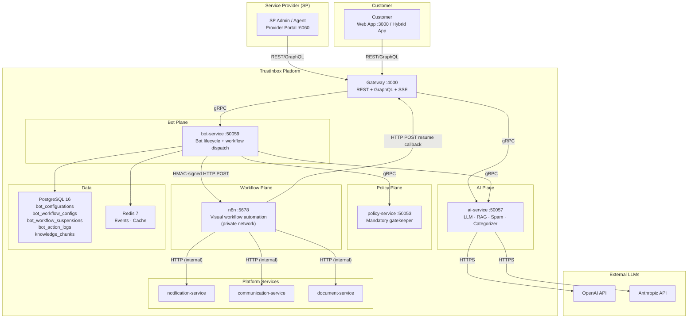
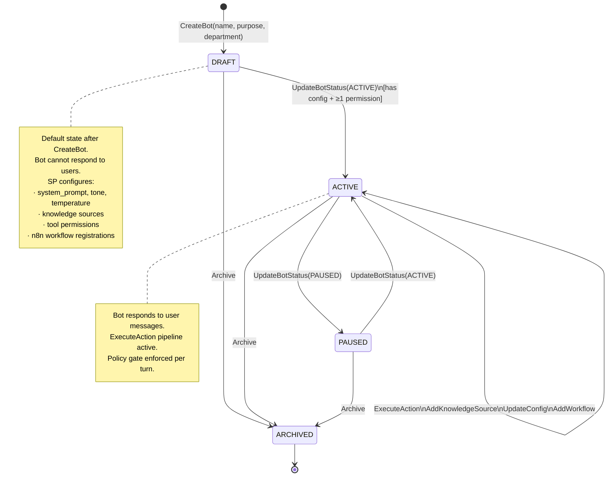
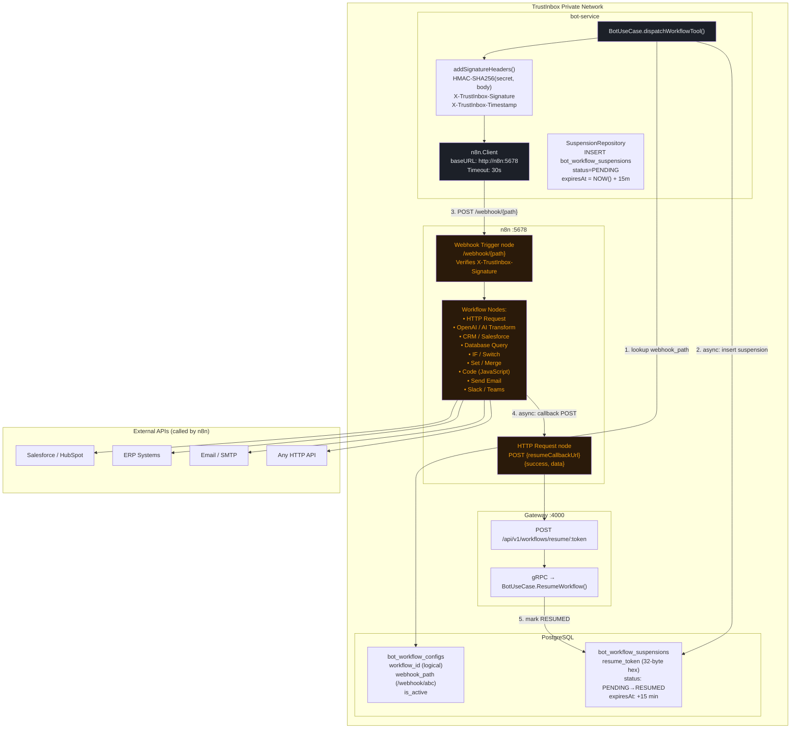
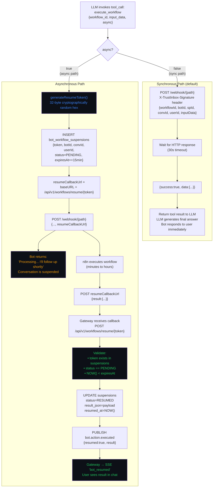
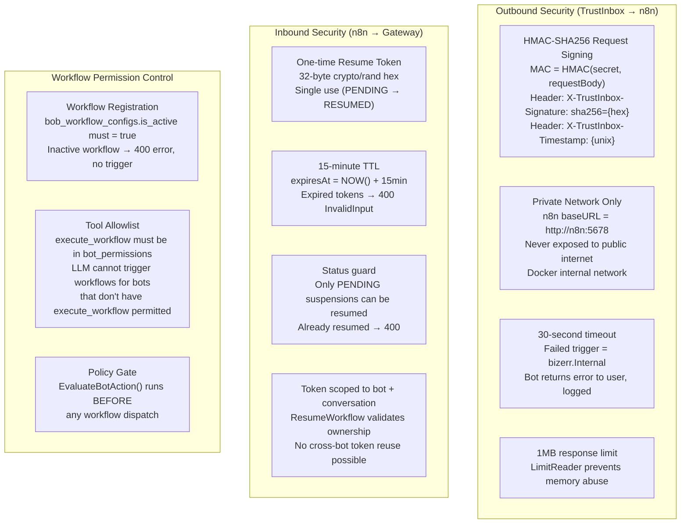
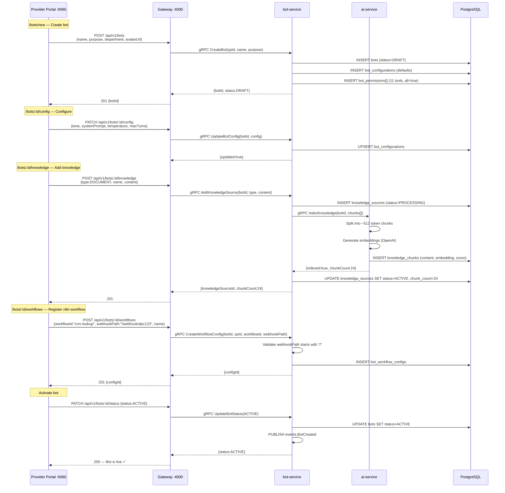
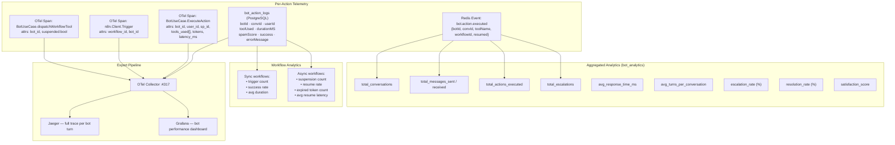
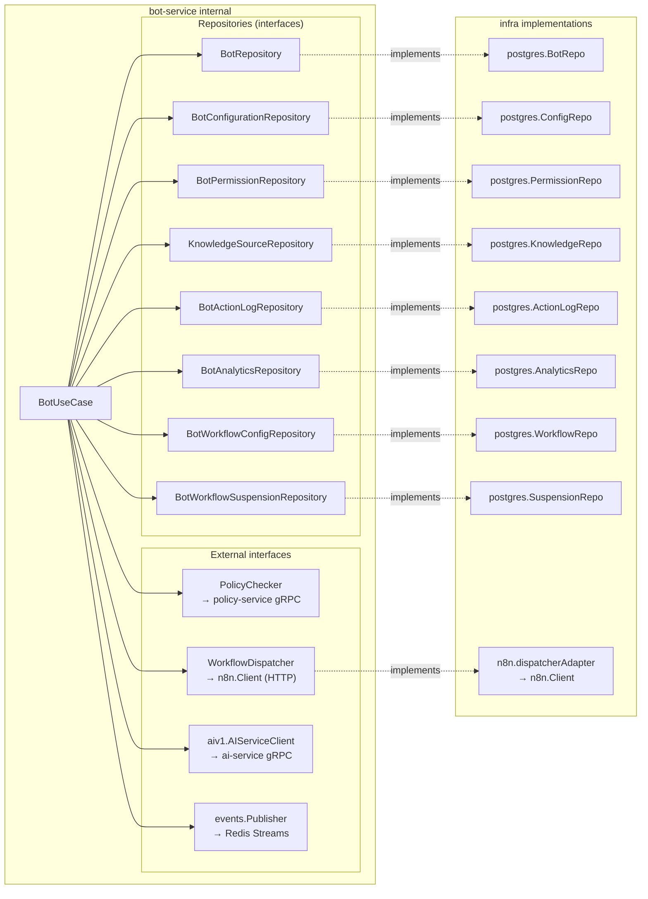

# 22 — n8n & Bot Integration Architecture

> **Principal Architect view** — Complete end-to-end architecture for the TrustInbox bot system and its n8n workflow automation integration. Every component, data flow, security boundary, and lifecycle state is derived directly from the production codebase.

---

## 1. System Context — Where Bots & n8n Fit



---

## 2. Bot Lifecycle State Machine



---

## 3. Bot Configuration Data Model

```mermaid
erDiagram
    BOTS {
        uuid id PK
        uuid service_provider_id FK
        varchar name
        varchar purpose
        varchar department
        varchar status "DRAFT|ACTIVE|PAUSED|ARCHIVED"
        varchar avatar_url
        timestamptz created_at
    }

    BOT_CONFIGURATIONS {
        uuid bot_id PK_FK
        varchar tone
        varchar writing_style
        text[] supported_languages
        int[] working_days
        varchar working_hours_start
        varchar working_hours_end
        int max_turns_before_escalation
        float temperature
        text custom_system_prompt
        jsonb escalation_rules
        jsonb human_handoff_policy
        jsonb compliance_restrictions
    }

    BOT_PERMISSIONS {
        uuid id PK
        uuid bot_id FK
        varchar tool_name
        boolean is_allowed
        jsonb constraints
    }

    KNOWLEDGE_SOURCES {
        uuid id PK
        uuid bot_id FK
        varchar source_type "DOCUMENT|URL|TEXT|FAQ|API|WORKFLOW"
        varchar name
        text content
        varchar s3_key
        varchar status "PENDING|PROCESSING|ACTIVE|FAILED"
        int chunk_count
    }

    KNOWLEDGE_CHUNKS {
        uuid id PK
        uuid bot_id FK
        uuid source_id FK
        text content
        vector embedding
        float relevance_score
        int chunk_index
        varchar source_name
    }

    BOT_WORKFLOW_CONFIGS {
        uuid id PK
        uuid bot_id FK
        varchar workflow_id "SP-chosen logical ID e.g. crm-lookup"
        varchar workflow_name
        varchar webhook_path "n8n relative path /webhook/abc123"
        text description
        boolean is_active
    }

    BOT_WORKFLOW_SUSPENSIONS {
        uuid id PK
        varchar resume_token "32-byte hex, one-time use"
        uuid bot_id FK
        uuid conversation_id
        uuid user_id
        varchar workflow_id
        varchar status "PENDING|RESUMED|EXPIRED"
        text result_json
        timestamptz expires_at "NOW() + 15 minutes"
        timestamptz resumed_at
    }

    BOT_ACTION_LOGS {
        uuid id PK
        uuid bot_id FK
        uuid conversation_id
        uuid user_id
        varchar action_type
        varchar tool_used
        text input_summary
        text output_summary
        varchar policy_decision
        int duration_ms
        boolean success
    }

    BOTS ||--|| BOT_CONFIGURATIONS : "has"
    BOTS ||--o{ BOT_PERMISSIONS : "has many"
    BOTS ||--o{ KNOWLEDGE_SOURCES : "has many"
    KNOWLEDGE_SOURCES ||--o{ KNOWLEDGE_CHUNKS : "chunked into"
    BOTS ||--o{ BOT_WORKFLOW_CONFIGS : "registers"
    BOTS ||--o{ BOT_WORKFLOW_SUSPENSIONS : "suspends on"
    BOTS ||--o{ BOT_ACTION_LOGS : "logged in"
```

---

## 4. Bot Action Execution — Complete Call Graph

```mermaid
sequenceDiagram
    participant User as Customer (Web/App)
    participant GW as Gateway :4000
    participant Bot as bot-service :50059
    participant PS as policy-service
    participant AI as ai-service
    participant LLM as LLM Router
    participant Tool as ToolExecutor
    participant N8N as n8n :5678
    participant PG as PostgreSQL
    participant Redis as Redis Streams

    User->>GW: POST /api/v1/bots/:id/action<br/>{message, conversationId}

    Note over Bot: ① Load & validate
    GW->>Bot: gRPC ExecuteAction(botId, userId, message)
    Bot->>PG: SELECT bots WHERE id=$1 AND status='ACTIVE'
    Bot->>PG: SELECT bot_permissions WHERE bot_id=$1

    Note over Bot: ② Permission check
    Bot->>Bot: CheckPermission(botId, "chat")
    alt permission missing → 403

    Note over PS: ③ Policy gate
    Bot->>PS: gRPC EvaluateBotAction(botId, userId, "chat")
    PS->>PG: 9-step evaluation
    PS-->>Bot: {allowed:true}

    Note over AI: ④ RAG knowledge retrieval
    Bot->>AI: gRPC ProcessBotAction(message, config, history[])
    AI->>PG: SELECT knowledge_chunks<br/>ORDER BY embedding <-> $query LIMIT 5<br/>WHERE relevance_score >= 0.7
    PG-->>AI: chunks[]
    AI->>AI: buildAugmentedPrompt(query, chunks)

    Note over LLM: ⑤ LLM completion
    AI->>LLM: ChatCompletion(messages[], tools[], temp, maxTokens)
    LLM-->>AI: {content, tool_calls:[{name, args}]}

    alt tool_calls includes "execute_workflow"
        Note over N8N: ⑥a n8n workflow dispatch
        AI->>Tool: Execute("execute_workflow", {workflow_id, input_data, async})
        Tool->>Bot: dispatchWorkflowTool(workflowId, inputJSON)
        Bot->>PG: SELECT bot_workflow_configs WHERE workflow_id=$1 AND is_active=true
        PG-->>Bot: {webhook_path: "/webhook/abc123"}

        alt async=false (synchronous)
            Bot->>N8N: POST {baseURL}/webhook/abc123<br/>X-TrustInbox-Signature: sha256={hmac}<br/>X-TrustInbox-Timestamp: {ts}<br/>{workflowId, botId, spId, convId, userId, inputData}
            N8N->>N8N: Execute workflow nodes
            N8N-->>Bot: {success:true, data:{...}}
            Bot-->>Tool: {status:"executed", success:true, data}
            Tool-->>AI: toolResult JSON
            AI->>LLM: Follow-up with tool result
            LLM-->>AI: Final answer

        else async=true (suspended)
            Bot->>Bot: generateResumeToken() → 32-byte hex
            Bot->>PG: INSERT bot_workflow_suspensions<br/>(token, botId, convId, status=PENDING, expires=+15min)
            Bot->>N8N: POST /webhook/abc123<br/>{..., resumeCallbackUrl: "/api/v1/workflows/resume/{token}"}
            N8N-->>Bot: {success:true} (ACK only)
            Bot-->>Tool: {status:"suspended", resume_url}
            Tool-->>AI: suspended JSON
            AI-->>Bot: {response:"Processing... I'll follow up shortly"}
            Bot-->>GW: {response, suspended:true}
            GW-->>User: "Processing..."

            Note over N8N: n8n executes async
            N8N->>N8N: HTTP nodes / CRM / external APIs
            N8N->>GW: POST /api/v1/workflows/resume/{token}<br/>{result: {...}}
            GW->>Bot: gRPC ResumeWorkflow(token, resultJSON)
            Bot->>PG: SELECT suspensions WHERE token=$1 AND status=PENDING
            Bot->>PG: UPDATE status=RESUMED, result_json=$2, resumed_at=NOW()
            Bot->>Redis: PUBLISH bot.action.executed {resumed:true}
            Bot-->>GW: {conversationId, userId, result}
            GW->>User: SSE "bot_resumed" {result}
        end

    else regular tool call (send_notification, etc.)
        Note over Tool: ⑥b Standard tool execution
        AI->>Tool: Execute(toolName, argsJSON)
        Tool->>Tool: registry.HasTool(name) — permission validated
        Tool-->>AI: toolResult
        AI->>LLM: Follow-up
        LLM-->>AI: Final answer
    end

    Note over AI: ⑦ Output spam guard
    AI->>AI: SpamDetector.Detect(response)<br/>score ≥ 0.8 → BLOCK response

    AI-->>Bot: {response, toolsUsed[], tokens, durationMS}

    Note over Bot: ⑧ Persist & emit
    Bot->>PG: INSERT bot_action_logs<br/>(botId, convId, toolUsed, response,<br/>durationMS, spamScore, success)
    Bot->>Redis: XADD bot.action.executed
    Bot-->>GW: {response, metadata}
    GW-->>User: 200 {message: response}
```

---

## 5. n8n Integration Architecture — Detailed



---

## 6. Sync vs Async Workflow Execution Paths



---

## 7. n8n Security Model



---

## 8. Provider Portal — Bot Management UI Flow



---

## 9. Bot Analytics & Observability



---

## 10. Complete Component Dependency Map



---

## 11. Real-World n8n Workflow Examples

```mermaid
graph TB
    subgraph "Example A: Synchronous CRM Lookup"
        A1["Bot receives: 'What is my account balance?'"]
        A2["LLM: tool_call execute_workflow\n{workflow_id:'crm-lookup', async:false,\ninput_data:{customer_id}}"]
        A3["n8n: HTTP Request → Salesforce API\nGET /accounts/{customerId}"]
        A4["n8n returns: {balance:1234.56, tier:'gold'}"]
        A5["LLM: 'Your balance is $1,234.56. You are a Gold tier member.'"]
        A1-->A2-->A3-->A4-->A5
    end

    subgraph "Example B: Async Multi-Step Onboarding"
        B1["Bot receives: 'I want to open an account'"]
        B2["LLM: tool_call execute_workflow\n{workflow_id:'onboarding', async:true}"]
        B3["n8n: Create lead → Send KYC email\n→ Wait for doc upload → Verify"]
        B4["Bot responds: 'I've started your application.\nYou'll receive an email shortly.'"]
        B5["Minutes later: n8n POSTs resume callback\n{kycApproved:true, accountNumber:'ACC-789'}"]
        B6["User receives SSE bot_resumed:\n'Great news! Your account ACC-789 is approved.'"]
        B1-->B2-->B3
        B2-->B4
        B3-->B5-->B6
    end

    subgraph "Example C: Compliance Notification Sequence"
        C1["Scheduled n8n trigger (not user-initiated)\nCron: every Monday 09:00"]
        C2["n8n: Query PG for customers\nwith expiring documents"]
        C3["n8n: For each customer\nPOST /api/v1/notifications (internal)"]
        C4["notification-service creates notification\nPolicy gate enforced per customer"]
        C5["Customers receive 'Document expiry reminder'"]
        C1-->C2-->C3-->C4-->C5
    end
```



---

## Principal Architect Observations

| Area | Observation | Recommendation |
|---|---|---|
| **Async suspension TTL** | Resume token expires in 15 minutes. Long-running n8n workflows (e.g. KYC, document review) will expire before n8n calls back. | Make TTL configurable per `BotWorkflowConfig`. Default 15m is fine for fast workflows; compliance flows need 24h+. |
| **Resume token storage** | Stored in PostgreSQL. High-volume bots with many async workflows create rows that need cleanup. | Add a CleanupProcessor job in worker-service to DELETE expired+resumed suspensions older than 7 days. |
| **n8n HMAC verification** | Bot signs outbound requests. n8n workflow **must** verify `X-TrustInbox-Signature` on its webhook trigger node. This is configuration responsibility of the SP who builds the n8n workflow. | Add a verification code snippet to onboarding docs and optionally enforce on the bot side if n8n returns a 401 (reject webhook). |
| **n8n single point of failure** | Synchronous path blocks for 30s timeout if n8n is down. All sync workflow calls fail. | Circuit-breaker pattern in `n8n.Client`. After 5 consecutive failures, open the circuit and return a graceful "workflow service unavailable" message. |
| **Knowledge indexing at ingestion** | Embedding model is called at ingestion time (OpenAI `text-embedding-3-small`). If the model changes, historical vectors become incomparable. | Pin the embedding model name in `bot_knowledge_sources` table and store model version alongside each `knowledge_chunk`. |
| **Tool allowlist enforcement** | `execute_workflow` must be in `bot_permissions.is_allowed=true` for the bot to trigger n8n. Correct by design — but SP could accidentally revoke all tool permissions. | Add a validation in `UpdateBotStatus(ACTIVE)` that warns if a bot has zero active permissions. |
| **n8n calling TrustInbox APIs** | n8n workflows can call platform APIs (create notification, etc.) via HTTP Request nodes using internal service URLs. | These calls bypass the gateway RBAC. Create a dedicated n8n service account token with limited scope, not the SP admin JWT. |
